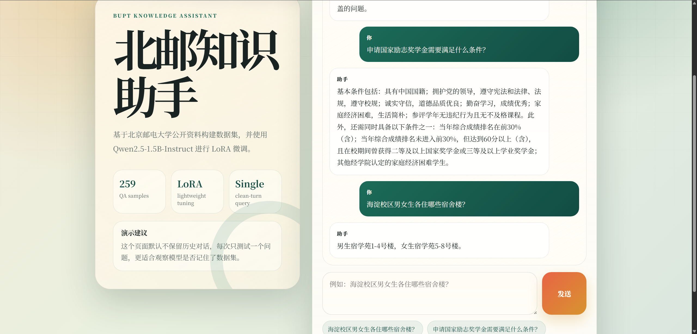

# 1 About this Project

本项目目标是构建一个**北京邮电大学校园知识问答数据集**——从公开网页爬取原始语料，经过清洗、切块、API改写、过滤去重等流程，最终产出 259 条高质量短问短答样本。数据集采用 `ms-swift` 兼容的 messages JSONL 格式，可直接用于下游 LoRA 微调任务。

## 1.1 项目动机

本项目是课程实践，核心目标不是训出好模型，而是**走通"非结构化网页文本 → 结构化 QA 数据集"的完整构建管线**。

三个核心问题：

1. **爬取与清洗**：不同网站 DOM 结构各异，如何稳定提取正文并去重？
2. **长文本切分**：一篇文章上千字、涵盖多个知识点，切成多长的块才适合生成 QA？
3. **质量过滤**：大模型生成的 QA 可能编造、冗余或多问，程序层面如何拦截？

项目以北京邮电大学为场景，覆盖爬虫、清洗、切块、API 改写、过滤的全流程。下游的 LoRA 微调仅用于验证数据集可用性——**重点在数据，不在模型**。

## 1.2 系统架构

```
  爬虫采集 ──→ 清洗去重 ──→ 句子切分 + 文本分块 ──→ DeepSeek API 生成 QA ──→ 过滤清洗去重 ──→ 格式化输出
```

## 1.3 最终数据概览

数据来源于三个公开网站:

| 网站 | 简称 | 内容类型 |
|---|---|---|
| [guide.byrdocs.org](https://guide.byrdocs.org/) | `byrdocs_guide` | BUPT 生存指南 |
| [xsc.bupt.edu.cn/jgjs/gzzd/xsgl.htm](https://xsc.bupt.edu.cn/jgjs/gzzd/xsgl.htm) | `bupt_xsc` | 学生处规章制度 |
| [xsc.bupt.edu.cn/xgdt/bszn.htm](https://xsc.bupt.edu.cn/xgdt/bszn.htm) | `bupt_xsc_guide` | 学生处办事指南 |

最终数据集统计：

| 来源 | QA 数 | 问题中位长度 | 答案中位长度 |
|---|---:|---:|---:|
| `bupt_xsc` | 172 | 15 字 | 72 字 |
| `byrdocs_guide` | 76 | 14 字 | 65 字 |
| `bupt_xsc_guide` | 11 | 17 字 | 78 字 |
| **合计** | **259** | **15 字** | **69 字** |

数据采用 `ms-swift` 兼容的 messages JSONL 格式，每条样本示例如下：

```json
{
  "messages": [
    {"role": "system", "content": "你是北京邮电大学知识助手，请基于已知资料准确、简洁地回答问题。"},
    {"role": "user", "content": "新生怎么连校园网？"},
    {"role": "assistant", "content": "新生使用学工号作为网关账号，初始密码为身份证后6位（X改为0）。必须修改初始密码才能接入校园网，可通过企业微信-校园网或校园网自服务系统修改。无线网络推荐连接BUPT-mobile，该信号只使用5GHz频段，体验更好。"}
  ]
}
```


# 2 数据处理流程

整个管道分为六个阶段，由两个核心脚本串联完成：

| 阶段 | 脚本 | 做什么 | 产物 |
|---|---|---|---|
| 一 | `crawler.py` | 从三个公开网站爬取原始页面 | `data/raw/*.jsonl`（58 条） |
| 二 | `build_dataset.py` | 跨文件清洗去重 | `clean_corpus.jsonl`（58 条） |
| 三 | `build_bupt_v2_dataset.py` | 中文分句 + 贪心合并切块 | 内存中约 150 个文本块 |
| 四 | 同上 | DeepSeek API 生成 QA | `deepseek_qa_cache.json` |
| 五 | 同上 | 程序级过滤（长度/多问/拒答） | 过滤后的 QA 列表 |
| 六 | 同上 | 问题去重 + ms-swift 格式化 | `bupt_v2_messages.jsonl`（259 条） |

阶段一、二完成数据采集与清洗，阶段三至六完成从长文本到短 QA 的转换。其中阶段四是整个管道的核心——Prompt 设计和 API 调用质量直接决定最终数据集的上限，而阶段五的程序过滤则守住下限。

### 中间产物示例

以"研究生学业奖学金证明打印"这条数据为例，展示它在管道各阶段的形态变化。

**阶段一产出 — 原始页面** (`data/raw/bupt_xsc_guide.jsonl`)：

```json
{
  "source_site": "bupt_xsc_guide",
  "title": "研究生学业奖学金证明打印服务事项办事指南",
  "content": "服务事项：研究生学业奖学金证明打印 办理方式：部门办公室 / 报到注册一体机自助打印 咨询方式：1. 窗口咨询：西土城校区学生活动中心202室  ...",
  "url": "https://xsc.bupt.edu.cn/info/1099/1497.htm",
  "publish_time": "2025-09-01"
}
```

**阶段二产出 — 干净语料** (`data/clean_corpus.jsonl`)：
因为该页面内容较为独立，且 title 和 content 都不空，所以它会被保留，且 title 和 content 中的空白会被统一处理：
```json
{
  "source_site": "bupt_xsc_guide",
  "title": "研究生学业奖学金证明打印服务事项办事指南",
  "content": "服务事项：研究生学业奖学金证明打印 办理方式：部门办公室 / 报到注册一体机自助打印 ...",
  "url": "https://xsc.bupt.edu.cn/info/1099/1497.htm",
  "publish_time": "2025-09-01"
}
```

与阶段一结构相同，经 `normalize_whitespace()` 统一空白（`\xa0` → 空格、合并连续空白），`MD5(title || content)` 跨文件去重后保留。

**阶段四产出 — API 响应缓存** (`data/deepseek_qa_cache.json`)：

DeepSeek API 的每一条原始响应都会被缓存，key 为 SHA-256 哈希，value 包含 `raw`（原始返回文本）和 `parsed`（解析后的 QA 数组）：

```json
{
  "a0914436d6ce...": {
    "raw": "[\n  {\"question\": \"研究生学业奖学金证明去哪打印？\",\n    \"answer\": \"可在报到注册一体机自助打印...\"\n  },\n  {\"question\": \"学生活动中心202室办理证明的时间？\",\n    \"answer\": \"办公时间为工作日8:00—11:30，13:30—17:30。\"\n  }\n]",
    "parsed": [
      {
        "question": "研究生学业奖学金证明去哪打印？",
        "answer": "可在报到注册一体机自助打印：西土城校区在教一楼一层中厅，沙河校区在一站式服务大厅。需携带一卡通或身份证。"
      },
      {
        "question": "学生活动中心202室办理证明的时间？",
        "answer": "办公时间为工作日8:00—11:30，13:30—17:30。"
      }
    ]
  }
}
```

缓存保证中断重跑时不重复调用 API，节省费用。

**阶段六产出 — 最终数据集** (`data/bupt_v2_messages.jsonl`)：

上面缓存中的第一条 QA 经过过滤、去重、格式化后，变成最终的训练样本：

```json
{
  "messages": [
    {"role": "system", "content": "你是北京邮电大学知识助手，请基于已知资料准确、简洁地回答问题。"},
    {"role": "user", "content": "研究生学业奖学金证明去哪打印？"},
    {"role": "assistant", "content": "可在报到注册一体机自助打印：西土城校区在教一楼一层中厅，沙河校区在一站式服务大厅。需携带一卡通或身份证。其他奖学金、荣誉称号证明请到西土城校区学生活动中心202室办理。"}
  ],
  "metadata": {
    "source_site": "bupt_xsc_guide",
    "title": "研究生学业奖学金证明打印服务事项办事指南",
    "source_chunk": "服务事项：研究生学业奖学金证明打印..."
  }
}
```

## 2.1 阶段一：爬虫采集

脚本：`crawler.py`，负责从三个公开来源采集原始网页。

### 2.1.1 爬虫架构

使用 `requests` + `lxml` 的经典方案。三个爬虫继承同一基类 `BaseCrawler`，各自覆盖 URL 匹配和正文提取逻辑：

| 爬虫类 | 来源 | 起始 URL | 采集页面数 | 内容 |
|---|---|---|---|---|
| `ByrdocsCrawler` | guide.byrdocs.org | 首页 | 25 | 宿舍、转专业、校园网、开学考试等 |
| `XscCrawler` | xsc.bupt.edu.cn | 学生管理列表页 | 25 | 奖学金、处分、助学贷款等规章制度 |
| `XscGuideCrawler` | xsc.bupt.edu.cn | 办事指南列表页 | 8 | 补办学生证、在读证明等办事流程 |

### 2.1.2 爬取策略：BFS + visited 去重

```python
# ByrDocsCrawler 核心逻辑 (crawler.py:133-163)
queue = deque(start_urls)
visited = set()

while queue:
    current = canonicalize_url(queue.popleft())   # URL 规范化
    if current in visited:
        continue
    visited.add(current)
    sleep(1.0)                                   

    tree = get_tree(session, current)              # HTTP + lxml 解析
    record = extract_record(current, tree)         # 提取正文
    if record:
        records.append(record)

    for href in tree.xpath("//a[@href]/@href"):    # 提取子链接
        absolute = canonicalize_url(urljoin(current, href))
        if is_valid_doc(absolute):
            queue.append(absolute)
```

`XscCrawler` 采用两阶段策略：先将列表页的所有详情页 URL 加入 `detail_urls` 集合，再逐一访问，避免重复翻页。

### 2.1.3 正文提取：差异化 XPath

不同来源的 DOM 结构不同，分别写 XPath：

```python
# ByrDocs: 结构化页面, 内容在 <main> 内
title  = tree.xpath("string(//main//h1)")
content = text_join(tree.xpath("//main//*[self::p or self::li or self::h2 or self::h3]//text()"))

# Xsc: 旧式 CMS, 内容在 id=vsb_content 的 div 内
title  = tree.xpath("string(//div[contains(@class, 'art-tit')])")
content = text_join(tree.xpath("//div[@id='vsb_content']//text()"))
```

`text_join()` 对所有文本节点做 `normalize_whitespace()`（`\xa0` → 空格，合并连续空白），然后以空格拼接。

### 2.1.4 URL 去重与过滤

爬虫级别的过滤规则：

- **去重**：`visited` 集合按 URL 做精确匹配，`canonicalize_url()` 统一路径编码和末尾斜杠
- **域名锁定**：byrdocs 只爬 `guide.byrdocs.org`，xsc 只爬 `xsc.bupt.edu.cn`
- **路径过滤**：排除 `/contributing`、`/acknowledgments` 等非内容页
- **类型过滤**：排除 `_astro` 内部路径、图片/CSS/JS/XML 等静态资源
- **长度过滤**：byrdocs < 80 字丢弃，xsc < 50 字丢弃

### 2.1.5 产出

```
data/raw/byrdocs_guide.jsonl   → 25 条
data/raw/bupt_xsc.jsonl        → 25 条
data/raw/bupt_xsc_guide.jsonl  → 8 条
```

每条记录字段：`source_site` `source_name` `category` `title` `content` `url` `publish_time` `crawled_at`

---

## 2.2 阶段二：清洗去重

脚本：`build_dataset.py` 中的 `deduplicate()`

虽然三个爬虫各自做了去重，但三份原始文件之间可能存在重复（如同一篇文章被不同爬虫采集）。这一步做跨文件清洗：

```python
def deduplicate(rows: list[dict]) -> list[dict]:
    seen = set()
    deduped = []
    for row in rows:
        title   = normalize_whitespace(row.get("title", ""))
        content = normalize_whitespace(row.get("content", ""))
        if not title or not content:
            continue                                    # ← 丢弃空字段
        key = hashlib.md5(f"{title}||{content}".encode()).hexdigest()
        if key in seen:
            continue                                    # ← 去重
        seen.add(key)
        row["title"]   = title
        row["content"] = content
        deduped.append(row)
    return deduped
```

| 操作 | 说明 |
|---|---|
| 字段清洗 | `normalize_whitespace()` 再次统一空白，覆盖爬虫阶段未处理的边缘 case |
| 去重 | `MD5(title \|\| content)` 为 key，本质上是对 (标题, 正文) 去重 |
| 丢弃 | title 或 content 为空字符串的记录 |

**产出：**

```
data/processed/clean_corpus.jsonl → 58 条
```

三份原始文件共 58 条页面（25+25+8），跨文件去重后仍为 58 条——三个来源内容互不重叠，无跨站重复。

---

## 2.3 阶段三：文本切块

脚本：`build_bupt_v2_dataset.py` 中的 `split_sentences()` + `chunk_text()`

直接调用 DeepSeek API 处理整篇文章有两个问题：一是文章太长超出 context；二是单篇文章包含多个不相关的知识点，生成的 QA 质量不稳定。解决方法是先切块。

### 2.3.1 句子切分

```python
def split_sentences(text: str) -> list[str]:
    text = normalize_whitespace(text)
    parts = re.split(r"(?<=[。；！？])\s*", text)
    return [p.strip() for p in parts if p.strip()]
```

按中文句号、分号、叹号、问号断句，使用正向后顾 `(?<=...)` 保留标点符号。

### 2.3.2 贪心合并

```python
def chunk_text(text, max_chars=900, min_chars=120):
    sentences = split_sentences(text)
    chunks = []
    current = ""

    for sent in sentences:
        if not current:
            current = sent
            continue
        if len(current) + len(sent) + 1 <= max_chars:
            current = f"{current} {sent}"      # ← 还能装下，继续拼接
        else:
            if len(current) >= min_chars:
                chunks.append(current)          # ← 装不下了，截断
                current = sent
            else:
                current = f"{current} {sent}"   # ← 太短，继续追加

    if current and len(current) >= min_chars:
        chunks.append(current)                  # ← 最后一块
    return chunks
```

## 2.4 阶段四：DeepSeek API 生成 QA

脚本：`build_bupt_v2_dataset.py` 中的 `call_deepseek()` + `extract_json_array()`

这是管道中最关键的一步：利用大模型的语言能力，将非结构化的原文块改写为结构化的 question-answer 对。

### 2.4.1 Prompt 设计

Prompt 是该步骤的核心，经过多轮迭代的最终版本：

```
请把下面的北邮资料改写成适合微调的数据集问答。

要求：
1. 生成 2 条以内 QA。
2. 每条只问一个问题，不要把多个问题合在一起。
3. 问题要像真实学生会问的话，简短自然，不要写"请问""同学您好"
   "根据资料"等客套或元叙述。
4. 答案必须严格来自资料，不要补充、猜测、编造。
5. 答案要短，优先 80 到 220 字；确实需要列点时可以列点，
   但不要长篇复述原文。
6. 保留关键事实，比如地点、电话、时间、网址、尺寸、条件、流程。
7. 如果资料信息太碎或不适合问答，返回空数组 []。

只返回 JSON 数组，不要返回 Markdown，不要解释。
格式：
[
  {"question": "问题？", "answer": "答案"}
]

标题：{title}
资料：
{content}
```

设计要点：

- **约束** 2 和 **约束** 3 共同保证“一个问题、一个答案”的短格式，这是 v2 版本相比 v1 的核心改进
- **约束** 4 是事实性的根基——宁可不生成，也不能编造
- **约束** 5 给出数值范围（80–220 字），比“尽量短”这类模糊表述更有效
- **约束** 7 给了模型一个“安全出口”，避免强行 QA 生成低质量样本
- 明确的 JSON 只输出格式（无 Markdown 包裹），减少后续解析开销

### 2.4.2 API 调用

```python
def call_deepseek(prompt, api_key, model="deepseek-v4-pro", timeout=60):
    response = requests.post(
        "https://api.deepseek.com/chat/completions",
        headers={"Authorization": f"Bearer {api_key}"},
        json={
            "model": model,
            "messages": [
                {"role": "system", "content": "你负责把高校公开资料整理成..."
                 "单问题的中文问答数据。只输出合法 JSON。"},
                {"role": "user",   "content": prompt},
            ],
            "temperature": 0.2,   # 低温度保证输出稳定
            "top_p": 0.9,
            "max_tokens": 1200,
        },
        timeout=timeout,
    )
    return response.json()["choices"][0]["message"]["content"]
```


### 2.4.3 JSON 解析与容错

DeepSeek 偶尔会在 JSON 外围包裹 Markdown 代码块标记，解析时先清洗再解析：

```python
def extract_json_array(text: str) -> list:
    text = text.strip()
    text = re.sub(r"^```(?:json)?\s*", "", text)      # 去开头 ```
    text = re.sub(r"\s*```$", "", text)                # 去结尾 ```

    try:
        data = json.loads(text)
    except json.JSONDecodeError:
        # 兜底：正则提取最近的 [...] 数组
        match = re.search(r"\[[\s\S]*\]", text)
        if not match:
            raise
        data = json.loads(match.group(0))

    if not isinstance(data, list):
        raise ValueError("Not a JSON array")
    return data
```

如果三次重试都解析失败，该文本块写入缓存的 `"error"` 字段，不阻塞整体管道。


---

## 2.5 阶段五：程序级过滤

脚本：`build_bupt_v2_dataset.py` 中的 `clean_question()` + `clean_answer()` + `is_valid_qa()`

DeepSeek 生成的 QA 不是 100% 可靠的，需要程序层面做二次把关。这一步从源头控制数据质量，避免“垃圾进垃圾出”。

### 2.5.1 问题清洗

```python
def clean_question(question):
    # 去掉客套前缀
    question = re.sub(r"^(请问|老师|同学|您好|你好)[，,:：\s]*", "", question)
    # 去掉元叙述
    question = re.sub(r"^(根据资料|根据上述资料|根据原文)[，,:：\s]*", "", question)
    # 去掉末尾句号，以问号结尾
    question = question.rstrip("。；;")
    if not question.endswith("？"):
        question += "？"
    return normalize_whitespace(question)
```

### 2.5.2 答案清洗

```python
def clean_answer(answer):
    answer = normalize_whitespace(answer)
    answer = re.sub(r"^(根据资料|根据原文|资料显示)[，,:：\s]*", "", answer)
    return answer
```

### 2.5.3 质量过滤规则

```python
def is_valid_qa(question, answer, max_question_chars=45, max_answer_chars=320):
    if not question or not answer:
        return False                        # 空问题或空答案

    if len(question) > max_question_chars:
        return False                        # 问题过长 (> 45 字)

    if len(answer) > max_answer_chars:
        return False                        # 答案过长 (> 320 字)

    if len(answer) < 20:
        return False                        # 答案过短 (< 20 字, 信息量不足)

    if not is_single_question(question):
        return False                        # 多问题 (含多个 ? 或 "分别是什么" 等)

    bad_phrases = ["无法从资料中得知", "资料未提及", "我不知道", "作为AI"]
    if any(phrase in answer for phrase in bad_phrases):
        return False                        # 模型拒答或编造的答案

    return True
```

```python
def is_single_question(question):
    if question.count("？") > 1:            # 多个问号
        return False
    multi_markers = ["分别是什么", "有哪些和", "以及哪些", "和什么", "及什么"]
    return not any(m in question for m in multi_markers)
```

### 2.5.4 过滤阈值的选择

| 阈值 | 值 | 设计考量 |
|---|---|---|
| 问题最长 | 45 字 | 覆盖最长自然问题（最短 6 字），拒绝多句堆砌 |
| 答案最⻓ | 320 字 | Prompt 要求 80−220 字，320 给一定余量但拒绝长篇 |
| 答案最短 | 20 字 | 低于 20 字通常无法承载有效信息 |

`clean_question` 确保格式统一，`clean_answer` 去掉元叙述，`is_valid_qa` 做硬阈值过滤。三者各自解耦，便于单独调整规则。

---

## 2.6 阶段六：去重与格式化

### 2.6.1 问题级去重

```python
deduped = []
seen = set()
for row in output_rows:
    question = row["messages"][1]["content"]   # user 消息
    if question in seen:
        continue
    seen.add(question)
    deduped.append(row)
```

完全相同的 question 只保留第一条（不同文本块可能生成相似问题，如 "转专业可以申请几次？" vs "北邮转专业有几次机会？"——这种情况去重不会捕获，属于合理保留）。

### 2.6.2 格式化

每条 QA 组装为 `ms-swift` 可直接训练的 messages JSONL 格式：

```python
{
    "messages": [
        {"role": "system",    "content": "你是北京邮电大学知识助手，..."},
        {"role": "user",      "content": "海淀校区男女生各住哪些宿舍楼？"},
        {"role": "assistant", "content": "男生宿学苑1-4号楼，女生宿学苑5-8号楼。"}
    ],
    "metadata": {
        "source":       "bupt_v2_deepseek_qa",
        "title":        "沙河六人间布局",
        "url":          "https://guide.byrdocs.org/沙河校区/六人间布局",
        "source_site":  "byrdocs_guide",
        "source_chunk": "即便有标号，也可与室友协商另行调换。..."   # ← 原始文本块，方便审计溯源
    }
}
```

`metadata` 保留溯源信息，包括原始文本块 `source_chunk`——这意味着每一条 AI 生成的答案都可以直接比对原文，做事实性校验。

---

## 2.7 完整中间产物总览

```
data/raw/byrdocs_guide.jsonl               ← 阶段一: 爬虫 → 25 条原始页面
data/raw/bupt_xsc.jsonl                    ← 阶段一: 爬虫 → 25 条原始页面
data/raw/bupt_xsc_guide.jsonl              ← 阶段一: 爬虫 → 8 条原始页面
data/processed/clean_corpus.jsonl          ← 阶段二: 去重 → 58 条干净语料
data/bupt_v2/deepseek_qa_cache.json        ← 阶段四: API 原始响应缓存
data/bupt_v2/bupt_v2_messages.jsonl        ← 阶段五+六: 最终数据集 → 259 条
```

# 3 下游应用：LoRA 微调

数据集构建的最终目的是用于下游模型训练。这里简要说明使用方法与结果，不做详细展开。

## 3.1 训练命令

```bash
swift sft \
  --model Qwen/Qwen2.5-1.5B-Instruct \
  --tuner_type lora \
  --dataset data/bupt_v2/bupt_v2_messages_train.jsonl \
  --num_train_epochs 5 \
  --lora_rank 16 \
  --lora_alpha 32 \
  --max_length 768 \
  --output_dir ~/bupt_outputs/qwen25_bupt_lora_v2
```

## 3.2 训练结果摘要

| 指标 | 数值 |
|---|---|
| 总参数 | 1.562B |
| LoRA 可训练参数 | 18.46M (1.18%) |
| 训练轮数 | 5 epochs, 165 steps |
| 训练耗时 | 约 8 分 28 秒 (RTX 4060 Laptop 8GB) |
| 峰值显存 | 约 4.48 GiB |
| 初始 loss → 最终 loss | 2.2 → 1.0 |


## 3.3 推理示例




# 4 总结

本项目完整走通了从爬虫采集、清洗去重、文本切块、API 生成 QA、程序过滤到格式化输出的全流程，最终产出一个包含 259 条高质量问答样本的数据集，并成功用于 LoRA 微调。数据质量的核心保障在于精心设计的 Prompt 和严格的程序过滤规则，确保生成的 QA 简短、准确且信息量充足。