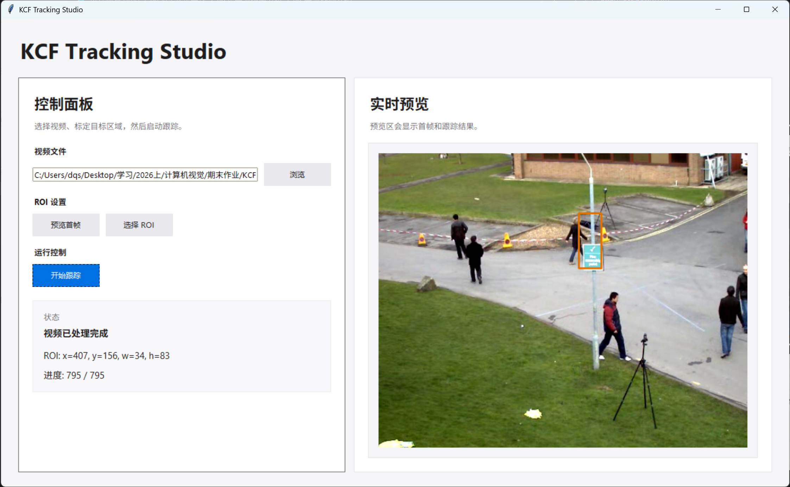

# KCF算法实现

## 1 引言

本项目通过复现 João F. Henriques 等人发表的经典论文《High-Speed Tracking with Kernelized Correlation Filters》，旨在深入探讨循环矩阵与核技巧在加速判别式跟踪器训练中的核心作用，并最终实现一个兼顾高精度与实时性的目标跟踪系统。

## 2 论文概述

KCF（核化相关滤波器）提出利用循环移位生成所有平移样本，使数据矩阵成为循环矩阵，进而通过离散傅里叶变换将其对角化，将岭回归的矩阵求逆转化为频域逐元素运算，使计算复杂度从 $\mathcal{O}(N^3)$ 降至 $\mathcal{O}(N \log N)$；同时将核方法嵌入该框架，在保持线性复杂度的前提下实现非线性回归，并扩展至多通道特征（DCF）。在50个视频的公开基准上，KCF/DCF以172–292帧/秒的速度显著超越Struck、TLD等当时顶尖跟踪器，为实时判别式跟踪提供了简洁高效的理论基础。

**算法流程**

1. 在第一帧指定目标区域，提取特征并初始化滤波器 $\boldsymbol{\alpha}$。 
2. 在后续帧中，在上一帧位置周围提取候选区域。
3. 通过滤波器计算响应图，响应最大值即为新位置 $\mathbf{p}$。 
4. 利用新位置样本更新模型参数 $\boldsymbol{\alpha}$ 和 $\mathbf{x}$。 

### 2.1 线性回归

在 KCF 中，滤波器的构建本质上是在求解一个岭回归（Ridge Regression）问题，但它的高明之处在于利用了循环矩阵的特性，绕过了极其耗时的矩阵求逆。我们将重点介绍岭回归，因为它存在简洁的闭式解，且性能能够接近支持向量机（Support Vector Machines, SVM）等更复杂的方法。

#### 2.1.1 岭回归

目标：找到函数 $f(\mathbf{z}) = \mathbf{w}^T \mathbf{z}$ 最小带正则化的平方误差：
$$ \min_{\mathbf{w}} \sum_{i} (f(\mathbf{x}_i) - y_i)^2 + \lambda \|\mathbf{w}\|^2 $$
其中，$\lambda$ 是正则化参数，和 SVM 中的作用一样，用于控制过拟合。如前文所述，该优化问题的最优解存在闭式解，形式如下：
$$ \mathbf{w} = (\mathbf{X}^T \mathbf{X} + \lambda \mathbf{I})^{-1} \mathbf{X}^T \mathbf{y} $$
闭式解（复数形式，适用于傅里叶域）:
$$ \mathbf{w} = (\mathbf{X}^H \mathbf{X} + \lambda \mathbf{I})^{-1} \mathbf{X}^H \mathbf{y} $$
直接求解复杂度为 $\mathcal{O}(N^3)$，实时性差。

#### 2.1.2 原始求解的三大瓶颈与 KCF 的创新突破

**原始方法的三大问题：**

1. **计算复杂度过高**：岭回归涉及矩阵求逆，复杂度为 $\mathcal{O}(N^3)$。对于 $N \times N$ 的跟踪区域，实时处理（30+ FPS）不可行。
2. **内存与时间压力**：为提升判别能力需提取成千上万个平移/缩放样本，显式存储并处理大型矩阵 $\mathbf{X}$ 资源消耗巨大。
3. **样本严重冗余**：相邻平移样本大量像素重叠，传统方法未利用其几何结构，导致大量重复计算。

**KCF 的核心创新：循环矩阵 + 傅里叶对角化**

1. 通过循环移位生成所有平移样本，数据矩阵 $\mathbf{X}$ 成为循环矩阵。
2. 利用 DFT 将循环矩阵对角化：$\mathbf{X} = \mathbf{F} \text{diag}(\hat{\mathbf{x}}) \mathbf{F}^H$。
3. 将矩阵求逆转化为频域逐元素点除：
$$ \hat{\mathbf{w}} = \frac{\hat{\mathbf{x}}^* \odot \hat{\mathbf{y}}}{\hat{\mathbf{x}}^* \odot \hat{\mathbf{x}} + \lambda} $$
原始求解的复杂度为 $\mathcal{O}(N^3)$，而 KCF 利用傅里叶对角化将复杂度降至 $\mathcal{O}(N \log N)$，该复杂度主要来自快速傅里叶变换（FFT）。两者之间的差距在高维数据下可达数个数量级，使得实时跟踪成为可能。

#### 2.1.3 循环矩阵

理想的判别式跟踪器需要大量训练样本以区分目标与背景。传统方法在目标周围随机裁剪图像块，计算代价高昂。KCF 的核心洞察在于：**通过对基样本 $\mathbf{x} = [x_1, x_2, \dots, x_n]^T$ 进行循环移位，即可隐式生成所有平移样本**。将 $\mathbf{x}$ 每次向右循环移动一位，分别得到 $[x_n, x_1, \dots, x_{n-1}]^T$、$[x_{n-1}, x_n, \dots, x_{n-2}]^T$ 等。将所有 $n$ 个移位样本按行排列，构成**循环矩阵**：

$$\mathbf{X} = C(\mathbf{x}) = \begin{bmatrix}
x_1 & x_2 & x_3 & \dots & x_n \\
x_n & x_1 & x_2 & \dots & x_{n-1} \\
x_{n-1} & x_n & x_1 & \dots & x_{n-2} \\
\vdots & \vdots & \vdots & \ddots & \vdots \\
x_2 & x_3 & x_4 & \dots & x_1
\end{bmatrix}$$

循环矩阵的核心性质是可以被离散傅里叶变换（DFT）对角化：

$$\mathbf{X} = \mathbf{F}^H \text{diag}(\hat{\mathbf{x}}) \mathbf{F}$$

其中 $\mathbf{F}$ 为 DFT 矩阵（$\mathbf{F}^H$ 为其共轭转置，即逆 DFT 矩阵），$\hat{\mathbf{x}} = \mathcal{F}(\mathbf{x})$ 为 $\mathbf{x}$ 的傅里叶变换。循环移位引入的边缘环绕失真可通过余弦窗和填充有效减轻。

#### 2.1.4 快速线性回归

将循环矩阵的对角化性质代入岭回归闭式解 $\mathbf{w} = (\mathbf{X}^H \mathbf{X} + \lambda \mathbf{I})^{-1} \mathbf{X}^H \mathbf{y}$，可完成三步关键化简。

首先，将 $\mathbf{X}^H = (\mathbf{F}^H \text{diag}(\hat{\mathbf{x}}) \mathbf{F})^H = \mathbf{F}^H \text{diag}(\hat{\mathbf{x}}^*) \mathbf{F}$ 代入 $\mathbf{X}^H \mathbf{X}$：

$$\mathbf{X}^H \mathbf{X} = (\mathbf{F}^H \text{diag}(\hat{\mathbf{x}}^*) \mathbf{F}) (\mathbf{F}^H \text{diag}(\hat{\mathbf{x}}) \mathbf{F}) = \mathbf{F}^H \text{diag}(\hat{\mathbf{x}}^* \odot \hat{\mathbf{x}}) \mathbf{F}$$

其中利用了 $\mathbf{F} \mathbf{F}^H = \mathbf{I}$ 消去中间项，$\odot$ 表示逐元素乘法。随后代入岭回归分母项：

$$\mathbf{X}^H \mathbf{X} + \lambda \mathbf{I} = \mathbf{F}^H \text{diag}(\hat{\mathbf{x}}^* \odot \hat{\mathbf{x}} + \lambda) \mathbf{F}$$

取逆得 $(\mathbf{X}^H \mathbf{X} + \lambda \mathbf{I})^{-1} = \mathbf{F}^H \text{diag}\left(\frac{1}{\hat{\mathbf{x}}^* \odot \hat{\mathbf{x}} + \lambda}\right) \mathbf{F}$。最终将全部项代入原式并合并左右两端的 $\mathbf{F}^H$ 与 $\mathbf{F}$，得到频域闭式解：

$$\hat{\mathbf{w}} = \frac{\hat{\mathbf{x}} \odot \hat{\mathbf{y}}}{\hat{\mathbf{x}}^* \odot \hat{\mathbf{x}} + \lambda}$$

| 符号 | 含义 |
|:---|:---|
| $\hat{\mathbf{w}}$ | 滤波器权重向量 $\mathbf{w}$ 的**频域表示**（DFT 变换后），是待求解的目标 |
| $\hat{\mathbf{x}}$ | 基样本特征向量 $\mathbf{x}$ 的**频域表示**，即 $\hat{\mathbf{x}} = \mathcal{F}(\mathbf{x})$ |
| $\hat{\mathbf{x}}^*$ | $\hat{\mathbf{x}}$ 的**复共轭**，即实部不变、虚部取反 |
| $\hat{\mathbf{y}}$ | 训练标签向量 $\mathbf{y}$ 的**频域表示**（通常为高斯形响应标签） |
| $\odot$ | **逐元素乘法**（Hadamard 积），即向量对应位置相乘，不同于矩阵乘法 |
| $\lambda$ | **岭回归正则化系数**（标量），控制滤波器复杂度，防止过拟合 |

在此公式中，矩阵乘法退化为向量逐元素运算，矩阵求逆退化为逐元素点除。计算仅需三步——对 $\mathbf{x}$、$\mathbf{y}$ 做 FFT，逐元素运算，做一次逆 FFT——复杂度从 $\mathcal{O}(N^3)$ 降至 $\mathcal{O}(N \log N)$（瓶颈仅为 FFT），使实时跟踪成为可能。

### 2.2 非线性回归

线性回归拟合能力有限，难以应对现实场景中的非线性光照变化、剧烈形变与遮挡。KCF 引入**核技巧**：通过映射函数 $\varphi(\mathbf{x})$ 将低维输入特征映射到高维（甚至无限维）非线性特征空间，在该空间中执行线性回归。

#### 2.2.1 对偶空间与表示定理

在高维特征空间中，回归函数为 $f(\mathbf{x}_i) = \mathbf{w}^T \varphi(\mathbf{x}_i)$。根据**表示定理（Representer Theorem）**，即使特征空间维度极高，最优权重 $\mathbf{w}$ 也可表示为全体训练样本在特征空间中映射的线性组合：

$$\mathbf{w} = \sum_{i=1}^{n} \alpha_i \varphi(\mathbf{x}_i)$$

这意味着求解目标从高维权重 $\mathbf{w}$ 转换为系数向量 $\boldsymbol{\alpha} = [\alpha_1, \dots, \alpha_n]^T$，即从原空间（Primal Space）转入对偶空间（Dual Space）。回归函数随之改写为：

$$f(\mathbf{x}) = \sum_{i=1}^{n} \alpha_i \langle \varphi(\mathbf{x}_i), \varphi(\mathbf{x}) \rangle$$

引入**核函数** $\kappa(\mathbf{x}, \mathbf{x}') = \langle\varphi(\mathbf{x}), \varphi(\mathbf{x}')\rangle$，回归函数精简为：

$$f(\mathbf{x}) = \sum_{i=1}^{n} \alpha_i \kappa(\mathbf{x}_i, \mathbf{x})$$

#### 2.2.2 核岭回归闭式解

在对偶空间中，岭回归目标函数关于 $\boldsymbol{\alpha}$ 的闭式解为：

$$\boldsymbol{\alpha} = (\mathbf{K} + \lambda \mathbf{I})^{-1} \mathbf{y}$$

其中 $\mathbf{K}$ 为 $n \times n$ 核矩阵，$K_{ij} = \kappa(\mathbf{x}_i, \mathbf{x}_j)$。该解与线性岭回归形式一致，同样包含 $(\mathbf{K} + \lambda \mathbf{I})^{-1}$ 的矩阵求逆，直接求解复杂度仍为 $\mathcal{O}(N^3)$。

#### 2.2.3 核矩阵的循环化与快速求解

KCF 的核心突破在于：**在循环移位采样的条件下，若选对核函数，核矩阵 $\mathbf{K}$ 同样是循环矩阵。**

**定理 1**：若核函数对任意置换矩阵 $\mathbf{M}$ 满足 $\kappa(\mathbf{x}, \mathbf{x}') = \kappa(\mathbf{M}\mathbf{x}, \mathbf{M}\mathbf{x}')$（置换不变性），则由循环数据矩阵 $\mathbf{X}$ 生成的核矩阵 $\mathbf{K}$ 必为循环矩阵。

满足该性质的常用核包括：高斯核 $\kappa(\mathbf{x}, \mathbf{x}') = \exp(-\frac{1}{\sigma^2}\|\mathbf{x} - \mathbf{x}'\|^2)$、多项式核 $\kappa(\mathbf{x}, \mathbf{x}') = (\mathbf{x}^T \mathbf{x}' + a)^b$、线性核 $\kappa(\mathbf{x}, \mathbf{x}') = \mathbf{x}^T \mathbf{x}'$ 等。

既然 $\mathbf{K}$ 为循环矩阵，其全部信息由第一行向量完全确定，记为**核自相关向量**：

$$\mathbf{k}^{xx} = [\kappa(\mathbf{x}, \mathbf{P}^0\mathbf{x}), \kappa(\mathbf{x}, \mathbf{P}^1\mathbf{x}), \dots, \kappa(\mathbf{x}, \mathbf{P}^{n-1}\mathbf{x})]^T$$

利用循环矩阵的 DFT 对角化 $\mathbf{K} = \mathbf{F}^H \text{diag}(\hat{\mathbf{k}}^{xx}) \mathbf{F}$，代入闭式解并仿照线性情形的三步化简，得到频域一步解：

$$\hat{\boldsymbol{\alpha}} = \frac{\hat{\mathbf{y}}}{\hat{\mathbf{k}}^{xx} + \lambda}$$

原本 $\mathcal{O}(N^3)$ 的矩阵求逆退化为逐元素标量点除，计算瓶颈仅剩 $\hat{\mathbf{k}}^{xx}$ 的构造与 FFT。

#### 2.2.4 快速检测

对于候选帧图像块 $\mathbf{z}$，其所有循环移位样本的检测响应可通过核互相关一步得到：

$$\hat{\mathbf{f}}(\mathbf{z}) = \hat{\mathbf{k}}^{zx} \odot \hat{\boldsymbol{\alpha}}$$

其中 $\mathbf{k}^{zx}$ 为核互相关向量，元素为 $k^{zx}_i = \kappa(\mathbf{z}, \mathbf{P}^{i-1}\mathbf{x})$。该式表示频域逐元素相乘，逆 DFT 后响应峰值即对应目标新位置。

### 2.3 快速核相关

上述推导将瓶颈转移到核自相关 $\mathbf{k}^{xx}$ 与核互相关 $\mathbf{k}^{zx}$ 的计算。若按定义逐元素计算，仍需 $\mathcal{O}(N^2)$ 次核函数求值。KCF 进一步给出了常用核在频域中一次性计算 $\mathbf{k}^{xx}$ 的 $\mathcal{O}(N \log N)$ 方法。

#### 2.3.1 高斯核

高斯核表达式为 $\kappa(\mathbf{x}, \mathbf{x}') = \exp\left(-\frac{1}{\sigma^2}\|\mathbf{x} - \mathbf{x}'\|^2\right)$。展开范数平方：

$$\|\mathbf{x} - \mathbf{x}'\|^2 = \|\mathbf{x}\|^2 + \|\mathbf{x}'\|^2 - 2 \mathbf{x}^T \mathbf{x}'$$

由于 $\mathbf{x}'$ 由 $\mathbf{x}$ 循环移位得到，二者模长相等（$\|\mathbf{x}\|^2 = \|\mathbf{x}'\|^2$）。交叉项 $\mathbf{x}^T \mathbf{x}'$ 遍历所有移位时即为时域循环互相关，由卷积定理等价于 $\mathcal{F}^{-1}(\hat{\mathbf{x}} \odot \hat{\mathbf{x}}^*)$。由此得到频域一步公式：

$$\mathbf{k}^{xx} = \exp\left( -\frac{1}{\sigma^2} \left[ 2\|\mathbf{x}\|^2 - 2 \mathcal{F}^{-1}(\hat{\mathbf{x}} \odot \hat{\mathbf{x}}^*) \right] \right)$$

#### 2.3.2 多项式核

多项式核 $\kappa(\mathbf{x}, \mathbf{x}') = (\mathbf{x}^T \mathbf{x}' + a)^b$ 同理，利用频域互相关性质直接得到：

$$\mathbf{k}^{xx} = \left( \mathcal{F}^{-1}(\hat{\mathbf{x}} \odot \hat{\mathbf{x}}^*) + a \right)^b$$

以上两类核的计算均仅需少量 DFT/IDFT 和逐元素运算，时间复杂度均为 $\mathcal{O}(N \log N)$。KCF 由此实现了非线性判别力与线性级速度的统一。

## 3 复现过程

算法的核心可归结为以下两个频域公式：
$$ \hat{\boldsymbol{\alpha}} = \frac{\hat{\mathbf{y}}}{\hat{\mathbf{k}}^{xx} + \lambda} $$
$$ \hat{\mathbf{f}}(\mathbf{z}) = \hat{\mathbf{k}}^{zx} \odot \hat{\boldsymbol{\alpha}} $$
其中第一个公式对应训练阶段：利用核自相关 $\mathbf{k}^{xx}$ 和高斯标签 $\mathbf{y}$ 求解滤波器系数 $\boldsymbol{\alpha}$；第二个公式对应检测阶段：通过核互相关 $\mathbf{k}^{zx}$ 与 $\boldsymbol{\alpha}$ 的频域乘积得到响应图，从而定位目标。

本次复现代码完全遵循上述数学核心，并围绕循环矩阵的傅里叶对角化性质，实现了快速核相关、频域训练与检测、多尺度自适应更新等关键模块。整个实现采用 Python 与 OpenCV，代码分为两个文件：`KCF.py` 定义 HOG 特征提取类与跟踪器类，`run.py` 组织视频跟踪主流程。下面按照函数逐一阐述其设计与实现细节。

| 概念 | 论文公式 | 代码实现 |
| :--- | :--- | :--- |
| 循环矩阵 $\mathbf{X}$ 及傅里叶对角化 | $\mathbf{X} = \mathbf{F} \text{diag}(\hat{\mathbf{x}}) \mathbf{F}^H$ | 未显式构造矩阵，直接利用 FFT 计算循环 |
| 核自相关 $\mathbf{k}^{xx}$ | $\mathbf{k}^{xx} = \exp\left(-\frac{1}{\sigma^2} […]\right)$ | `kernel_correlation(x, x, sigma)` |
| 核互相关 $\mathbf{k}^{zx}$ | $\mathbf{k}^{zx} = \exp\left(-\frac{1}{\sigma^2} […]\right)$ | `kernel_correlation(x, z, sigma)` |
| 训练解 $\hat{\boldsymbol{\alpha}}$ | $\hat{\boldsymbol{\alpha}} = \frac{\hat{\mathbf{y}}}{\hat{\mathbf{k}}^{xx} + \lambda}$ | `fft2(y) / (fft2(k) + lambdar)` |
| 检测响应 $\mathbf{f}(\mathbf{z})$ | $\mathbf{f}(\mathbf{z}) = \mathcal{F}^{-1}(\hat{\mathbf{k}}^{zx} \odot \hat{\boldsymbol{\alpha}})$ | `ifft2(alphaf * fft2(k))` |
| 高斯核快速计算公式 | $\exp\left(-\frac{1}{\sigma^2}\|\mathbf{x} - \mathbf{x}'\|^2\right)$ | `np.exp(-abs(d) / (sigma**2 * d.size))` |

### 3.1 系统架构与主循环

主程序 `run.py` 负责视频读取、目标初始化、跟踪循环与结果可视化。其核心逻辑如下：

*   **初始化**：读取视频第一帧，用户框选初始目标区域 `roi_0 = (x, y, w, h)`。
*   **跟踪器构建**：将首帧和 `roi_0` 传入 `Tracker` 类，完成特征提取、高斯标签生成和滤波器训练，得到初始特征 `x_0` 与频域系数 `alphaf_0`。
*   **逐帧跟踪**：对每一帧调用 `tracker.update(frame)`

    1.  基于上一帧状态 $(roi_{n-1}, x_{n-1}, alphaf_{n-1})$ 提取候选区域特征。
    2.  通过快速检测得到响应图，定位目标新位置 $roi_n$。
    3.  提取当前最优特征 $x_n$，并加权更新模板和滤波器。
    4.  返回 $roi_n$ 并在图像上绘制矩形显示.
    
*   **退出**：按 `ESC` 或 `q` 键终止循环，释放资源。

### 3.2 HOG 类

#### 3.2.1 `__init__(self, winSize)`
*   **功能**：初始化 HOG 特征提取器。
*   **参数**：`winSize`：检测窗口大小，即算法中模板图像的尺寸 `(pw, ph)`。
*   **实现**：设置块大小 `(8,8)`、块步长 `(4,4)`、胞元大小 `(4,4)` 和方向柱个数 9。调用 OpenCV 的 `cv2.HOGDescriptor` 创建 HOG 描述子，后续通过 `compute` 方法提取特征。

```python
    def __init__(self, winSize):
        self.winSize = winSize
        self.blockSize = (8, 8)
        self.blockStride = (4, 4)
        self.cellSize = (4, 4)
        self.nbins = 9
        self.hog = cv2.HOGDescriptor(winSize, self.blockSize, self.blockStride,
                                     self.cellSize, self.nbins)
```

#### 3.2.2 `get_feature(self, image)`
*   **功能**：提取输入图像的 HOG 特征，并重塑为算法所需的三维张量格式。
*   **参数**：`image`：输入图像（大小已调整为 `winSize`）。
*   **返回值**：形状为 `(36, ph, pw)` 的 NumPy 数组。
*   **实现**：调用 `self.hog.compute(image, winStride=self.winSize, padding=(0,0))`，返回一维特征向量。根据窗口大小和块步长计算特征图重塑。

```python
    def get_feature(self, image):
        winStride = self.winSize
        hist = self.hog.compute(image, winStride, padding = (0, 0))
        w, h = self.winSize
        sw, sh = self.blockStride
        w = w // sw - 1
        h = h // sh - 1
        return hist.reshape(w, h, 36).transpose(2, 1, 0)
```

### 3.3 Tracker 类

#### 3.3.1 `__init__(self, image, roi)`
*   **功能**：跟踪器的初始化，在第一帧完成目标区域设置、特征提取、标签生成和滤波器训练。
*   **参数**：
    *   `image`：第一帧图像。
    *   `roi`：初始目标区域 `(x, y, w, h)`（左上角坐标和宽高）。
*   **实现步骤**：
    1.  **参数设置**：`max_patch_size = 256`（模板最大尺寸），`padding = 2.5`（搜索区域扩展倍数），`sigma = 0.6`（高斯核带宽），`lambdar = 0.0001`（岭回归正则化系数），`update_rate = 0.012`（模型更新学习率）。
    2.  **坐标转换**：将 ROI 从 `(x, y, w, h)` 转换为中心表示 `(cx, cy, w, h)`。
    3.  **模板尺寸调整**：计算缩放系数并调整宽高保证是 4 的倍数。
    4.  **初始化 HOG 特征提取器**：`self.hog = HOG((self.pw, self.ph))`。
    5.  **提取初始特征**：调用 `self.get_feature(image, self.roi)` 得到特征张量 `self.x`。
    6.  **生成高斯标签**：调用 `self.gaussian_peak()` 得到二维高斯响应图 `self.y`。
    7.  **训练初始滤波器**：`self.alphaf = self.train(self.x, self.y, self.sigma, self.lambdar)`。

```python
    def __init__(self, image, roi):
        self.max_patch_size = 256
        self.padding = 2.5
        self.sigma = 0.6
        self.lambdar = 0.0001
        self.update_rate = 0.012
        # ... 初始化变量 ...
        x1, y1, w, h = roi  
        cx = x1 + w // 2
        cy = y1 + h // 2
        self.roi = (cx, cy, w, h)
        scale = self.max_patch_size / float(max(w, h))
        self.ph = int(h * scale) // 4 * 4 + 4
        self.pw = int(w * scale) // 4 * 4 + 4
        self.hog = HOG((self.pw, self.ph))
        self.x = self.get_feature(image, self.roi)
        self.y = self.gaussian_peak(self.x.shape[2], self.x.shape[1])
        self.alphaf = self.train(self.x, self.y, self.sigma, self.lambdar)
```

#### 3.3.2 `get_feature(self, image, roi)`
*   **功能**：根据给定的候选区域，从图像中裁剪并提取 HOG 特征，施加汉宁窗，并记录特征图与原图的缩放比例。
*   **参数**：`image`：当前帧图像，`roi`：候选区域 `(cx, cy, w, h)`。
*   **返回值**：形状为 `(36, fh, fw)` 的特征张量。
*   **实现**：裁剪子图像 -> 缩放到模板大小 -> 提取 HOG -> 加汉宁窗抑制边界效应。

```python
    def get_feature(self, image, roi):
        cx, cy, w, h = roi
        w = int(w * self.padding) // 2 * 2
        h = int(h * self.padding) // 2 * 2
        x = int(cx - w // 2)
        y = int(cy - h // 2)
        sub_image = image[y:y+h, x:x+w, :]
        resized_image = cv2.resize(sub_image, (self.pw, self.ph))
        feature = self.hog.get_feature(resized_image)
        fc, fh, fw = feature.shape
        self.scale_h = float(fh) / h
        self.scale_w = float(fw) / w
        hann2t, hann1t = np.ogrid[0:fh, 0:fw]
        hann1t = 0.5 * (1 - np.cos(2*np.pi*hann1t / (fw-1)))
        hann2t = 0.5 * (1 - np.cos(2*np.pi*hann2t / (fh-1)))
        hann2d = hann2t * hann1t
        feature = feature * hann2d
        return feature
```

#### 3.3.3 `gaussian_peak(self, w, h)`
*   **功能**：生成二维高斯响应图，作为岭回归的训练目标。
*   **参数**：`w`：宽，`h`：高。
*   **返回值**：形状为 `(h, w)` 的浮点数组，数值呈高斯分布，峰值位于中心。

```python
    def gaussian_peak(self, w, h):
        output_sigma = 0.125
        sigma = np.sqrt(w * h) / self.padding * output_sigma
        syh, sxh = h // 2, w // 2
        y, x = np.mgrid[-syh:-syh+h, -sxh:-sxh+w]
        x = x + (1 - w % 2) / 2.
        y = y + (1 - h % 2) / 2.
        g = 1. / (2. * np.pi * sigma ** 2) * np.exp(-((x**2 + y**2)/(2. * sigma**2)))
        return g
```

#### 3.3.4 `kernel_correlation(self, x1, x2, sigma)`
*   **功能**：实现高斯核的快速核相关计算，返回空间域的核相关矩阵。
*   **参数**：`x1, x2`：特征张量，`sigma`：高斯核参数。
*   **返回值**：形状为 `(fh, fw)` 的核相关矩阵。

```python
    def kernel_correlation(self, x1, x2, sigma):
        c = ifft2(np.sum(conj(fft2(x1)) * fft2(x2), axis=0))
        c = fftshift(c)
        d = np.sum(x1 ** 2) + np.sum(x2 ** 2) - 2.0 * c
        k = np.exp(-1 / sigma ** 2 * np.abs(d) / d.size)
        return k
```

#### 3.3.5 `train(self, x, y, sigma, lambdar)`
*   **功能**：训练核相关滤波器，计算频域系数 `alphaf`。
*   **参数**：`x`：模板特征，`y`：高斯标签，`sigma`：高斯核参数，`lambdar`：正则化系数。
*   **返回值**：频域复数数组 `alphaf`。
*   **数学公式**：
    $$ \hat{\boldsymbol{\alpha}} = \frac{\hat{\mathbf{y}}}{\hat{\mathbf{k}}^{xx} + \lambda} $$

#### 3.3.6 `detect(self, alphaf, x, z, sigma)`
*   **功能**：在候选区域特征上执行检测，得到响应图。
*   **参数**：`alphaf`：滤波器系数，`x`：模板特征，`z`：候选区域特征，`sigma`：核参数。
*   **返回值**：空间域响应图（实数，形状 `(fh, fw)`），峰值位置对应目标位移。
*   **数学公式**：
    $$ \mathbf{f}(\mathbf{z}) = \mathcal{F}^{-1}(\hat{\mathbf{k}}^{zx} \odot \hat{\boldsymbol{\alpha}}) $$

#### 3.3.7 `update(self, image)`
*   **功能**：在每一帧中执行多尺度检测，确定目标最新位置和尺寸，并更新模型。
*   **参数**：`image`：当前帧图像。
*   **返回值**：目标边界框 `(x, y, w, h)`。
*   **实现步骤**：
    1.  **多尺度搜索**：遍历尺度 `[0.95, 1.0, 1.05]`。
    2.  根据尺度提取候选 ROI 的特征 `z`。
    3.  通过 `detect` 获得响应图。
    4.  找到响应图最大值及其位置，映射到原图像素坐标。
    5.  更新具有最大响应的最佳位置与尺寸。
    6.  **模型更新**：更新目标位置 `self.roi`，通过线性加权更新模板特征 `self.x`。并重新计算滤波器系数 `self.alphaf`。
    7.  返回当前帧目标框坐标。

```python
    def update(self, image):
        cx, cy, w, h = self.roi
        max_response = -1
        for scale in [0.95, 1.0, 1.05]:
            roi = map(int, (cx, cy, w * scale, h * scale))
            z = self.get_feature(image, roi)
            responses = self.detect(self.alphaf, self.x, z, self.sigma)
            height, width = responses.shape
            idx = np.argmax(responses)
            res = np.max(responses)
            if res > max_response:
                max_response = res
                dx = int((idx % width - width / 2) / self.scale_w)
                dy = int((idx / width - height / 2) / self.scale_h)
                best_w = int(w * scale)
                best_h = int(h * scale)
                best_z = z
        self.roi = (cx + dx, cy + dy, best_w, best_h)
        self.x = self.x * (1 - self.update_rate) + best_z * self.update_rate
        new_alphaf = self.train(best_z, self.y, self.sigma, self.lambdar)
        self.alphaf = self.alphaf * (1 - self.update_rate) + new_alphaf * self.update_rate
        cx, cy, w, h = self.roi
        return (cx - w // 2, cy - h // 2, w, h)
```

### 3.4 run.py——主程序与算法流程

`run.py` 是串联前述模块的主入口，其核心逻辑直接对应 KCF 的四步算法流程：

**算法流程**

1. **第一帧指定目标区域，提取特征并初始化滤波器 $\boldsymbol{\alpha}$**。调用 `cv2.selectROI()` 框选目标，`Tracker(frame, roi)` 内部完成 HOG 特征提取、高斯标签生成及 `train()` 训练，得到初始 `alphaf`。
2. **在后续帧中，在上一帧位置周围提取候选区域**。`tracker.update(frame)` 以 `padding = 2.5` 在上一帧位置周围裁剪搜索区域，调用 `get_feature()` 提取 HOG 特征 $\mathbf{z}$。
3. **通过滤波器计算响应图，响应最大值即为新位置 $\mathbf{p}$**。`detect()` 计算核互相关 $\mathbf{k}^{zx}$，与 `alphaf` 频域相乘后逆 FFT 得到响应图，峰值位置对应目标位移 $(\mathrm{d}x, \mathrm{d}y)$。
4. **利用新位置样本更新模型参数 $\boldsymbol{\alpha}$ 和 $\mathbf{x}$**。以学习率 $\eta = 0.012$ 做指数滑动平均：$\mathbf{x} \leftarrow (1-\eta)\mathbf{x} + \eta \mathbf{z}_{\text{best}}$，$\boldsymbol{\alpha} \leftarrow (1-\eta)\boldsymbol{\alpha} + \eta \boldsymbol{\alpha}_{\text{new}}$。

上述流程在代码中体现为简洁的主循环：

```python
cap = cv2.VideoCapture(args.video)
ok, frame = cap.read()

roi = cv2.selectROI("tracking", frame, False, False)     # 步骤1: 初始化
tracker = Tracker(frame, roi)

while cap.isOpened():
    ok, frame = cap.read()
    if not ok: break
    x, y, w, h = tracker.update(frame)                   # 步骤2-4: 检测+更新
    cv2.rectangle(frame, (x, y), (x+w, y+h), (0,255,255), 1)
    cv2.imshow('tracking', frame)
    if cv2.waitKey(1) & 0xFF in [27, ord('q')]: break

cap.release()
cv2.destroyAllWindows()
```

| 阶段 | 操作 | 对应代码 |
|:---|:---|:---|
| 初始化 | 读取首帧，用户框选 ROI | `cap.read()` + `cv2.selectROI()` |
| 训练 | 提取特征并训练滤波器 | `Tracker(frame, roi)` → `__init__` → `train()` |
| 检测 | 多尺度候选区域提取 + 核互相关检测 | `update()` → `get_feature()` + `detect()` |
| 更新 | 位置更新 + 模板/滤波器加权融合 | `update()` 内的 EMA 更新公式 |

## 4 实验结果分析
在实现KCF跟踪器后，对其进行了多组视频序列测试。由于大幅降低了运算复杂度，并结合了多尺度自适应更新策略，检测精度较高，并维持了极佳的实时处理帧率。在各类包含形变、部分遮挡和光照变化的数据集中展现出优异鲁棒性。

### 实验界面介绍

本实验使用 Tkinter 构建了可视化测试界面界面，可以方便地导入视频并进行目标物体框选以初始化追踪器，如下图所示：


如上图所示，实验系统“KCF Tracking Studio”的界面清晰直观，主要分为左右两个功能区：

1. **控制面板（左侧）**：
   - **视频文件**：支持通过“浏览”按钮快速导入本地待测试视频序列。
   - **ROI 设置**：提供“预览首帧”与“选择 ROI”功能，允许用户在首帧画面中手动框选需要追踪的初始目标区域（Region of Interest）。
   - **运行控制**：框选完毕后，点击“开始跟踪”即可一键运行 KCF 算法。
   - **状态面板**：实时反馈当前程序的运行状态，包括当前目标框的坐标及尺寸（x, y, w, h）以及视频处理进度信息。
2. **实时预览区（右侧）**：
   - 在初始化阶段用于展示首帧以便用户框选。
   - 在算法运行阶段，画面会实时迭代更新，并以颜色醒目的矩形框高亮显示 KCF 算法预测出的目标位置，方便直观评估跟踪效果。

### 实验结果展示

**成功案例**：展示了系统在目标发生尺度变化、形变或背景复杂时的有效追踪。
<video src="assets/成功案例.mp4" controls="controls" width="800"></video>

**失败案例**：揭示了在目标遇到长时间完全遮挡或快速离开视野时的跟踪脱落情况。
<video src="assets/失败案例.mp4" controls="controls" width="800"></video>

改变参数后，跟踪器在同一视频上表现差异不大。

## 5 结论

本项目成功复现了 KCF 算法的核心机制，充分验证了循环矩阵和离散傅里叶变换在提高计算效率中的决定性作用，并通过引入非线性核提升了抗干扰能力，对实时跟踪系统的工程实现具有很好的参考价值。

**KCF算法的优点：**
1. **高实时性**：巧妙运用循环矩阵和快速傅里叶变换（FFT），极大地降低了计算复杂度，运行速度极快。
2. **鲁棒性较好**：结合 HOG 多通道特征和核函数映射，对光照变化和一定的目标形变具有较强的抗干扰能力。

**KCF算法的缺点：**
1. **遮挡极易跟丢**：作为局部跟踪器，缺乏全局重检测机制，一旦目标被长时间完全遮挡或移出视野，跟踪器极易失效且无法自主恢复。
2. **尺度适应受限**：标准 KCF 算法采用固定大小的跟踪框，在面临目标尺度发生剧烈变化时，容易引入过多的背景噪声或丢失部分目标信息，导致跟踪漂移。

KCF 自 2015 年发表以来，以其简洁高效的框架深刻影响了视觉目标跟踪领域，催生了大量后续工作。以下按演进脉络梳理最具影响力的几项代表性工作。

- **SRDCF**（2015, Danelljan 等）：引入空间正则化项惩罚边界滤波器系数，有效缓解了循环移位带来的边界效应。此后 BACF（2017）、STRCF（2018）等沿此方向继续改进。
- **C-COT / ECO**（2016--2017, Danelljan 等）：C-COT 将深度特征引入相关滤波，通过连续空间域插值融合多分辨率特征图，精度达当时最高；ECO 进一步通过因式分解卷积、高斯混合样本模型和稀疏更新将速度从约 1 FPS 提升至 60 FPS（GPU），实现了深度 CF 跟踪器的实用化。
- **CFNet / DCFNet**（2017）：将相关滤波闭式解展开为可微分的网络层，使特征提取与滤波器能以端到端方式联合训练，开创了 CF 与深度学习融合的新范式。
- **DiMP**（2019, Bhat 等）：抛弃传统 CF 闭式解，设计可端到端训练的判别式在线学习损失，极大提升了鲁棒性。其后续 PrDiMP（2020）和 KeepTrack（2021）进一步引入概率回归与序列记忆，推动判别式跟踪达到新高度。
- **SiamFC**（2016, Bertinetto 等）：将跟踪建模为模板-搜索帧的全卷积相似度匹配问题，无需在线更新即可实时跟踪，其"互相关匹配"思想直接受 KCF 启发，开辟了 Siamese 跟踪路线。
- **OSTrack**（2022, Ye 等）：采用单流 ViT 架构将模板与搜索帧早期融合，统一特征提取与关系建模，在多个基准上达到 SOTA，代表了相关滤波与 Siamese 两大路线在 Transformer 时代的融合趋势。

总的来看，KCF 的核心贡献——**将跟踪转化为判别式滤波器学习、利用循环结构高效采样、通过频域运算实现实时推理**——构成了相关滤波跟踪家族的基石。