# 1 About this Project

## 1.1 项目背景

语言模型正在向能处理多样化自然语言任务的通用系统演进。本次作业聚焦其中一个方向——数学推理，并以此为实验平台，系统性地完成评估体系构建、监督微调（SFT）以及基于强化学习（GRPO）的推理训练。与以往作业相比，本次有两点关键变化：

1. 不再使用之前作业中的语言模型代码库和模型。理想情况下，我们希望使用先前作业中训练的基础语言模型，但之前性能过于薄弱，无法展现复杂的数学推理能力。因此，我们将改用一个可获取的现代高性能语言模型（Qwen 2.5 Math 1.5B Base），并在此模型基础上开展大部分工作。
2. 引入一个新的基准数据集来评估语言模型。在此之前，我们一直认为交叉熵是许多下游任务的良好替代指标。但本次作业的核心是缩小基础模型与下游任务之间的差距，因此必须使用独立于交叉熵的评估方法。我们将采用 Hendrycks 等人（2021）提出的 MATH 12K 数据集，该数据集包含具有挑战性的高中竞赛数学问题。通过对比语言模型的输出与参考答案来进行评估。

**核心内容涵盖**

1. 针对 Hendrycks 等人（2021）提出的竞赛数学问题数据集 MATH，构建零样本提示基线模型。
2. 利用更强推理模型（DeepSeek R1）的推理轨迹，进行有监督微调（SFT）。
3. 运用组相对策略优化（GRPO）方法，通过验证奖励改善推理性能。

**需实现的内容**

1. 评估 Qwen 2.5 Math 1.5B 模型的零样本提示性能（作为基线）。
2. 利用 R1 模型的推理轨迹，对 Qwen 2.5 Math 1.5B 进行有监督微调（SFT）。
3. 借助验证奖励，对 Qwen 2.5 Math 1.5B 运行 GRPO 算法。

## 1.2 模型选择

整个项目使用 **Qwen 2.5 Math 1.5B Base** 模型（Yang et al., 2024），该模型是在 Qwen 2.5 1.5B 基础上，利用高质量合成数学预训练数据持续预训练得到的。选择 Base 模型而非 Instruct 模型的原因在于：作业的目的是从零学习对齐——SFT、GRPO 本身就是一个将 Base 模型"对齐"到能按指定格式逐步推理的过程。如果起点已是 Instruct 模型，对齐效果大部分已存在，无法体现各方法的训练效果差异。

## 1.3 代码结构

```
basics/                        # 项目根目录
├── __init__.py                # 包初始化文件
├── drgrpo_grader.py           # 数学答案评分模块（奖励函数）
├── evaluate_base_MATH.py      # 基线/SFT 模型评估脚本
├── prompts/
│   └── r1_zero.prompt         # R1-Zero 风格 prompt 模板
├── data/
│   ├── checkpoints/           # 模型检查点与评估结果
│   │   ├── base_qwen_1.5b/          # 基线模型评估输出
│   │   ├── sft_qwen_1.5b_full/      # SFT（带推理链）检查点
│   │   ├── sft_raw_qwen_1.5b_full/  # SFT（原始数据）检查点
│   │   └── grpo_qwen_1.5b_full/     # GRPO 训练检查点
│   ├── math/                  # MATH 数据集
│   │   ├── train.jsonl        # GRPO 训练集
│   │   ├── val.jsonl          # 验证集
│   │   ├── sft.jsonl          # SFT 训练集（含推理链）
│   │   └── sft_filtered.jsonl # 过滤后的 SFT 训练集
│   └── models/
│       └── Qwen2.5-Math-1.5B/ # Qwen2.5-Math-1.5B 基座模型权重
├── sft/                       # 监督微调（SFT）模块
│   ├── config.yaml            # SFT 训练配置
│   ├── sft_train.py           # SFT 训练主入口
│   ├── sft_helper.py          # 分词、对数概率计算、SFT loss
│   ├── policy_evaluation.py   # vLLM 策略评估（SFT 训练共用）
│   └── get_cosine_lr.py       # Cosine 学习率调度器
├── grpo/                      # GRPO 强化学习模块
│   ├── grpo_train.yaml        # GRPO 训练配置
│   ├── grpo_train.py          # GRPO 训练主入口
│   ├── grpo_helper.py         # 组归一化奖励、PPO-clip loss、数据集类
│   └── grpo_evaluator.py      # GRPO 评估脚本
└── wandb/                     # Weights & Biases 运行日志
```

## 1.4 本报告的目标

本报告包含以下三个主要部分的实验：

| 部分 | 核心内容 |
|------|----------|
| 零样本 MATH 基线评估 | 评估 Base 模型的零样本推理能力，统计格式和正确性 |
| SFT 监督微调 |  用 R1 推理轨迹微调模型 |
| GRPO 策略梯度 |  从零实现 GRPO 强化学习训练 |

# 2 Create a Virtual Environment

## 2.1 环境要求

- **Python**: 3.12
- **包管理**: uv
- **CUDA**: 需要支持 bfloat16 和 FlashAttention-2 的 NVIDIA GPU

## 2.2 安装步骤

按照 README 中的说明，使用 uv 管理依赖：

```bash

# 安装依赖（flash-attn 需要单独安装）
uv sync --no-install-package flash-attn
uv sync
```

## 2.3 主要依赖

| 依赖 | 用途 |
|------|------|
| `torch` | 深度学习框架 |
| `transformers` | HuggingFace 模型加载与分词 |
| `vllm` | 高吞吐推理引擎 |
| `wandb` | 实验跟踪与可视化 |
| `sympy`, `math_verify` | 数学答案验证 |
| `flash-attn` | FlashAttention-2 加速 |


# 3 Dataset

## 3.1 数据集概览

本实验使用 **MATH** 数据集（Hendrycks et al., 2021）。MATH 由具有挑战性的高中竞赛数学问题组成，共 12K 个样本（7K 训练 + 5K 验证），涵盖代数、几何、概率、数论等多个数学子领域。

## 3.2 数据文件

MATH 数据集位于集群路径 `/data/a5-alignment/MATH/` 下，包含三个文件，每个文件均为 JSON 数组格式。

| 文件 | 样本数 | 字段 | 用途 |
|------|:------:|------|------|
| `train.jsonl` | 7,000 | `problem`, `expected_answer` | 训练问题池——GRPO 算法在训练时从此集合随机采样问题进行 rollout |
| `val.jsonl` | 5,000 | `problem`, `expected_answer` | 验证集——所有实验（零样本基线、SFT、GRPO）统一用它评估，保证可比性 |
| `sft_filtered.jsonl` | 3,496 | `problem`, `reasoning_trace`, `extracted_answer`, `expected_answer` | SFT 训练数据——由 DeepSeek R1 模型生成的推理链，在此基础上进行了筛选仅保留答案正确的样本 |


### 3.2.1 `train.jsonl` — 训练问题池

每个样本包含一个 LaTeX 格式的数学问题及其标准答案。该文件用于 GRPO 训练阶段的 rollout 采样。

**样例 1：**

```json
{
  "problem": "Let \\[f(x) = \\left\\{\\begin{array}{cl} ax+3, &\\text{ if }x>2, \\\\ x-5 &\\text{ if } -2 \\le x \\le 2, \\\\ 2x-b &\\text{ if } x <-2. \\end{array}\\right.\\] Find $a+b$ if the piecewise function is continuous (which means that its graph can be drawn without lifting your pencil from the paper).",
  "expected_answer": "0"
}
```

**样例 2：**

```json
{
  "problem": "What is the area of the triangle bounded by the lines $y=x,$ $y=-x,$ and $y=6$?",
  "expected_answer": "36"
}
```

该问题考察坐标系中直线围成三角形的面积计算，涉及解析几何。

### 3.2.2 `val.jsonl` — 验证集

验证集结构与训练集一致，但问题互不重叠。所有实验（零样本基线、SFT、GRPO）均在此集合上评估，以保证结果可比性。

**样例 1：**

```json
{
  "expected_answer": "420",
  "problem": "What is $10.0000198\\cdot 5.9999985401\\cdot 6.9999852$ to the nearest whole number?"
}
```

**样例 2：**

```json
{
  "expected_answer": "\\dfrac{1}{9}",
  "problem": "Two fair 6-sided dice are rolled. What is the probability the sum rolled is 9?"
}
```


### 3.2.3 `sft_filtered.jsonl` — SFT 训练数据

该文件由 DeepSeek R1 模型（DeepSeekAI et al., 2025）通过批量推理生成，并经筛选仅保留答案正确的样本。每个样本的 `reasoning_trace` 字段包含完整的思维链推理过程，采用 `<think>...</think><answer>...</answer>` 格式，与 GRPO 所需的输出格式完全一致。

**样例 1：**

```json
{
  "problem": "The two lines $y = 4x - 19$ and $2x+y = 95$ intersect. What is the value of $x$ at the point of intersection?",
  "reasoning_trace": "We substitute the expression for y from the first equation into the second: 2x + (4x − 19) = 95 → 6x − 19 = 95 → 6x = 114 → x = 19.</think> <answer>19</answer>",
  "extracted_answer": "19",
  "expected_answer": "19"
}
```

**样例 2：**

```json
{
  "problem": "The area of a circle is $49\\pi$ square units. What is the radius of the circle, in units?",
  "reasoning_trace": "The area of a circle is given by \\(A = \\pi r^2\\). Setting this equal to the given area:\n\\[\\pi r^2 = 49\\pi \\implies r^2 = 49 \\implies r = \\sqrt{49} = 7.\\]\nSince radius is non‑negative, the radius is 7 units.\n</think> <answer>7</answer>",
  "extracted_answer": "7",
  "expected_answer": "7"
}
```

从以上样例可以看出：

- **`problem`**：原始的 LaTeX 格式数学问题，与训练集/验证集格式一致；
- **`reasoning_trace`**：R1 模型生成的完整推理链，包含 `<think>...</think>` 中的逐步推理过程和 `<answer>...</answer>` 中的最终答案；
- **`extracted_answer`**：从 `<answer>` 标签中解析出的纯答案字符串；
- **`expected_answer`**：标准答案，用于筛选正确样本（筛选条件为 `extracted_answer == expected_answer`）。

全量 3,496 个高质量推理链为 SFT 提供了充足的教师信号，使学生模型（Qwen 2.5 Math 1.5B）能够学习到逐步推理的思维模式。


# 4 零样本 MATH 基线评估

## 4.1 About 

在 Qwen 2.5 Math 1.5B Base 模型上运行零样本（zero-shot）评估，建立基线性能，为后续 SFT 和 GRPO 实验提供参照。该基线能够帮助理解每种对齐方法对模型行为的实际影响。

### 4.1.1 Prompt 设计

对于 MATH 实验，我们采用来自 DeepSeek R1-Zero 模型（DeepSeek-AI et al., 2025）的 prompt 模板，称为 **r1_zero** prompt。该 prompt 定义了一个「用户—助手」对话结构，要求助手在 `<think> ... </think>` 标签内进行隐式推理（思维链），然后在 `<answer> ... </answer>` 标签内向用户给出最终符号答案：

> 用户提出数学问题 → 助手先 `<think>` 推理，再 `<answer>` 给出答案。

具体模板文本为：

```
用户与助手之间的对话。用户提出问题，助手解决问题。
助手首先在脑海中思考推理过程，然后向用户提供答案。
推理过程包含在 <think> </think> 标签内，答案包含在 <answer> </answer> 标签内，即：
<think> 此处为推理过程 </think>
<answer> 此处为答案 </answer>
用户：{question}
助手：<think>
```

其中 `{question}` 将被替换为实际的数学问题，例如：

> *”Natalia 在 4 月向她的 48 位朋友出售了回形针，然后在 5 月出售的数量是 4 月的一半。Natalia 在 4 月和 5 月一共出售了多少个回形针？”*

由于 prompt 已以 `<think>` 结尾，模型将自然地接续生成推理过程。当模型输出 `</think>` 后，我们期望它紧接着输出 `<answer>...</answer>` 包裹的最终答案。这种结构化设计有两大优势：

1. **便于答案提取**：通过正则匹配 `<answer> ... </answer>` 标签，可准确提取模型的最终答案；
2. **高效截断生成**：将 `</answer>` 设为 stop string，模型给出答案后立即停止，减少无效 token 消耗。

### 4.1.2 评估指标 

在分类或多选题中，评估仅需检查模型是否精确输出正确标签。但数学推理的评估却面临一个核心挑战：**同一数学答案可能有许多语义等价但字面不同的表达**。例如，正确答案为 $0.5$，模型回答 `1/2` 也完全正确。

为此，我们需要一个**答案解析器（Answer Parser）**，接收模型的完整输出和已知的标准答案（ground truth），并自动判断两者是否语义等价。

本实验采用近期推理 RL 工作中广泛使用的答案解析器（Liu et al., 2025），实现在 `basics/drgrpo_grader.py` 的 `r1_zero_reward_fn` 函数中。该函数返回以下三个字段：

| 字段 | 类型 | 含义 |
|------|:----:|------|
| `format_reward` | `0` 或 `1` | 输出是否满足 `<think>...</think><answer>...</answer>` 格式 |
| `answer_reward` | `0` 或 `1` | 提取出的答案是否与标准答案语义等价 |
| `reward` | `float` | 综合奖励 = `format_reward + answer_reward` |

基于前两者的组合，我们将模型输出分为三类：

| 类别 | `format_reward` | `answer_reward` | 含义 |
|------|:---:|:---:|------|
| ✅ 格式正确 + 答案正确 | 1 | 1 | 模型同时掌握了输出格式与推理能力 |
| ⚠️ 格式正确 + 答案错误 | 1 | 0 | 模型学会了格式，但推理过程出错 |
| ❌ 格式错误 | 0 | 0 | 模型未能遵循指令格式 |


### 4.1.3 推理引擎 —— vLLM 离线批处理

对于零样本评估及后续的 SFT/GRPO 实验，需要对大量 prompt 生成响应。高效实现 RL 训练要求高吞吐的推理能力——涉及优化的 CUDA 内核、PagedAttention（Kwon et al., 2023）管理 KV cache、连续批处理等，这些优化超出了本作业的范围。

因此，我们选用 **vLLM**（Kwon et al., 2023）作为推理引擎。vLLM 是专为大语言模型设计的高吞吐、内存高效的推理框架，核心特性包括：

- **PagedAttention**：以分页方式管理 KV cache，避免内存碎片化，显著提高吞吐；
- **连续批处理（Continuous Batching）**：动态合并请求，最大化 GPU 利用率；
- **优化的 CUDA 内核**：加速注意力计算与采样操作。

本实验使用 vLLM 的**离线批处理模式（Offline Batch Inference）**完成所有评估。

## 4.2 实验设置

模型下载


```python
# 安装 huggingface_hub（如果没有）
pip install huggingface_hub

# 下载模型到指定路径
HF_ENDPOINT=https://hf-mirror.com hf download Qwen/Qwen2.5-Math-1.5B \
      --local-dir data/models/Qwen2.5-Math-1.5B

```

| 配置项 | 设置 | 说明 |
|--------|------|------|
| 模型 | Qwen 2.5 Math 1.5B Base | 数学持续预训练的 Base 模型，未经指令微调 |
| 评估数据集 | `val.jsonl`（5,000 样本） | 所有实验统一评估集，见 [3.2.2](#322-valjsonl--验证集) |
| Prompt | `r1_zero.prompt` | 含 `<think>` + `<answer>` 格式指令，见 [4.2] |
| 推理引擎 | vLLM（离线批处理） | 高吞吐 GPU 推理，见 [4.4] |
| Temperature | 1.0 | 不进行温度缩放 |
| Top-p | 1.0 | 不进行 nucleus 截断 |
| Max tokens | 1024 | 为推理过程预留充足 token |
| Stop string | `</answer>`（含输出） | 答案结束后立即截断 |
| 奖励函数 | `r1_zero_reward_fn` | 格式 + 答案双重验证，见 [4.3] |

## 4.3 代码实现

当我们有了数据、推理流程和评估指标后，需要实现一个函数完成零样本 MATH 基线评估。核心流程分为五步：加载模型、格式化数据、生成模型输出、计算奖励并分类、保存结果。完整实现见 `evaluate_base_MATH.py`。

### 4.3.1 核心函数 `evaluate_vllm`

```python
def evaluate_vllm(
    vllm_model: LLM,
    problems: list[str],
    solutions: list[str],
    reward_fn,
    eval_sampling_params: SamplingParams,
    output_path,
    prompt_template: str,
):
```

**步骤 1：格式化数据**

读取 `prompts/r1_zero.prompt` 模板，将 `{question}` 替换为具体问题，得到完整 prompt 列表：

```python
prompts = []
for problem in problems:
    pt = prompt_template.replace("{question}", problem)
    prompts.append(pt)
```

**步骤 2：生成模型输出**

调用 vLLM 的 `generate` 方法，对所有 prompt 进行离线批处理推理：

```python
outputs = vllm_model.generate(prompts, eval_sampling_params)
responses = [output.outputs[0].text for output in outputs]
```

**步骤 3：计算奖励并分类**

逐条调用 `r1_zero_reward_fn` 获取 `format_reward`、`answer_reward` 和 `reward`：

```python
for i, generated_text in enumerate(responses):
    grades = reward_fn(generated_text, solutions[i])
    results.append({
        "problem": prompts[i],
        "ground_truth": solutions[i],
        "model_generation": generated_text,
        "format_reward": grades.get("format_reward", 0),
        "answer_reward": grades.get("answer_reward", 0),
        "reward": grades.get("reward", 0),
    })
```

统计并打印平均指标：

```python
avg_reward = total_reward / n
avg_format_reward = total_format_reward / n
avg_answer_reward = total_answer_reward / n
```

**步骤 4：保存结果**

将每条详细结果保存为 JSONL 文件，同时保存汇总指标：

```python
# 逐条结果
with open(output_path, 'w', encoding='utf-8') as f:
    for item in results:
        f.write(json.dumps(item, ensure_ascii=False) + '\n')

# 汇总指标 → *_metrics.json
metrics = {
    "avg_reward": avg_reward,
    "avg_format_reward": avg_format_reward,
    "avg_answer_reward": avg_answer_reward,
    "sample_count": n
}
with open(metrics_path, 'w', encoding='utf-8') as f:
    json.dump(metrics, f, indent=4)
```

### 4.3.2 奖励函数 `r1_zero_reward_fn`

奖励函数定义在 `drgrpo_grader.py` 中，负责对模型生成的回答进行双重评分：**格式正确性** 和 **答案正确性**。

**格式检查：**

函数首先验证回答是否包含完整的 `<think>...</think><answer>...</answer>` 标签结构。两个条件必须同时满足：

1. `</think> <answer>` 分隔符存在
2. `</answer>` 闭合标签存在

如果格式不正确，直接返回 `{format_reward: 0, answer_reward: 0, reward: 0}`，不再检查答案。

**答案提取与评分：**

格式正确的回答执行以下流程：

1. 提取 `<answer>` 标签内的文本
2. 如果包含 `\boxed{}`，提取 boxed 内容（LaTeX 数学表达）
3. 调用 `grade(model_answer, ground_truth, fast=True)` 比对答案

`grade()` 函数依次尝试两种策略：

| 策略 | 函数 | 方法 |
|------|------|------|
| 字符串匹配 | `grade_answer_mathd()` | `mathd_normalize_answer()` 标准化后字符串比对 |
| 符号等价 | `grade_answer_sympy()` | sympy 解析 LaTeX → 数值近似 + 符号化简比对 |

**返回值：**

```python
# 格式正确 + 答案正确
{"format_reward": 1.0, "answer_reward": 1.0, "reward": 1.0}

# 格式正确 + 答案错误
{"format_reward": 1.0, "answer_reward": 0.0, "reward": 0.0}

# 格式不正确（不检查答案）
{"format_reward": 0.0, "answer_reward": 0.0, "reward": 0.0}
```

**设计要点：**

- `reward = format_reward + answer_reward`，取值范围 {0, 1, 2}。由于 `answer_reward` 依赖 `format_reward`（格式错误不检查答案），实际 reward 只能是 0 或 1。
- `fast=True` 模式跳过 `is_latex_equal()`（`math_verify` 库的完整 LaTeX 验证），在精度与速度之间选择速度。这对评估 5000 条验证集至关重要——sympy 单次调用可达数百毫秒，`math_verify` 更慢。

### 4.3.3 运行方式

```bash
uv run python evaluate_base_MATH.py \
    --model_path "data/models/Qwen2.5-Math-1.5B" \
    --data_path "data/math/val.jsonl" \
    --output_path "eval_result.jsonl"
```

## 4.4 显存

GPU 显存是训练和推理过程中的关键资源瓶颈。本节以 vLLM 离线批处理推理为实验场景，从理论和实测两个角度分析显存占用：先基于模型结构与超参数进行逐项估算，再与 vLLM 运行中观测到的实际显存进行对比，并给出兼顾并发与显存的优化方案。

### 4.4.1 显存估计

基于实验的实际超参数，对 GPU 显存占用进行逐项估算。

**超参数回顾：**

| 参数 | 值 |
|------|-----|
| 模型 | Qwen 2.5 Math 1.5B Base（1.5B 参数） |
| dtype | bfloat16 |
| max_model_len | 1536 |
| enable_prefix_caching | True |

**1. 模型权重**

$$1.5 \times 10^9 \times 2\ \text{bytes} = 3.0\ \text{GB}$$

加上 embedding 层与 lm_head 等额外结构，实际约 **3.2 GB**。

**2. KV Cache**

Qwen2.5-Math-1.5B 的注意力配置：

| 参数 | 值 |
|------|-----|
| num_layers（$L$） | 28 |
| num_kv_heads（GQA） | 2 |
| head_dim（$d_h$） | 128 |

每个 token 的 KV cache：

$$2 \times L \times \text{num\_kv\_heads} \times d_h \times 2\ \text{bytes} = 2 \times 28 \times 2 \times 128 \times 2 = 28\ \text{kB}$$

满长度序列（max_model_len = 1536）单条序列：

$$1536 \times 28\ \text{kB} \times 10^{-3} \approx 43\ \text{MB}$$

vLLM 使用连续批处理（Continuous Batching），默认最大并发序列数 $N = 256$。由于开启了前缀缓存（`enable_prefix_caching=True`），所有序列共享相同的 prompt 前缀（`r1_zero.prompt` 模板中 `{question}` 之前的部分，约 50-80 tokens），前缀部分的 KV 仅需缓存一次。但 `{question}` 之后每个问题的内容各不相同，生成部分更是完全独立——前缀缓存节省的比例非常有限（约 60/1536 ≈ 4%）。因此实际 KV 需求接近满额：

$$256 \times 43 \approx 11.0\ \text{GB}$$

**3. 激活值 + 框架开销**

vLLM 的 CUDA kernel、临时张量、PagedAttention 内存池等额外开销约为 **1–2 GB**。

**总计：**

| 项目 | 显存 |
|------|------|
| 模型权重 | 3.2 GB |
| KV Cache（含前缀共享） | 11 GB |
| 激活 + vLLM 开销 | 1–2 GB |
| **总计** | **15–17 GB** |


### 4.4.2 实际显存

实验在 **NVIDIA GeForce RTX 4090D（24 GB）** 上运行，`nvidia-smi` 显示实际显存占用约 **22 GB**，与 4.4.1 节的估算（7–9 GB）相差较大。原因在于 vLLM 的显存策略：**vLLM 默认预占 90% 的 GPU 显存作为 KV Cache 池**，而非按需分配。

启动日志中的显存分配明细如下：

```
total_gpu_memory (23.52 GiB) × gpu_memory_utilization (0.90) = 21.16 GiB 可用
model weights:                     2.88 GiB
PyTorch activation peak:           1.39 GiB
KV Cache reserved:                 16.82 GiB   ← 预占，不与实际使用量挂钩
```

**估算 vs 实际对比：**

| 项目 | 估算值 | 实际值 | 说明 |
|------|:------:|:------:|------|
| 模型权重 | 3.2 GB | 2.88 GB | 估算准确 |
| 激活 + 框架开销 | 1–2 GB | 1.39 GB | 估算准确 |
| KV Cache | 11 GB | **16.82 GB** | vLLM 预占 90% 显存池 |
| **总计** | **15–17 GB** | **~22 GB** | — |

**估算偏差的根本原因：** 4.4.1 节的 KV Cache 估算是按「实际需要的 KV Cache 量」计算的（，但 vLLM 默认 `gpu_memory_utilization=0.90`，会将约 90% 的剩余显存（扣除权重后的）预分配给 KV Cache 池。这一预占是显存池策略行为，不代表实际内存消耗——在低负载推理时，大部分 KV Cache 池是空闲的。


**如何在不牺牲效率的前提下节省显存**

直接降低 `gpu_memory_utilization`（如设为 0.40）虽然省显存，但会因 KV Cache 池缩小而导致并发数下降、吞吐量降低。是否有既能保持 256 条并发、又不多占显存的最优点？

核心思路：**让 KV Cache 池恰好容纳最大并发 × 单条序列 KV 量，不预留空闲空间。**

1. 计算实际所需显存：

   $$\text{实际需要} = 2.88\text{（权重）} + 1.39\text{（激活）} + 11.0\text{（256 条 KV）} \approx 15.3\text{ GB}$$

2. 反推最优 `gpu_memory_utilization`：

   $$15.3 / 23.5 \approx 0.65$$

3. 效果对比：

   | 设置 | 显存 | 并发 | 吞吐 |
   |------|:---:|:---:|:---:|
   | 默认 0.90 | ~22 GB | 256 | 基准 |
   | **0.7** | **~17 GB** | **256** | **不变** |
   | 过度 0.40 | ~9 GB | ~100 | 下降 |

   即只需在 `LLM(...)` 中加入一行：

   ```python
   Qwen_Math = LLM(
       model=args.model_path,
       max_model_len=1536,
       dtype="bfloat16",
       gpu_memory_utilization=0.7,  # 刚好够 256 并发
   )
   ```

   节省的 ~5 GB 来自 vLLM 预占但实际用不到的 KV Cache 池空间，不砍并发、不降吞吐，是效率无损的极限节省。

**实验结果：** 设置 `gpu_memory_utilization=0.7` 后实际运行，`nvidia-smi` 显示显存占用从 22 GB 降至约 17 GB，节省约 5 GB，推理速度不变：

```
| GPU  Name                 Persistence-M | Bus-Id          Disp.A |
|   0  NVIDIA GeForce RTX 4090 D      On  |   00000000:41:00.0 Off |
| 31%   46C    P0            207W /  425W |   17213MiB /  24564MiB |

| Processes:
|  GPU   GI   CI              PID   Type   Process name    GPU Memory |
|    0   N/A  N/A           16446      C   python            17190MiB |

默认 0.90
Processed prompts: 100%|███████████████████████████████████████████████████████████████████████████████████████████| 5000/5000 [04:58<00:00, 16.77it/s, est. speed input: 2714.09 toks/s, output: 5885.29 toks/s]

实测 0.70
Processed prompts: 100%|███████████████████████████████████████████████████████████████████████████████████████████| 5000/5000 [04:53<00:00, 16.64it/s, est. speed input: 2824.21 toks/s, output: 5753.43 toks/s]


```

| 配置 | 显存占用 | 并发 | 吞吐 |
|------|:---:|:---:|:---:|
| 默认 0.90 | ~22 GB | 256 | 基准 |
| 实测 0.70 | **~17 GB** | 256 | 不变 |


## 4.5 实验结果

### 4.5.1 推理性能

在 RTX 4090D（24 GB）上使用 vLLM 离线批处理完成全量 5,000 条验证集的推理，耗时约 **5 分钟**（~16.77 it/s），输入吞吐 2,714 toks/s，输出吞吐 5,885 toks/s。

### 4.5.2 零样本基线结果

| 指标 | 值 |
|------|:---:|
| Average Reward | 0.0258 |
| Average Format Reward | 0.1728 |
| Average Answer Reward | 0.0258 |

### 4.5.3 三类输出分布

| 类别 | `format_reward` | `answer_reward` | 数量 | 比例 |
|------|:---:|:---:|:---:|:---:|
| ✅格式正确 + 答案正确 | 1 | 1 | 129 | 2.6% |
| ⚠️ 格式正确 + 答案错误 | 1 | 0 | 735 | 14.7% |
| ❌ 格式错误 | 0 | 0 | 4,136 | 82.7% |
| **合计** | — | — | **5,000** | **100%** |

### 4.5.4 结果分析

- **格式正确率仅 17.3%**：Qwen 2.5 Math 1.5B 是 Base 模型，未经过任何指令微调，不理解 `<think>` / `<answer>` 标签的语义，绝大多数输出格式错误。
- **答案正确率仅 2.6%**：即使格式正确（735 条），答案正确率也极低（129/864 = 14.9%），说明 Base 模型的数学推理能力有限。
- **格式正确 ≠ 答案正确**：14.7% 的输出学会了格式但推理错误——模型只是在格式层面"模仿"了回复结构，缺乏真正的推理。
- **基线意义**：这一低基线（2.6% 整体正确率）恰好说明后续 SFT 和 GRPO 训练的必要性——需要分别通过模仿学习和强化学习教会模型逐步推理的能力。

### 4.5.5 格式错误案例分析

从 4,136 条格式错误样本中选取 3 例，分析格式失败的典型类型。

**案例 1（样本 #1）：近似乘法**

> 问题：What is $10.0000198\cdot 5.9999985401\cdot 6.9999852$ to the nearest whole number?
> 标准答案：`420`
> 模型输出：`We can use the fact that $10.0000198$ is very close to $10$...` → `(answer) $10\cdot 6\cdot 7 = 420$ to the nearest hundred.` → `That it is clearly $419$`

- **格式错误类型**：使用 `(answer)` 圆括号代替 `<answer>` 尖括号标签。解析器要求精确匹配 `<answer>...</answer>`，无法识别圆括号变体。
- **推理质量**：近似思路正确（10×6×7=420），但最终给出了两个矛盾的答案（420 和 419），说明推理过程不稳定。
- **根因分类**：**解析器严格性问题**——模型生成了近似正确的格式，差一个字符导致解析失败。

**案例 2（样本 #2）：掷骰子概率**

> 问题：Two fair 6-sided dice are rolled. What is the probability the sum rolled is 9?
> 标准答案：`\dfrac{1}{9}`
> 模型输出：`Here we have two fair 6-sided dice. Since the two dice are fair... so there are 4 possibilities where the sum rolled is 9...`（无任何标签，自由文本输出）

- **格式错误类型**：完全没有生成 `<think>` / `<answer>` 标签，以自然语言自由回答。
- **推理质量**：推理过程实际上**正确**——正确识别了 36 种总结果和 4 种有利结果，但输出被截断在计算概率之前。
- **根因分类**：**模型输出问题**——Base 模型不理解指令中要求的结构化输出格式。

**案例 3（样本 #4）：时间转换 + 退化**

> 问题：At 2:30 p.m. during a long drive... "We will be there in 7200 seconds."... at what time in the afternoon will they arrive?
> 标准答案：`\text{4:30 p.m.}`
> 模型输出：以时间计算开始 → `<end think>` → 随后切换到完全无关的「船在迷宫中寻找无线电信号」问题

- **格式错误类型**：使用了 `<end think>` 而非 `</think>`，标签错误。
- **推理质量**：严重退化——模型在生成过程中完全偏离原问题，产生了不相关的新问题，属于典型的**退化（degeneration）行为**。
- **根因分类**：**模型输出问题**——Base 模型缺乏稳定的长文本生成能力，容易在生成长度较长时出现主题漂移。

**格式错误总结：** 三类典型失败模式——标签近似但偏差（案例 1）、完全无格式意识（案例 2）、格式尝试 + 内容退化（案例 3）。82.7% 的格式错误率说明 Base 模型完全不理解 `<think>` / `<answer>` 结构化指令。

### 4.5.6 格式正确但答案错误案例分析

从 735 条格式正确但答案错误样本中选取 3 例，分析推理失败类型。

**案例 1（样本 #3）：线性方程求解 —— 答案包含变量**

> 问题：For what value of $x$ is the following equation true: $6500 + x - 4500 = 3400 + 2000$?
> 标准答案：`3400`
> 模型输出：`$x+2000=5400$` → `$x+2000-2000=5400-2000$` → `<answer> $x=3400$ </answer>`

- **格式**：✅ 完整的 `<think>...</think><answer>...</answer>` 结构。
- **答案正确性**：❌ 数学上 $x=3400$ 是完全正确的，但 `answer_reward=0`。原因是解析器提取的答案为 `x=3400`，而标准答案为 `3400`。尽管语义等价，但解析器未将 `x=3400` 归一化为 `3400`。
- **失败类型**：**答案解析器匹配失败**——模型推理和答案本质上正确，答案格式（包含变量名）导致不匹配。这是解析器而非模型的局限。

**案例 2（样本 #10）：负数问题 —— 完全错误**

> 问题：If a certain negative number is multiplied by six, the result is the same as 20 less than the original number. What is the value of the original number?
> 标准答案：`-4`
> 模型输出：`Let x be the number</think> <answer> x oranges</answer>`

- **格式**：✅ 有 `</think>` 和 `<answer>` 标签。
- **答案正确性**：❌ 推理仅写了 `Let x be the number` 即终止，答案 `x oranges` 完全无关——"oranges" 是凭空出现的幻觉内容。
- **失败类型**：**推理不完整 + 幻觉**——模型未能完成数学推导，直接生成了一个无意义的答案。
- **标准解法**：设原数为 $x$，则 $6x = x - 20$，解得 $5x = -20$，$x = -4$。

**案例 3（样本 #14）：方程填数 —— 推理错误**

> 问题：What number must be placed in the box: $4x + 6 + 7x - 9 = 12x - 7 - x + \boxed{\phantom{2}}$?
> 标准答案：`4`
> 模型输出：`As you can extract from the equation, the x has the same coefficient at both parts... we need a number so that coefficients at the left and right equal to zero simultaneously.` → `<answer> 0 </answer>`

- **格式**：✅ 完整格式。
- **答案正确性**：❌ 答案 0 错误，标准答案为 4。
- **失败类型**：**推理逻辑错误**。模型认为需要「使系数同时为零」，但正确思路是：化简得 $11x - 3 = 11x - 7 + k$，约去 $11x$ 得 $-3 = -7 + k$，故 $k = 4$。模型的推理方向完全错误。
- **根因**：模型缺乏真正的代数运算能力，用「系数为零」的错误直觉替代了逐步计算。

**答案错误总结：** 即使格式正确，答案错误的原因多样——解析器匹配缺陷（案例 1）、推理不完整 + 幻觉（案例 2）、推理逻辑错误（案例 3）。14.7% 的样本格式正确但答案错误，说明学会格式远不等于学会推理。


# 5 SFT

## 5.1 About

第 4 节的零样本评估揭示了 Qwen 2.5 Math 1.5B Base 的两个根本性问题：

1. **格式缺失：** 模型不理解 `<think>...</think><answer>...</answer>` 结构化输出格式，格式正确率仅 17.3%；
2. **能力缺失：** 即使格式正确，答案正确率也极低，条件正确率仅 2.5%。

两者均源于 Base 模型从未接触过结构化的数学推理示范。

**SFT 方案：** 使用 DeepSeek R1 在 MATH 训练集上生成的推理轨迹作为教师信号，对 Base 模型进行监督微调。每条轨迹采用 `<think>...</think><answer>...</answer>` 格式，`<think>` 包含逐步推理过程，`<answer>` 给出最终答案（详见 [3.2.3 节](#323-sft_filteredjsonl--sft-训练数据)）。

**训练目标：** 最小化 response 部分的负对数似然（NLL）：

$$\mathcal{L}_{\text{SFT}} = -\frac{1}{|\mathcal{R}|} \sum_{t \in \mathcal{R}} \log p_{\theta}(y_t \mid x, y_{<t})$$

其中 $\mathcal{R}$ 为 response token 位置集合，$x$ 为 prompt，$y$ 为 R1 生成的推理轨迹。

**本节结构。** [5.2](#52-实验配置) 介绍训练超参数及双 GPU 三模型架构的硬件部署；[5.3](#53-代码实现) 详述核心工具模块（`sft_helper.py`、`policy_evaluation.py`）及三模型架构设计理由；[5.4](#54-实验结果) 对比两组 SFT 实验——全部 R1 轨迹 vs 仅正确答案轨迹——对模型数学推理能力的影响。

## 5.2 实验配置

本次 SFT 实验的配置由 `basics/sft/config.yaml` 统一管理，`sft_train.py` 启动时通过 `load_config()` 加载。以下汇总各组件的关键设置。

### 模型配置

| 参数 | 值 | 说明 |
|------|-----|------|
| `model_id` | `Qwen2.5-Math-1.5B` | 基础模型，1.5B 参数，专为数学推理预训练 |
| `tokenizer_path` | 同上 | 使用模型自带的 tokenizer |
| `dtype` | `bfloat16` | 训练和推理均使用 bf16，平衡精度与显存 |
| `attn_implementation` | `flash_attention_2` | FlashAttention 加速，减少显存占用 |
| `gradient_checkpointing` | 开启 | 以计算换显存，支持更大 batch |

### 训练超参数

| 参数 | 值 | 说明 |
|------|-----|------|
| `max_samples` | 3494 | 训练样本数（从 DeepSeek R1 生成的 MATH 推理轨迹中截取） |
| `batch_size` | 4 | 每个 micro-batch 的样本数 |
| `gradient_accumulation_steps` | 16 | 梯度累积步数，有效 batch size = $4 \times 16 = 64$ |
| `learning_rate_max` | $1 \times 10^{-5}$ | 余弦退火调度峰值（warmup 后达到） |
| `learning_rate_min` | $1 \times 10^{-6}$ | 余弦退火调度终值 |
| `weight_decay` | 0.1 | AdamW 权重衰减 |
| `clip_grad` | 1.0 | 梯度裁剪最大范数 |
| `warmup_steps` | 20 | 线性 warmup 步数 |
| 优化器 | AdamW ($\beta_1=0.9, \beta_2=0.95$) | 标准 LLM 训练配置 |
| 学习率调度 | warmup → cosine decay → constant min | 见 `get_cosine_lr.py` |
| 训练 epoch | 1 | 单 epoch，避免过拟合 |

### 评估配置

| 参数 | 值 | 说明 |
|------|-----|------|
| `eval_interval` | 10 | 每 10 个 optimizer step 评估一次 |
| `eval_batch_size` | 512 | 每次评估使用 512 个验证样本 |
| `temperature` | 1.0 | 生成温度，保持原始分布 |
| `max_tokens` | 1024 | 单条生成最大 token 数 |
| `max_model_len` | 2048 | vLLM 最大序列长度 |
| `vllm_device` | `cuda:1` | vLLM + eval_model 所在 GPU |
| `gpu_memory_utilization` | 0.2 | vLLM 显存利用率上限（20%，为训练 GPU 留空间） |

### 数据路径

| 参数 | 路径 | 说明 |
|------|------|------|
| `train_path` | `data/math/sft_filtered.jsonl` | DeepSeek R1 生成的推理轨迹训练集 |
| `val_path` | `data/math/val.jsonl` | MATH 验证集（包含问题与标准答案） |
| `save_dir` | `data/checkpoints/sft_qwen_1.5b_full` | 模型 checkpoint 与评估结果的输出目录 |

### 训练过程中保存的文件

| 类型 | 保存路径 | 触发时机 | 内容 |
|------|---------|---------|------|
| 评估结果 | `{save_dir}/training_samples-50000-checkpoint/eval_step_{step}.jsonl` | 每 10 步 | 512 条生成结果的 problem、generation、reward 等（JSONL） |
| 最终 checkpoint | `{save_dir}/training_samples-50000-checkpoint/` | 训练结束 | `model.save_pretrained()` + `tokenizer.save_pretrained()` 完整权重 |

#### 硬件与模型架构

训练涉及 **3 个模型实例**，部署在两块 GPU 上：

| GPU | 模型 | 用途 |
|-----|------|------|
| `cuda:0` | `policy_model` (HF) | 前向传播 + 反向传播 + 参数更新 |
| `cuda:1` | `eval_model` (HF) | 评估时计算 log-prob / entropy |
| `cuda:1` | `vllm_engine` (vLLM) | 评估时高吞吐批量生成 |

## 5.3 代码实现

### 5.3.1 sft_helper

`sft_helper.py` 是 SFT（Supervised Fine-Tuning，监督微调）训练流程的核心工具模块，提供了数据预处理、熵计算、对数概率获取以及微批次训练步骤等关键功能。该模块共包含 5 个函数，下文逐一介绍。

#### 1. `tokenize_prompt_and_output`

**函数作用：** 将提示（prompt）字符串和输出（output）字符串分别进行分词（tokenize），并将它们拼接成完整的 token 序列。同时构造 `input_ids`（模型输入）、`labels`（训练目标）和 `response_mask`（标记哪些位置属于 response 部分）。

**输入：**

- `prompt_strs: List[str]` — 提示字符串列表，batch 中每个样本的 prompt 文本。
- `output_strs: List[str]` — 输出字符串列表，batch 中每个样本的 response 文本。
- `tokenizer: PreTrainedTokenizer` — HuggingFace 分词器，用于将文本转换为 token id 序列。

**输出：** `dict[str, torch.Tensor]`，包含三个键：

- `"input_ids"`：形状为 `(batch_size, max_len - 1)`，截取拼接序列的前 $L-1$ 个 token 作为模型输入。
- `"labels"`：形状同 `input_ids`，等于拼接序列的后 $L-1$ 个 token（即输入右移一位），用于标准自回归语言模型训练。标签与输入的关系满足：

$$\text{labels}[i, t] = \text{input\_ids}[i, t+1], \quad t = 0, 1, \dots, L-2$$

- `"response_mask"`：形状同 `input_ids`，布尔张量，在 response token 对应位置为 `True`，prompt 和 padding 位置为 `False`。

**代码实现：**

```python
def tokenize_prompt_and_output(prompt_strs, output_strs, tokenizer):
    # Step 1: 分别对 prompt 和 output 进行分词（不做 padding，返回 list of lists）
    prompt_encodings = tokenizer(prompt_strs, padding=False)
    output_encodings = tokenizer(output_strs, padding=False)

    # Step 2: 提取 input_ids 列表
    prompt_ids_list = prompt_encodings["input_ids"]
    output_ids_list = output_encodings["input_ids"]

    # Step 3: 计算每对 prompt+output 的长度，找到最大长度以确定 padding 尺寸
    pair_lens = [len(p) + len(o) for p, o in zip(prompt_ids_list, output_ids_list)]
    max_prompt_and_output_lens = max(pair_lens)
    batch_size = len(prompt_strs)

    # Step 4: 初始化 input_ids（用 pad_token_id 填充）和 response_mask（初始全 False）
    input_ids = torch.full(
        (batch_size, max_prompt_and_output_lens),
        tokenizer.pad_token_id, dtype=torch.long
    )
    response_mask = torch.zeros(
        (batch_size, max_prompt_and_output_lens), dtype=torch.bool
    )

    # Step 5: 逐样本填充 — prompt 部分在前，output 部分在后
    for i in range(batch_size):
        p_ids = prompt_ids_list[i]
        o_ids = output_ids_list[i]
        p_len = len(p_ids)
        o_len = len(o_ids)

        # 填入 prompt token
        input_ids[i, :p_len] = torch.tensor(p_ids)
        # 填入 output token
        input_ids[i, p_len:p_len + o_len] = torch.tensor(o_ids)

        # 标记 response 位置为 True
        response_mask[i, p_len:p_len + o_len] = True

    return {
        # 去掉最后一个 token 作为输入
        "input_ids": input_ids[:, :-1],
        # 去掉第一个 token 作为标签（即 input 右移一位）
        "labels": input_ids[:, 1:],
        # response_mask 同样右移一位
        "response_mask": response_mask[:, 1:]
    }
```

---

#### 2. `compute_entropy`

**函数作用：** 根据模型输出的 logits 计算每个 token 位置上的预测分布熵（entropy）。熵值反映了模型在该位置的预测不确定程度——熵越大，模型对该位置的 token 预测越不确定。

**数学公式：** 给定 logits $\mathbf{z} \in \mathbb{R}^{V}$（$V$ 为词表大小），首先通过 softmax 计算概率分布：

$$p_i = \frac{e^{z_i}}{\sum_{j=1}^{V} e^{z_j}}, \quad i = 1, 2, \dots, V$$

然后计算该分布的熵：

$$H = -\sum_{i=1}^{V} p_i \log p_i$$

该函数对序列中每个位置独立计算上述熵值。

**输入：**

- `logits: torch.Tensor` — 形状为 `(batch_size, sequence_length, vocab_size)`，模型输出的未归一化 logits。

**输出：** `torch.Tensor`，形状为 `(batch_size, sequence_length)`，每个元素代表对应位置的预测熵。

**代码实现：**

```python
def compute_entropy(logits: torch.Tensor) -> torch.Tensor:
    # 保存原始 dtype，转 float32 以保证数值稳定性
    original_dtype = logits.dtype
    logits = logits.to(torch.float32)

    # 计算 log-softmax: log(p_i)
    log_probs = torch.nn.functional.log_softmax(logits, dim=-1)

    del logits  # 释放显存

    # 计算概率: p_i = exp(log(p_i))
    probs = torch.exp(log_probs)

    # 计算熵: H = -Σ p_i * log(p_i)
    entropy = -torch.sum(probs * log_probs, dim=-1)

    # 转回原始 dtype 并返回
    return entropy.to(original_dtype)
```

> **数值稳定性说明：** 先将 logits 转为 `float32` 再计算，避免 `float16` / `bfloat16` 下可能出现的数值溢出；计算完后再转回原始 dtype 以与后续计算兼容。

---

#### 3. `get_response_log_probs`

**函数作用：** 对给定的 `input_ids` 执行一次模型前向传播，获取每个位置的条件对数概率（conditional log-probability），可选同时返回逐 token 的熵值。这是 SFT 训练和评估中获取逐 token 似然的核心函数。

**数学公式：** 设模型参数为 $\theta$，对序列中位置 $t$（标签为 $x_t$），条件对数概率定义为：

$$\log p_{\theta}(x_t \mid x_{<t})$$

实际通过交叉熵损失计算：

$$\log p_{\theta}(x_t \mid x_{<t}) = -\mathcal{L}_{\text{CE}}(\text{logits}[t], x_t)$$

其中 $\mathcal{L}_{\text{CE}}$ 为交叉熵损失（reduction='none' 时返回逐元素的负对数似然）。

**输入：**

- `model: PreTrainedModel` — 处于推理模式的 HuggingFace 因果语言模型。
- `input_ids: torch.Tensor` — 形状 `(batch_size, sequence_length)`，tokenize 后的输入序列。
- `labels: torch.Tensor` — 形状 `(batch_size, sequence_length)`，目标 token 序列。
- `return_token_entropy: bool = False` — 是否额外返回逐 token 熵。

**输出：** `dict[str, torch.Tensor]`：

- `"log_probs"`：形状 `(batch_size, sequence_length)`，每个位置的 $\log p_{\theta}(x_t \mid x_{<t})$。
- `"token_entropy"`（可选）：形状 `(batch_size, sequence_length)`，仅当 `return_token_entropy=True` 时存在。

**代码实现：**

```python
def get_response_log_probs(model, input_ids, labels,
                           return_token_entropy=False):
    # Step 1: 前向传播，获取 logits
    logits = model(input_ids).logits  # shape: (batch, seq, vocab)

    # Step 2: 使用交叉熵计算逐 token 的负对数似然
    # 将 logits 展平为 (batch*seq, vocab)，labels 展平为 (batch*seq)
    log_probs = -torch.nn.functional.cross_entropy(
        logits.view(-1, logits.size(-1)),  # (B*S, V)
        labels.view(-1),                    # (B*S)
        reduction='none'                    # 不做平均，保留每个 token 的 loss
    ).view(labels.size())                   # 恢复形状为 (B, S)
    # 取负号得到 log probability（cross_entropy 返回的是 negative log-likelihood）

    # Step 3: 可选 — 计算逐 token 熵
    if return_token_entropy:
        entropy = compute_entropy(logits)  # 使用前述数值稳定的熵计算
        return {"log_probs": log_probs, "token_entropy": entropy}

    return {"log_probs": log_probs}
```

---

#### 4. `masked_normalize`

**函数作用：** 对张量按 mask 筛选后求和，再除以归一化常数。这是一个通用的工具函数，用于仅对 response 部分的 log-probabilities 求和并归一化。

**数学公式：** 给定张量 $\mathbf{T}$ 和 mask $\mathbf{M}$（$\mathbf{M}$ 中值为 1 的位置被选中），对选中的元素求和后除以归一化常数 $C$：

- 若指定了维度 `dim`：
  $$\text{result} = \frac{\sum_{i \in \text{dim}} (\mathbf{T}_i \cdot \mathbf{M}_i)}{C}$$
- 若 `dim = None`（对标量求和）：
  $$\text{result} = \frac{\sum_{i,j} (\mathbf{T}_{ij} \cdot \mathbf{M}_{ij})}{C}$$

**输入：**

- `tensor: torch.Tensor` — 待求和并归一化的张量。
- `mask: torch.Tensor` — 与 `tensor` 形状相同的布尔/数值掩码。
- `normalize_constant: float = 1.0` — 归一化除数 $C$。
- `dim: int | None = None` — 求和的维度；若为 `None`，对所有维度求和。

**输出：** `torch.Tensor`，归一化后的和。

**代码实现：**

```python
def masked_normalize(tensor, mask, normalize_constant=1.0, dim=None):
    # 将 mask 为 0 的位置置零，保留 mask 为 1 的位置
    masked_tensor = tensor * mask

    if dim is not None:
        # 沿指定维度求和后除以归一化常数
        return torch.sum(masked_tensor, dim=dim) / normalize_constant
    else:
        # 对标量求和
        return torch.sum(masked_tensor) / normalize_constant
```

---

#### 5. `sft_microbatch_train_step`

**函数作用：** 执行 SFT 训练的一个微批次（microbatch）步骤：计算 response 部分的 masked 负对数似然损失（Negative Log-Likelihood, NLL），并执行反向传播（backward）。这是 SFT 训练循环中最核心的一步。

**数学公式：** SFT 的优化目标是最小化 response 部分的条件对数似然的负值。设序列中 response 部分的 token 索引集合为 $\mathcal{R}$（由 `response_mask` 标记），则损失函数为：

$$\mathcal{L}_{\text{SFT}} = -\frac{1}{|\mathcal{R}|} \sum_{t \in \mathcal{R}} \log p_{\theta}(x_t \mid x_{<t})$$

考虑到梯度累积（gradient accumulation），实际每个 microbatch 的损失需要在上述基础上除以梯度累积步数 $G$：

$$\mathcal{L}_{\text{microbatch}} = \frac{\mathcal{L}_{\text{SFT}}}{G} = -\frac{1}{G \cdot |\mathcal{R}|} \sum_{t \in \mathcal{R}} \log p_{\theta}(x_t \mid x_{<t})$$

其中：
- $\mathcal{R}$ 为 `response_mask == True` 的位置集合（即 response tokens）
- $|\mathcal{R}|$ 为 response 部分的 token 总数
- $G$ 为 `gradient_accumulation_steps`

**输入：**

- `policy_log_probs: torch.Tensor` — 形状 `(batch_size, sequence_length)`，由 `get_response_log_probs` 返回的逐 token 对数概率。
- `response_mask: torch.Tensor` — 形状 `(batch_size, sequence_length)`，标记 response token 位置。
- `gradient_accumulation_steps: int` — 梯度累积步数 $G$。
- `normalize_constant: float = 1.0` — 可选的归一化除数（通常为 1.0）。

**输出：** `tuple[torch.Tensor, dict[str, torch.Tensor]]`：

- `loss`：标量张量，microbatch 的损失值（已 detach，用于日志记录）。
- `metadata`：字典，包含底层损失的元数据：
  - `"loss"`：损失值
  - `"num_tokens"`：response token 数量

**代码实现：**

```python
def sft_microbatch_train_step(
    policy_log_probs, response_mask,
    gradient_accumulation_steps, normalize_constant=1.0,
):
    # Step 1: 统计 response 部分的 token 总数（分母 |R|）
    num_tokens = response_mask.sum()
    # 防御性处理：如果没有任何 response token，将分母设为 1 避免除零
    if num_tokens == 0:
        num_tokens = torch.tensor(1.0, device=response_mask.device)

    # Step 2: 计算 microbatch 损失
    # masked_normalize 对 response 部分的 log_probs 求和并归一化
    # 取负号得到 NLL，再除以梯度累积步数和 token 数
    # L = - Σ_{t∈R} log_p(t) / (C * G * |R|)
    loss = (
        -masked_normalize(
            policy_log_probs, response_mask,
            normalize_constant=normalize_constant, dim=None
        )
        / gradient_accumulation_steps
        / num_tokens
    )

    # Step 3: 反向传播，累积梯度
    loss.backward()

    # Step 4: 记录元数据（detach 避免保持计算图）
    metadata = {
        "loss": loss.detach(),
        "num_tokens": response_mask.sum().detach()
    }

    return (loss.detach(), metadata)
```

---

#### 函数调用关系总结

上述 5 个函数在 SFT 训练流程中的调用关系如下：

1. **数据预处理阶段**：调用 `tokenize_prompt_and_output` 将原始文本转为 `input_ids`、`labels` 和 `response_mask`。
2. **前向传播阶段**：调用 `get_response_log_probs`（内部可能调用 `compute_entropy`）获取逐 token 对数概率。
3. **损失计算与反向传播阶段**：调用 `sft_microbatch_train_step`（内部调用 `masked_normalize`）计算 NLL 损失并执行 `backward()`。

整个流程可以概括为：

$$\text{文本} \xrightarrow{\text{tokenize}} \text{input\_ids / labels / mask} \xrightarrow{\text{model forward}} \log p_{\theta} \xrightarrow{\text{masked NLL}} \mathcal{L}_{\text{SFT}} \xrightarrow{\text{backward}} \nabla_{\theta}\mathcal{L}$$

这 5 个函数构成了 SFT 训练的核心计算路径，其输出直接用于后续 PPO（Proximal Policy Optimization）阶段的 reference model log-probability 计算。

### 5.3.2 policy_evaluation.py

`policy_evaluation.py` 负责 SFT 训练过程中的模型评估。由于训练时策略模型（policy model）在单张 GPU 上运行且处于训练模式，直接用它做生成式评估不仅速度慢，还可能干扰训练状态。因此该模块采用**双模型架构**：使用 vLLM 推理引擎进行高效生成，同时将训练权重同步到另一个独立的 HuggingFace 评估模型上进行对数概率和熵的精确计算。该模块共包含 3 个函数，下文逐一介绍。

---

#### 1. `init_vllm`

**函数作用：** 初始化 vLLM 推理引擎实例。vLLM 是一个高性能 LLM 推理框架，支持 PagedAttention、连续批处理（continuous batching）等优化技术。本函数通过 monkey-patching 屏蔽分布式训练相关的检查，使得 vLLM 可以在单卡非分布式环境下正常启动。

**输入：**
- `model_id: str` — 模型 ID 或路径（与 HuggingFace 模型标识一致）。
- `device: str` — 推理设备，如 `"cuda:0"`。
- `seed: int` — 随机种子，用于保证生成的可复现性。
- `max_model_len: int` — 模型最大序列长度。
- `gpu_memory_utilization: float = 0.85` — GPU 显存利用率上限（默认 85%），防止 OOM。
- `enforce_eager: bool = True` — 是否禁用 CUDA graph（启用 eager 模式），避免与训练进程的 CUDA context 冲突。

**输出：** `LLM` — 初始化完成的 vLLM 推理引擎实例。

**代码实现：**

```python
def init_vllm(model_id, device, seed, max_model_len,
              gpu_memory_utilization=0.85, enforce_eager=True):
    # 设置随机种子，保证生成的可复现性
    random.seed(seed)
    np.random.seed(seed)
    torch.manual_seed(seed)

    # Monkey-patch: 模拟单卡环境（vLLM 默认期望分布式环境）
    # patch 1: 强制 torch.distributed.get_world_size() 返回 1
    world_size_patch = patch("torch.distributed.get_world_size", return_value=1)
    # patch 2: 跳过 vLLM worker 的显存占用 profiling 检查
    profiling_patch = patch(
        "vllm.worker.worker.Worker._assert_memory_footprint_increased_during_profiling",
        return_value=None
    )

    # 在 patch 上下文内初始化 vLLM，避免分布式检查报错
    with world_size_patch, profiling_patch:
        return LLM(
            model=model_id,
            device=device,
            dtype="bfloat16",                # 使用 bf16 以平衡精度和显存
            enable_prefix_caching=True,      # 开启前缀缓存，加速同 prompt 的多次生成
            gpu_memory_utilization=gpu_memory_utilization,
            max_model_len=max_model_len,
            enforce_eager=enforce_eager      # eager 模式避免 CUDA graph 冲突
        )
```

---

#### 2. `load_policy_into_vllm_instance`

**函数作用：** 将训练中的 PyTorch 策略模型（policy）的权重加载到 vLLM 推理引擎中。vLLM 内部维护了一份独立的模型副本，通过此函数可以实现训练权重的热更新——每次评估前将最新的训练权重同步到 vLLM，从而评估当前策略的真实表现。

**输入：**
- `policy: torch.nn.Module` — 训练中的策略模型（PyTorch 格式，如 HuggingFace `PreTrainedModel`）。
- `llm: LLM` — 已初始化的 vLLM 推理引擎实例。

**输出：** 无（原地修改 vLLM 内部模型权重）。

**代码实现：**

```python
def load_policy_into_vllm_instance(policy, llm):
    # Step 1: 从训练模型中提取 state_dict（参数字典）
    state_dict = policy.state_dict()

    # Step 2: 通过 vLLM 内部引用链获取其持有的模型对象
    # 路径: llm_engine → model_executor → driver_worker → model_runner → model
    llm_model = llm.llm_engine.model_executor.driver_worker.model_runner.model

    # Step 3: 将 state_dict 中的权重逐层加载到 vLLM 模型中
    llm_model.load_weights(state_dict.items())
```

---

#### 3. `evaluate_vllm`

**函数作用：** 评估流程的核心函数，对数学问题进行批量评估。工作流程分为五个阶段：

1. **构造 prompt：** 将问题格式化为思维链（Chain-of-Thought）风格的 prompt；
2. **批量生成：** 使用 vLLM 进行高效批量推理生成；
3. **权重同步：** 将训练权重同步到独立的评估模型；
4. **计算指标：** 以 micro-batch 方式逐 token 计算熵（entropy）和奖励（reward）；
5. **汇总持久化：** 汇总所有指标并持久化结果。

**Micro-batch 设计的必要性：** 由于 Qwen 2.5 等大词表模型（vocab size $\approx$ 152k），一次前向传播输出的 logits 张量大小为 $(B, S, V)$。在长序列场景下，完整的 logits 极易导致 GPU 显存溢出（OOM）。采用 micro-batch（默认 `micro_batch_size=4`）可有效限制单次前向传播的显存峰值。

**数学公式：** 评估阶段的核心指标包括：

- **平均逐 token 熵**（Average Token Entropy）：

$$\bar{H} = \frac{\sum_{i=1}^{N} \sum_{t \in \mathcal{R}_i} H_{\theta}(x_t \mid x_{<t})}{\sum_{i=1}^{N} |\mathcal{R}_i|}$$

其中 $\mathcal{R}_i$ 为第 $i$ 个样本的 response mask 标记的 token 集合，$H_{\theta}(x_t \mid x_{<t})$ 为模型在位置 $t$ 的预测熵（由 `sft_helper.compute_entropy` 计算）。

- **平均格式奖励**（Average Format Reward）：

$$\bar{R}_{\text{format}} = \frac{1}{N} \sum_{i=1}^{N} r_{\text{format}}(\hat{y}_i, y_i)$$

- **平均总奖励**（Average Reward）：

$$\bar{R} = \frac{1}{N} \sum_{i=1}^{N} r(\hat{y}_i, y_i)$$

其中 $r_{\text{format}}$ 和 $r$ 由外部的 `reward_fn` 函数根据模型生成 $\hat{y}_i$ 和标准答案 $y_i$ 计算。

**输入：**
- `vllm_model: LLM` — vLLM 推理引擎实例，用于高效生成。
- `policy_model` — 训练中的 HuggingFace 策略模型（位于训练 GPU）。
- `eval_model` — HuggingFace 评估模型副本（与 vLLM 位于同一 GPU），用于计算 log-prob / entropy。
- `problems: list[str]` — 数学问题文本列表（$N$ 个样本）。
- `solutions: list[str]` — 对应的标准答案列表。
- `reward_fn` — 奖励函数，接收 `(model_response, ground_truth)`，返回 `{"format_reward": ..., "reward": ...}`。
- `eval_sampling_params: SamplingParams` — vLLM 采样参数（temperature, top_p, max_tokens 等）。
- `output_path: str` — 评估结果的持久化路径（JSONL 格式）。
- `micro_batch_size: int = 4` — micro-batch 大小，控制显存峰值。

**输出：** `dict[str, float]`，包含以下指标：
- `"eval/format_reward"`：平均格式奖励
- `"eval/avg_reward"`：平均总奖励
- `"eval/avg_correct_response_length"`：正确答案的平均 response 长度
- `"eval/avg_incorrect_response_length"`：错误答案的平均 response 长度
- `"eval/avg_token_entropy"`：平均逐 token 预测熵

**代码实现：**

```python
def evaluate_vllm(vllm_model, policy_model, eval_model,
                  problems, solutions, reward_fn,
                  eval_sampling_params, output_path,
                  micro_batch_size=4):
    # ===== 阶段 1: 构造 CoT Prompt =====
    # 如果指定了输出路径，先创建目录
    if output_path:
        dir_name = os.path.dirname(output_path)
        os.makedirs(dir_name, exist_ok=True)

    prompts = []
    for problem in problems:
        # 构造标准的思维链推理 prompt 模板
        # 要求模型在 <think>...</think> 中推理，在 <answer>...</answer> 中给出答案
        pt = f"""
            A conversation between User and Assistant. The User asks a question,
            and the Assistant solves it. The Assistant first thinks about the
            reasoning process in the mind and then provides the User with the answer.
            The reasoning process is enclosed within <think> </think> and answer is
            enclosed within <answer> </answer> tags, respectively, i.e.,
            <think> reasoning process here </think>
            <answer> answer here </answer>.
            User: {problem}
            Assistant: <think>
            """
        prompts.append(pt)

    # ===== 阶段 2: vLLM 批量生成 =====
    outputs = vllm_model.generate(prompts, eval_sampling_params)
    response = [output.outputs[0].text for output in outputs]

    # ===== 阶段 3: 同步权重到评估模型 =====
    # 将最新的训练权重加载到独立 eval_model，保证评估反映当前策略
    eval_model.load_state_dict(policy_model.state_dict())

    # ===== 阶段 4: 初始化累积统计量 =====
    total_sum_entropy = 0.0     # Σ H_t，所有 response token 的熵之和
    total_valid_tokens = 0      # Σ |R_i|，所有 response token 总数
    total_format_reward = 0.0   # 格式奖励累加
    total_reward = 0.0          # 总奖励累加

    correct_lengths = []        # 正确答案的 response 长度列表
    incorrect_lengths = []      # 错误答案的 response 长度列表
    results_to_save = []        # 持久化结果列表

    tokenizer = vllm_model.get_tokenizer()
    device = eval_model.device

    # ===== 阶段 5: Micro-batch 循环计算 Entropy 和 Reward =====
    with torch.no_grad():
        for i in range(0, len(prompts), micro_batch_size):
            # 获取当前 micro-batch 的数据切片
            batch_prompts = prompts[i: i + micro_batch_size]
            batch_responses = response[i: i + micro_batch_size]
            batch_solutions = solutions[i: i + micro_batch_size]

            # ---- A. 计算 Entropy ----
            # 使用 sft_helper 对 prompt + response 进行分词
            val_batch_ids = sft_helper.tokenize_prompt_and_output(
                batch_prompts, batch_responses, tokenizer
            )
            input_ids = val_batch_ids["input_ids"].to(device)
            labels = val_batch_ids["labels"].to(device)
            response_mask = val_batch_ids["response_mask"].to(device)

            # 通过 eval_model 前向传播获取逐 token 熵
            token_entropy = sft_helper.get_response_log_probs(
                eval_model, input_ids, labels, return_token_entropy=True
            )["token_entropy"]

            # 仅累加 response 部分的熵（通过 response_mask 筛选）
            total_sum_entropy += (token_entropy * response_mask).sum().item()
            total_valid_tokens += response_mask.sum().item()

            # ---- B. 计算 Reward 并统计长度 ----
            for j in range(len(batch_responses)):
                current_resp = batch_responses[j]
                current_sol = batch_solutions[j]

                # 调用外部奖励函数打分
                grades = reward_fn(current_resp, current_sol)
                f_rew = grades.get("format_reward", 0.0)
                r_rew = grades.get("reward", 0.0)

                total_format_reward += f_rew
                total_reward += r_rew

                # 从当前 batch 的 mask 中获取 response token 数量
                resp_len = torch.sum(response_mask[j]).item()

                # 根据答案正确性分组统计长度
                if r_rew > 0:
                    correct_lengths.append(resp_len)
                else:
                    incorrect_lengths.append(resp_len)

                # 收集单条结果用于磁盘持久化
                results_to_save.append({
                    "problem": batch_prompts[j],
                    "ground_truth": current_sol,
                    "model_generation": current_resp,
                    "format_reward": f_rew,
                    "reward": r_rew,
                    "response_length": resp_len
                })

    # ===== 阶段 6: 汇总最终评估指标 =====
    # 平均 token 熵 = Σ entropy / Σ tokens
    avg_token_entropy = (
        total_sum_entropy / total_valid_tokens
        if total_valid_tokens > 0 else 0.0
    )
    num_samples = len(problems)

    # 安全的列表平均函数（空列表返回 0）
    def safe_avg(data_list):
        return sum(data_list) / len(data_list) if len(data_list) > 0 else 0.0

    metrics = {
        "eval/format_reward": total_format_reward / num_samples,
        "eval/avg_reward": total_reward / num_samples,
        "eval/avg_correct_response_length": safe_avg(correct_lengths),
        "eval/avg_incorrect_response_length": safe_avg(incorrect_lengths),
        "eval/avg_token_entropy": avg_token_entropy
    }

    # ===== 阶段 7: 持久化评估结果 =====
    if output_path:
        with open(output_path, 'w', encoding='utf-8') as f:
            for item in results_to_save:
                f.write(json.dumps(item, ensure_ascii=False) + '\n')
        print(f"Evaluation results saved to {output_path}")

    return metrics
```

---

#### 函数调用关系总结

`policy_evaluation.py` 的三个函数构成了完整的 SFT 评估流水线：

```
init_vllm()                       # ① 初始化 vLLM（仅调用一次）
       ↓
load_policy_into_vllm_instance()  # ② 同步权重（每次评估前调用）
       ↓
evaluate_vllm()                   # ③ 执行评估（内部调用 sft_helper 的函数：
                                  #    tokenize_prompt_and_output,
                                  #    get_response_log_probs (含 compute_entropy))
```

关键设计决策：

1. **双模型分离架构：** vLLM 负责生成（高吞吐），HuggingFace `eval_model` 负责计算 log-prob / entropy（精度保证）。两者位于同一 GPU，训练策略模型位于另一 GPU，避免显存冲突。

2. **Micro-batch 策略：** 对于大词表模型（如 Qwen 2.5，vocab $\approx$ 152k），单个样本的 logits 张量可达 $(1, S, 152\text{k})$。以 `micro_batch_size=4` 分批计算，可在不 OOM 的前提下完成全量评估。

3. **权重热同步：** 每次评估前调用 `load_state_dict` 将训练权重同步到 eval_model，保证评估指标反映最新策略状态。此操作发生在 `torch.no_grad()` 上下文中，不记录梯度。

4. **评估指标的双重维度：** 一方面通过 `reward_fn` 评估任务表现（格式正确性 + 答案正确性），另一方面通过 entropy 监控模型的不确定性——entropy 下降通常意味着模型对预测更自信，是 SFT 训练进展的辅助指标。


## 5.4 实验结果

### 5.4.1 实验概述与训练过程

为研究 SFT 数据质量的影响，使用两组训练数据进行对照实验（超参数完全相同，见 [5.2 节](#52-实验配置)）：

| 实验组 | 训练数据 | 样本数 | 正确率 | 特点 |
|--------|---------|:------:|:---:|------|
| **SFT-filtered** | `sft_filtered.jsonl` | 3,496 | 100% | 仅保留答案正确的 R1 推理轨迹 |
| **SFT-raw** | `sft.jsonl` | 4,836 | 72.3% | 全部 R1 轨迹（3,496 正确 + 1,340 错误） |


训练在两块 NVIDIA RTX 4090D（24 GB）上完成，采用 5.3.4 节所述的三模型架构：

| 训练指标 | SFT-filtered | SFT-raw |
|------|:---:|:---:|
| 有效 Batch Size | 64（4 × 16 梯度累积） | 同 |
| 总步数 / 耗时 | 55 步 / ~13 min | 76 步 / ~17 min |
| Loss（初始 → 最终） | 0.814 → 0.640 | 0.877 → 0.569 |

### 5.4.2 训练曲线

每 10 步在 512 条验证子集上评估，下图为 format_reward 和 avg_reward 随训练步数的变化：

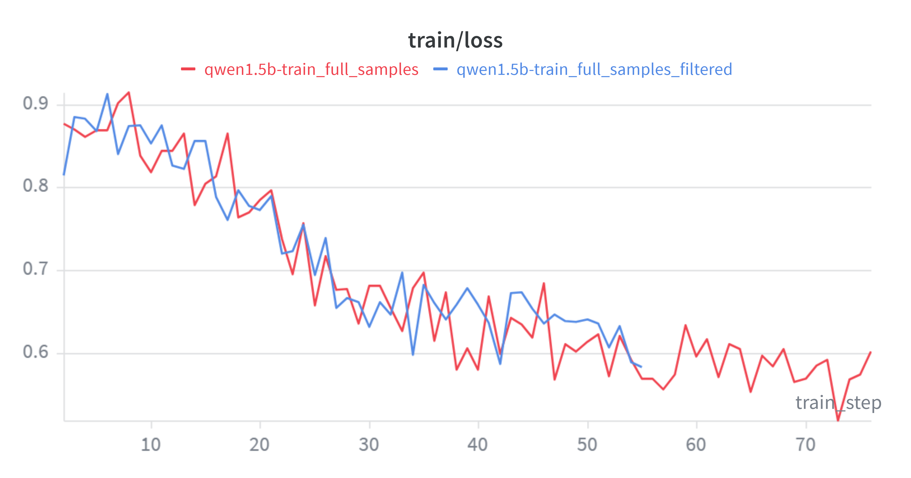

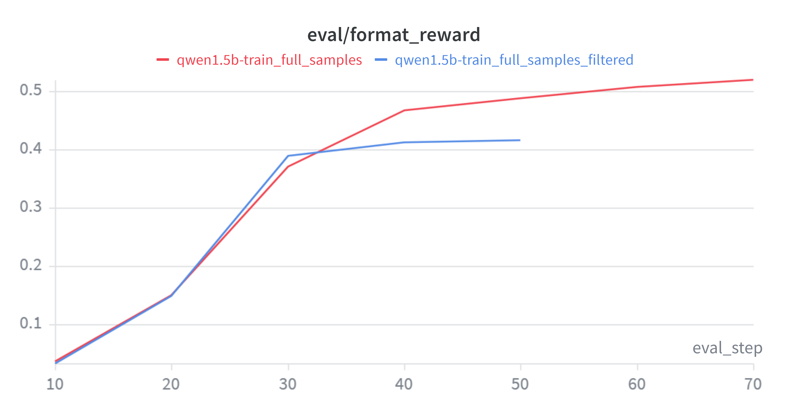

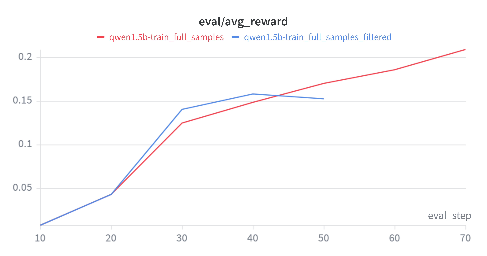

关键观察：

1. **早期快速习得格式**：Step 10–20 内 format 从 ~3% 跃升至 ~15%，SFT 在格式学习上效率极高。
2. **中后期分化**：SFT-filtered 在 Step 30 后趋于平台（format ~41%），而 SFT-raw 在 Step 40–70 仍持续增长（format 46.7% → 52.0%），更多数据带来了更大的上升空间。

### 5.4.3 最终评估结果

使用与零样本基线相同的评估协议（`r1_zero.prompt` + vLLM，5,000 条 MATH 验证集）：

| 指标 | 零样本基线 | SFT-filtered | SFT-raw |
|------|:---:|:---:|:---:|
| Average Format Reward | 0.1728 | 0.5060 | **0.6134** |
| Average Answer Reward | 0.0258 | 0.1334 | **0.1860** |

**三类输出分布：**

| 类别 | 零样本基线 | SFT-filtered | SFT-raw |
|------|:---:|:---:|:---:|
| ✅ 格式正确 + 答案正确 | 129 (2.6%) | 667 (13.3%) | **930 (18.6%)** |
| ⚠️ 格式正确 + 答案错误 | 735 (14.7%) | 1,863 (37.3%) | 2,137 (42.7%) |
| ❌ 格式错误 | 4,136 (82.7%) | 2,470 (49.4%) | **1,933 (38.7%)** |

条件正确率（排除格式错误样本，更纯粹地反映推理能力）：零样本 14.9% → SFT-filtered 26.4% → **SFT-raw 30.3%**（翻倍），说明模型确实在学习 R1 的推理过程而非仅模仿格式。

下图展示了训练过程中 response 长度和 token 熵的变化趋势：

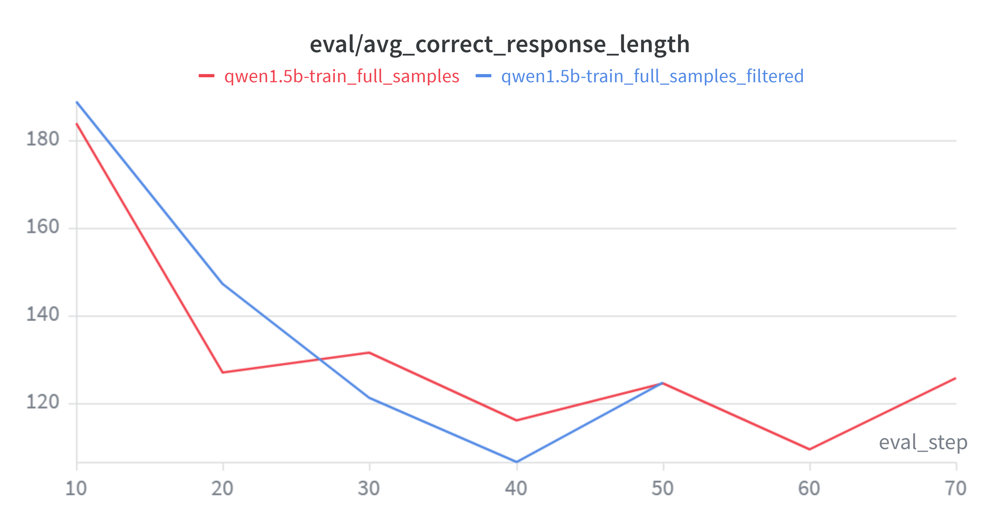

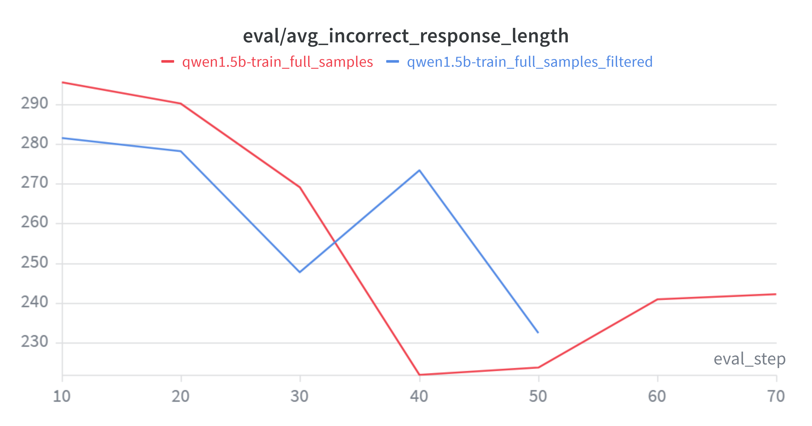

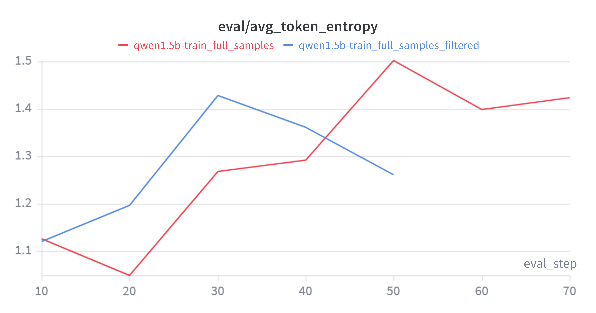

从图中可总结出两条规律：

1. **错误答案更冗长：** 错误答案的 response 长度约为正确答案的 2 倍（~232–242 vs ~125 tokens），模型在不自信时倾向于生成更冗长的推理；
2. **错误样本提升多样性：** SFT-raw 的 token 熵更高（1.423 vs 1.261），表明接触错误样本后模型保留了更大的输出多样性。

### 5.4.4 核心发现：未筛选数据优于筛选数据

**含 27.7% 错误答案的 SFT-raw 在所有指标上显著优于仅用正确答案的 SFT-filtered：**

| 对比维度 | SFT-filtered | SFT-raw |
|------|:---:|:---:|:---:|
| 答案正确率 | 13.3% | 18.6% |
| 格式正确率 | 50.6% | 61.3% |
| 条件正确率 | 26.4% | 30.3% |

这一反直觉结果的原因：

1. **数据量压倒纯度：** 额外 1,340 条样本增加了 38% 的数据量，提供了更丰富的问题类型和推理策略覆盖，在 1 epoch SFT 下数量效应超过纯度效应。
2. **推理 token 价值独立于答案：** R1 的错误轨迹通常仅最后一步计算出错，大量正确的中间推理 token 仍在有效训练模型（SFT 按 token 级最大化似然）。
3. **隐式对比学习：** 模型在错误 token 上遇到更高 loss，客观上形成对正确/错误推理模式的辨识信号，而 SFT-filtered 模型缺乏这种校准。
4. **格式学习靠数量：** R1 输出始终遵循 `<think>...</think><answer>...</answer>` 格式，更多示范带来更稳健的格式遵循。

> **重要教训：** SFT-raw 的训练 loss（0.602）高于 SFT-filtered（0.583），但下游指标全面占优——**训练损失与任务表现并非单调对应**，过度追求降低 loss 可能误导实验决策。

### 5.4.5 SFT 的局限性

- **天花板效应**：最佳答案正确率仅 18.6%，与 R1 教师差距巨大。1 epoch SFT 能教会推理的「形式」，但深层数学能力的建立需要更充分的训练。
- **格式–推理鸿沟**：42.7%（SFT-raw）的样本格式正确但答案错误——学会格式远比学会推理容易。
- **行为克隆本质**：SFT 只能模仿教师，无法超越。这一局限恰好为后续 **GRPO 强化学习训练**（第 6 节）提供了动机：通过奖励信号引导模型探索并优化超越教师的行为。

### 5.5 补充实验：仅用错误数据进行 SFT

#### 5.5.1 实验动机

在 [5.4.4 节](#544-核心发现未筛选数据优于筛选数据) 中我们观察到：包含 27.7% 错误答案的 SFT-raw 实验在所有指标上均优于仅用正确答案的 SFT-filtered。这一反直觉结果引出一个自然追问：**如果 SFT 数据全是错误答案，模型会学到什么？**

为解答此问题，设计本补充实验：从 `sft.jsonl`（4,836 条全量 R1 轨迹）中剔除 `sft_filtered.jsonl`（3,496 条正确轨迹），得到 **1,340 条纯错误轨迹**（`sft_wrong.jsonl`），所有样本的 `extracted_answer ≠ expected_answer`。用这批数据独立训练一个模型，观察：

1. 模型是否能**学会格式**（`<think>...</think><answer>...</answer>` 结构）？
2. 模型是否能**习得部分推理能力**（即使最终答案错误）？
3. 与零样本基线、SFT-filtered、SFT-raw 对照，**量化正确/错误 SFT 数据的相对贡献**。

#### 5.5.2 实验结果及分析

训练过程中 avg_reward 变化如下：

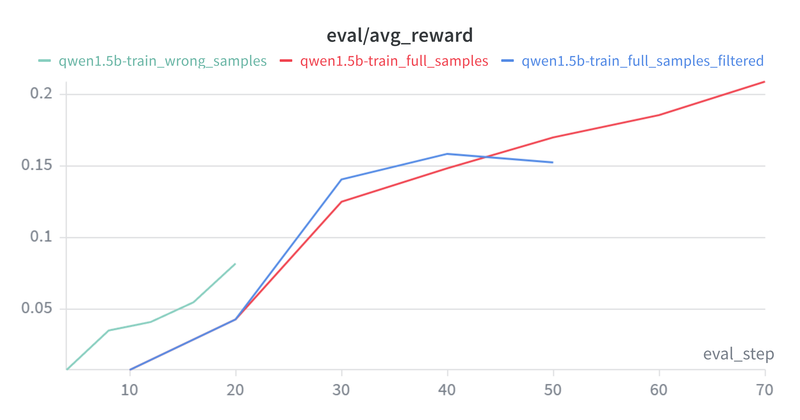

在 5,000 条 MATH 验证集上的最终评估：

| 指标 | 零样本基线 | **SFT-wrong** | SFT-filtered | SFT-raw |
|------|:---:|:---:|:---:|:---:|
| Avg Format Reward | 0.1728 | 0.3532 | 0.5060 | 0.6134 |
| Avg Answer Reward | 0.0258 | 0.0690 | 0.1334 | 0.1860 |
| 答案正确率 | 2.6% | 6.9% | 13.3% | 18.6% |
| 条件正确率 | 14.9% | 19.5% | 26.4% | 30.3% |

仅用错误数据训练后，格式奖励翻倍，答案正确率也有所上升。这说明：（1）即使全是错误答案，模型仍能从 `<think>...</think><answer>...</answer>` 结构中学会输出格式；（2）R1 错误轨迹的中间推理步骤大部分正确，模型仍能从中受益。

综合四组实验可以得出一个**"数据质量—性能"的非线性关系**：100% 正确数据（SFT-filtered）显著优于 0% 正确数据（SFT-wrong），但混入 28% 错误数据的 SFT-raw 反而优于纯粹正确的 SFT-filtered。这一规律揭示：**少量错误样本通过增加数据多样性提升了泛化能力**。

### question

**SFT 训练过程中总共需要加载几个模型？** 

训练过程中加载了三份独立权重副本，均基于同一 base model：

| 模型 | 设备 | 作用 |
|------|------|------|
| `policy_model` | `cuda:0` | **训练模型**：执行前向、反向传播与参数更新，唯一参与训练的实例 |
| `vllm_engine` | `cuda:1` | **推理引擎**：PagedAttention + Continuous Batching，高吞吐批量生成 |
| `eval_model` | `cuda:1` | **评估模型**：HuggingFace 原生路径计算 log-prob 与 entropy，与训练 loss 数值一致 |


**三个模型为何不可相互替代**

**`policy_model` 不可替代：** 只有 HuggingFace 标准模型支持完整 autograd 计算图，能执行 `loss.backward()` 和 `optimizer.step()`。vLLM 不支持反向传播；若将训练与评估合并，评估时的生成会阻塞训练，且长序列 KV cache 与训练 batch 的 logits 竞争显存，极易 OOM。

**`vllm_engine` 不可替代：** HuggingFace 原生 `generate()` 是纯串行自回归，单条样本需数百至数千次前向传播；vLLM 通过 PagedAttention 和 Continuous Batching 将生成吞吐提升 10–100 倍。去掉 vLLM，评估耗时会令总训练时间延长数倍。

**`eval_model` 不可替代：** vLLM 为追求吞吐在 logits 计算上存在数值近似，且返回的 logprobs 可能仅含 top-k，与训练 loss 存在系统偏差。`eval_model` 使用 HuggingFace 原生路径，能计算精确的全词表分布熵，确保评估指标忠实反映训练进展。

**核心结论**

**训练、生成、评估**三者的需求相互矛盾——训练需要 autograd，生成需要吞吐，评估需要数值一致性——单一模型实例无法同时满足。三模型架构是对**训练效率、评估精度、硬件利用**的最优权衡：训练与推理 GPU 隔离，异步评估不中断训练，评估指标与训练 loss 保持一致。后续 PPO 阶段将在此基础上进一步引入 reference model、reward model 等更多模型实例。


# 6 GRPO 

## 6.1 About

GRPO（Group Relative Policy Optimization，组相对策略优化）是一种面向可验证奖励的策略梯度方法。

与标准 PPO 不同，GRPO 不使用单独的价值网络（critic），而是利用**组内相对比较**来估计优势函数：对同一问题采样 $G$ 条响应，在组内计算每条响应相对于组均值的优势值 $A_i = (r_i - \mu_g) / (\sigma_g + \epsilon)$。这种设计的直觉是：同一问题的多条响应天然构成一个"微型比赛"——答对的响应获得正向优势，答错的获得负向优势，无需额外的 critic 模型。

与 SFT 的"模仿教师"路径不同，GRPO 只定义"什么是对的"（奖励函数），不规定"怎么想"（推理过程），模型可以自由探索任意推理路径，只要最终答案正确即可获得正奖励。

**On-policy vs Off-policy。** 纯 on-policy 要求每步都用最新策略重新生成数据——但每步同步 vLLM 权重需重建 KV cache，成本过高。纯 off-policy 不关心行为策略与当前策略的差距，但偏差积累过大会导致训练不稳定。本实验取折中，处于 **semi-on-policy** 状态：vLLM 权重每 10 步同步一次，同步窗口内行为策略固定不变，训练策略持续更新，偏离程度随窗口内步数累积——Step 0 刚同步接近 on-policy，Step 9 偏离最远——然后下次同步拉回。`cliprange=0.2` 负责在窗口内兜底，防止策略在两次同步之间跑太远。
                                                            
本实验从 **Qwen2.5-Math-1.5B Base** 模型出发，直接在二值验证奖励信号下探索模型自主习得推理能力的可能性。

**本章结构。** [6.2](#62-实验配置) 介绍训练与评估的完整超参数配置及单卡显存约束下的工程权衡；[6.3](#63-代码实现) 详述 `grpo_helper.py` 等核心模块的实现；[6.4](#64-显存占用) 分析 GRPO 训练在单卡上的显存分配与 OOM 解决过程；[6.5](#65-实验结果) 呈现 130 步训练的完整实验结果与分析。

## 6.2 实验配置

### 模型配置

| 参数 | 值 |
|------|-----|
| 基座模型 | Qwen2.5-Math-1.5B Base |
| 初始权重 | Qwen2.5-Math-1.5B Base（未经任何 SFT 或指令微调） |
| dtype | bfloat16 |
| attn_implementation | flash_attention_2 |
| gradient_checkpointing | True |

### 训练超参数

Policy Model 和 vLLM 引擎均部署在 `cuda:0`（单卡 RTX 4090D，24 GB），训练所需的瞬态张量、优化器状态和 KV Cache 共享同一显存空间，显存管理是本次实验的核心工程挑战。

| 参数 | 值 | 说明 |
|------|-----|------|
| `n_grpo_steps` | 130 | 总训练步数 |
| `rollout_batch_size` | 256 | 每步采样数（= `group_size × n_prompts_per_rollout_batch`） |
| `group_size` | 8 | 每题生成响应数 |
| `train_batch_size` | 128 | 有效训练 batch |
| `gradient_accumulation_steps` | 32 | 梯度累积步数 |
| **micro_batch_size** | **4** | 每次前向的样本数（= 128 / 32） |
| `chunk_size` | 8 | old_log_probs 分块大小 |
| `epochs_per_rollout_batch` | 2 | 同一批采样数据的训练轮数 |
| `loss_type` | `grpo_clip` | GRPO 裁剪损失 |
| `cliprange` | 0.2 | 策略比率裁剪范围 |
| `clip_grad` | 1.0 | 梯度裁剪阈值 |
| `length_norm` | `masked_normalize` | 按 batch 总 token 数归一化 loss |
| `learning_rate` | 1.0e-5 | 固定学习率（无 warmup / 无衰减） |
| `seed` | 42 | 随机种子 |

### 评估配置

| 参数 | 值 | 说明 |
|------|-----|------|
| `eval_interval` | 10 | 每 10 步评估一次 |
| `sampling_temperature` | 1.0 | 评估采样温度 |
| `sampling_min_tokens` | 4 | 最小生成 token 数（后因 vLLM bug 设为 0） |
| `sampling_max_tokens` | 1024 | 最大生成 token 数 |
| `stop` | `</answer>` | 停止符 |
| `gpu_memory_utilization` | 0.3 | vLLM 显存占比 |
| `max_model_len` | 1536 | 最大序列长度 |
| `vllm_device` | `cuda:0` | 与 Policy Model 共享同一 GPU |
| `enforce_eager` | True | 禁用 CUDA graphs（避免权重同步后崩溃） |

### 数据路径

| 参数 | 路径 |
|------|------|
| `train_path` | `data/math/train.jsonl`（5000 条） |
| `val_path` | `data/math/val.jsonl`（5000 条） |
| Prompt 模板 | `prompts/r1_zero.prompt` |

## 6.3 代码实现

### 6.3.1 `grpo_helper.py` 

`grpo_helper.py` 是 GRPO 训练的核心数学模块，包含奖励计算、优势估计、损失函数和 micro-batch 训练步骤。该模块共包含 6 个函数，下文按调用顺序逐一介绍。

#### 1. `compute_group_normalized_rewards`

**函数作用：** 对 vLLM 生成的 `rollout_batch_size` 条响应计算原始奖励，并在同一问题的 `group_size` 条响应内进行 z-score 归一化，得到优势值（advantage）。

**数学公式：**

设第 $g$ 组内 $|G|$ 条响应的原始奖励为 $\{r_1, \dots, r_{|G|}\}$：

$$r_i = \text{reward\_fn}(\text{response}_i, \text{ground\_truth}_i)$$

$$\mu_g = \frac{1}{|G|} \sum_{i \in G} r_i, \quad \sigma_g = \sqrt{\frac{1}{|G|} \sum_{i \in G} (r_i - \mu_g)^2}$$

$$A_i = \frac{r_i - \mu_g}{\sigma_g + \epsilon}$$

**输入：**

- `reward_fn: Callable` — 评分函数（即 `r1_zero_reward_fn`），返回 `{"reward", "format_reward", "answer_reward"}`
- `rollout_responses: list[str]` — 长度 `rollout_batch_size`（= `n_prompts_per_rollout_batch * group_size`）
- `repeated_ground_truths: list[str]` — 标准答案列表，同一问题的答案重复 `group_size` 次
- `group_size: int` — 每个问题生成的响应数量（= 8）
- `advantage_eps: float` — 归一化时避免除零的小常数（= 1e-6）
- `normalize_by_std: bool` — 是否除以组内标准差

**输出：** `tuple[torch.Tensor, torch.Tensor, dict]`

- `advantages`：形状 `(rollout_batch_size,)`，组内归一化优势值
- `raw_rewards`：形状 `(rollout_batch_size,)`，原始未归一化奖励
- `metadata`：包含 `rewards_mean`、`rewards_std`、`format_reward_mean`、`answer_reward_mean` 等统计量

**代码实现：**

```python
def compute_group_normalized_rewards(reward_fn, rollout_responses,
                                      repeated_ground_truths, group_size,
                                      advantage_eps=1e-6, normalize_by_std=True):
    raw_rewards = []
    for idx, response in enumerate(rollout_responses):
        grades = reward_fn(response, repeated_ground_truths[idx])
        raw_rewards.append(grades["reward"])

    raw_rewards = torch.tensor(raw_rewards, dtype=torch.float32)
    raw_rewards_reshaped = raw_rewards.view(-1, group_size)  # (n_prompts, group_size)

    rewards_mean = raw_rewards_reshaped.mean(dim=1, keepdim=True)
    rewards_std = raw_rewards_reshaped.std(dim=1, keepdim=True)

    advantages = (raw_rewards_reshaped - rewards_mean)
    if normalize_by_std:
        advantages = advantages / (rewards_std + advantage_eps)

    advantages = advantages.reshape(-1)  # (rollout_batch_size,)
    return advantages, raw_rewards, {
        "rewards_mean": rewards_mean.mean().item(),
        "rewards_std": rewards_std.mean().item(),
    }
```

> **设计要点：** 组内归一化使同一问题的不同响应形成相对比较——正确答案正优势，错误答案负优势。避免了绝对奖励尺度因问题难度不同而引入的方差。

---

#### 2. `compute_grpo_clip_loss`

**函数作用：** GRPO 的核心损失函数。借鉴 PPO 的 clipped surrogate objective，通过重要性采样比率和裁剪机制，防止策略在单次更新中偏离过远。

**数学公式：**

定义重要性采样比率：

$$r_t(\theta) = \frac{\pi_\theta(a_t \mid s_t)}{\pi_{\theta_\text{old}}(a_t \mid s_t)} = \exp\left(\log\pi_\theta - \log\pi_{\theta_\text{old}}\right)$$

GRPO 裁剪损失：

$$\mathcal{L}^{\text{CLIP}}_t = -\min\left(r_t A_t,\; \operatorname{clip}(r_t, 1-\epsilon, 1+\epsilon) \cdot A_t\right)$$

其中 $\epsilon$ 为裁剪范围（`cliprange`），$A_t$ 为优势值。

**输入：**

- `advantages: torch.Tensor` — 形状 `(batch_size, 1)`，组内归一化优势值
- `policy_log_probs: torch.Tensor` — 形状 `(batch_size, seq_len)`，当前策略的逐 token 对数概率
- `old_log_probs: torch.Tensor` — 形状 `(batch_size, seq_len)`，旧策略的逐 token 对数概率
- `cliprange: float` — 裁剪范围 $\epsilon$（= 0.2）

**输出：** `tuple[torch.Tensor, dict]`

- `loss`：形状 `(batch_size, seq_len)`，逐 token 的裁剪损失
- `metadata`：包含 `is_clipped`（每个 token 是否被裁剪）和 `clipped_ratio`（被裁剪比例）

**代码实现：**

```python
def compute_grpo_clip_loss(advantages, policy_log_probs,
                            old_log_probs, cliprange=0.2):
    # 转 float32 避免 bf16 下 exp 精度损失
    policy_log_probs = policy_log_probs.to(torch.float32)
    old_log_probs = old_log_probs.to(torch.float32)

    # 重要性采样比率
    ratio = torch.exp(policy_log_probs - old_log_probs)

    # 两种 surrogate 目标
    surr1 = ratio * advantages                         # 标准 PG
    surr2 = ratio.clamp(1.0 - cliprange, 1.0 + cliprange) * advantages  # 裁剪

    # 悲观估计：取两者的最小值
    loss = -torch.minimum(surr1, surr2)

    # 统计裁剪比例
    is_clipped = (surr1 != surr2)
    clipped_ratio = is_clipped.float().mean().item()

    return loss, {"is_clipped": is_clipped, "clipped_ratio": clipped_ratio}
```

> **直观理解：** 当 $A_t > 0$（好于组内均值），鼓励增大 $r_t$ 但不超 $1+\epsilon$；当 $A_t < 0$（差于组内均值），鼓励减小 $r_t$ 但不低于 $1-\epsilon$。`min` 取悲观估计，防止策略走得过远。

---

#### 3. `compute_policy_gradient_loss`

**函数作用：** 损失函数分发器。根据 `loss_type` 选择对应的损失计算方式，并统一 `advantages` / `raw_rewards` 的维度以 broadcast 到逐 token 形状。

**数学公式：**

| `loss_type` | 公式 | 说明 |
|------|------|------|
| `"no_baseline"` | $\mathcal{L} = -r \cdot \log\pi_\theta$ | 朴素策略梯度，无 baseline |
| `"reinforce_with_baseline"` | $\mathcal{L} = -A \cdot \log\pi_\theta$ | 使用优势值代替原始奖励 |
| `"grpo_clip"` | $\mathcal{L} = \mathcal{L}^{\text{CLIP}}$ | GRPO 裁剪损失（本实验采用） |

**输入：**

- `policy_log_probs: torch.Tensor` — 形状 `(batch_size, seq_len)`，当前策略的逐 token 对数概率
- `loss_type: str` — 损失类型（`"no_baseline"` / `"reinforce_with_baseline"` / `"grpo_clip"`）
- `raw_rewards: torch.Tensor` — 形状 `(batch_size, 1)`，原始奖励
- `advantages: torch.Tensor` — 形状 `(batch_size, 1)`，优势值
- `old_log_probs: torch.Tensor` — 形状 `(batch_size, seq_len)`，旧策略对数概率（仅 `"grpo_clip"` 需要）
- `cliprange: float` — 裁剪范围（仅 `"grpo_clip"` 需要）

**输出：** `tuple[torch.Tensor, dict]`

- `loss`：形状 `(batch_size, seq_len)`，逐 token 的策略梯度损失
- `metadata`：损失类型的元信息

**代码实现：**

```python
def compute_policy_gradient_loss(policy_log_probs, loss_type,
                                  raw_rewards=None, advantages=None,
                                  old_log_probs=None, cliprange=0.2):
    if loss_type == "no_baseline":
        loss = -raw_rewards * policy_log_probs
        return loss, {}

    elif loss_type == "reinforce_with_baseline":
        loss = -advantages * policy_log_probs
        return loss, {}

    elif loss_type == "grpo_clip":
        loss, metadata = compute_grpo_clip_loss(
            advantages, policy_log_probs, old_log_probs, cliprange)
        return loss, metadata

    else:
        raise ValueError(f"Unknown loss_type: {loss_type}")
```

---

#### 4. `masked_mean` 与 `masked_normalize`

**函数作用：** 将逐 token 损失聚合为标量，仅对 `response_mask == 1` 的 response token 部分计算。两个函数提供两种归一化策略。

**数学公式：**

$$\text{masked\_mean}(\mathbf{T}, \mathbf{M}) = \frac{\sum_{i,j} (\mathbf{T}_{ij} \cdot \mathbf{M}_{ij})}{\sum_{i,j} \mathbf{M}_{ij}}$$

$$\text{masked\_normalize}(\mathbf{T}, \mathbf{M}, C) = \frac{\sum_{i,j} (\mathbf{T}_{ij} \cdot \mathbf{M}_{ij})}{C}$$

**输入：**

- `tensor: torch.Tensor` — 待聚合的损失张量
- `mask: torch.Tensor` — 与 `tensor` 形状相同的布尔/数值掩码
- `normalize_constant: float = 1.0` — 归一化除数 $C$（仅 `masked_normalize`）
- `dim: int | None = None` — 求和维度；`None` 表示所有维度

**输出：** `torch.Tensor`，聚合后的标量或降维张量。

**代码实现：** 见 [5.3.1 节](#531-sft_helper) 中 `masked_normalize` 的完整实现。`masked_mean` 与之类似，仅将分母换为 `mask.sum()`。

> **设计选择：** 本实验采用 `masked_normalize`，关键优势在于同一 train_batch 的 32 个 micro-batch 使用相同的 `normalize_constant`（= `batch_total_tokens`），确保 `loss.backward()` 后梯度尺度一致。

---

#### 5. `grpo_microbatch_train_step`

**函数作用：** 执行单个 micro-batch（4 条样本）的完整前向 + 反向流程：计算损失 → response 区域聚合 → 梯度累积缩放 → 反向传播。

**输入：**

- `policy_log_probs: torch.Tensor` — 形状 `(micro_batch_size, seq_len)`，当前策略逐 token 对数概率
- `response_mask: torch.Tensor` — 形状同 `policy_log_probs`，标记 response token 位置
- `gradient_accumulation_steps: int` — 梯度累积步数（= 32）
- `loss_type: str` — 损失类型（`"grpo_clip"`）
- `raw_rewards: torch.Tensor` — 形状 `(micro_batch_size, 1)`
- `advantages: torch.Tensor` — 形状 `(micro_batch_size, 1)`
- `old_log_probs: torch.Tensor` — 形状 `(micro_batch_size, seq_len)`
- `cliprange: float` — 裁剪范围
- `length_norm: str` — 归一化方式（`"masked_mean"` / `"masked_normalize"`）
- `batch_total_tokens: int` — 整个 train_batch 的 response token 总数

**输出：** `tuple[torch.Tensor, dict]`

- `loss`：标量，已除以 `gradient_accumulation_steps` 的损失值（用于日志）
- `metadata`：来自 `compute_policy_gradient_loss` 的元信息

**代码实现：**

```python
def grpo_microbatch_train_step(policy_log_probs, response_mask,
                                gradient_accumulation_steps, loss_type,
                                raw_rewards, advantages, old_log_probs,
                                cliprange, length_norm, batch_total_tokens):
    # 1. 计算逐 token 损失
    loss, metadata = compute_policy_gradient_loss(
        policy_log_probs, loss_type, raw_rewards, advantages,
        old_log_probs, cliprange)

    # 2. 聚合为标量（仅对 response token）
    if length_norm == "masked_mean":
        loss = masked_mean(loss, response_mask, dim=None)
    elif length_norm == "masked_normalize":
        loss = masked_normalize(loss, response_mask,
                                normalize_constant=batch_total_tokens, dim=None)

    # 3. 梯度累积缩放 + 反向传播
    loss = loss / gradient_accumulation_steps
    loss.backward()
    return loss, metadata
```

---

#### 6. `PromptDataset`

**函数作用：** 数据加载辅助类，配合 PyTorch `DataLoader` 按批返回 `(prompt, solution)` 对。

**代码实现：**

```python
class PromptDataset(Dataset):
    def __init__(self, prompts, answers):
        self.prompts = prompts
        self.answers = answers

    def __getitem__(self, idx):
        return self.prompts[idx], self.answers[idx]

    def __len__(self):
        return len(self.prompts)
```

---

#### 函数调用关系总结

```
train_loop (grpo_train.py)
├── compute_group_normalized_rewards()     ← vLLM 生成后调用
│   └── reward_fn() × rollout_batch_size  ← 每个 response 调用 r1_zero_reward_fn
│
├── tokenize_prompt_and_output()           ← sft_helper，CPU 编码
│
├── get_response_log_probs() × 32 chunks  ← sft_helper，no_grad 计算 old_log_probs
│
└── for epoch × for batch × for micro (32次):
    ├── get_response_log_probs()           ← sft_helper，有梯度前向
    └── grpo_microbatch_train_step()
        ├── compute_policy_gradient_loss()
        │   └── compute_grpo_clip_loss()   ← 核心：ratio → clamp → min
        ├── masked_normalize()             ← 按 batch_total_tokens 归一化
        └── loss.backward()                ← 梯度累积
```

---

### 6.3.2 `grpo_evaluator.py` 

#### `evaluate_vllm`

**函数作用：** 与第 4 节零样本评估的 `evaluate_base_MATH.py` 核心逻辑相同，仅做了适应训练循环的简化——去掉了 `answer_reward` 单独统计和 `*_metrics.json` 保存，只返回 `avg_reward` 和 `avg_format_reward` 两个指标。在 `grpo_train.py` 中每 `eval_interval=10` 步调用一次，对全部验证集推理和打分。

**评估流程：**

```
1. 读取 r1_zero.prompt → 遍历 val_problems → format({question})
2. vllm_model.generate(prompts, eval_sampling_params) → 提取 response 文本
3. for each response: r1_zero_reward_fn(response, solution) → grades
4. 累加 reward / format_reward → 求平均 → 打印 + 保存 JSONL
```

---

### 6.3.3 `grpo_train.py` 

`grpo_train.py` 是 GRPO 训练的主入口，包含模型加载、数据准备和 `train_loop` 训练循环。每个 GRPO step 按固定顺序执行 6 个阶段。

**模型加载：** 训练启动时加载两份独立权重副本——`policy_model` (HF, `cuda:0`，有梯度) 和 `vllm_engine` (vLLM, `cuda:0`，仅推理)。两者共享单卡显存。此外复用 `sft_helper` 中的工具函数（详见 [6.3.4](#634-复用-sft-组件)），无需独立 `eval_model`。

**训练循环（6 个阶段）：**

```python
# grpo_train.py — train_loop 伪代码
for step in range(130):
    # 阶段 1: 采样 — vLLM 批量生成
    batch_prompts, batch_solutions = next(prompt_loader)      # 32 prompts
    outputs = vllm_engine.generate(batch_prompts, n=8)         # 32×8=256 responses

    # 阶段 2: 奖励 + 优势 — 组内归一化
    advantages, raw_rewards, meta = compute_group_normalized_rewards(
        r1_zero_reward_fn, responses, solutions, group_size=8)

    # 阶段 3: Tokenize — CPU 编码
    encode_dict = tokenize_prompt_and_output(prompts, responses, tokenizer)

    # 阶段 4: old_log_probs — no_grad 前向（chunk_size=8，分批防 OOM）
    for chunk in range(0, 256, 8):
        logits = policy_model(chunk).logits
        old_log_probs[chunk] = cross_entropy(logits, labels)

    # 阶段 5: 训练 — epochs=2, micro_batch_size=4
    for epoch in range(2):
        for batch in range(2):                     # 128 samples each
            for micro in range(32):                 # 4 samples each
                logits = policy_model(inputs).logits
                policy_log_probs = cross_entropy(logits, labels)
                ratio = exp(policy_log_probs - old_log_probs)
                loss = -min(ratio*A, clamp(ratio, 0.8, 1.2)*A)
                loss = masked_normalize(loss, mask, batch_tokens) / 32
                loss.backward()
            clip_grad_norm(1.0)
            optimizer.step()
            zero_grad()

    # 阶段 6: 评估 — 每 10 步同步权重并评估
    if step % 10 == 0:
        load_policy_into_vllm_instance(policy_model, vllm)
        metrics = evaluate_vllm(vllm, val_problems, val_solutions, ...)
        policy_model.train()
```

**六阶段数据流：**

| 阶段 | 操作 | 设备 | 数据量 |
|------|------|------|--------|
| 1. Rollout | vLLM `generate(n=8)` | GPU vLLM | 32 prompts → 256 responses |
| 2. 奖励 | `r1_zero_reward_fn` × 256，组内 z-score | CPU | 256 → advantages(256,) |
| 3. Tokenize | `tokenize_prompt_and_output` | CPU | 256 → input_ids/labels/mask(L) |
| 4. old_log_probs | `get_response_log_probs`，chunk_size=8，no_grad | GPU Policy | 256 seqs，分 32 chunk |
| 5. 训练 | 2 epochs × 2 batches × 32 micro | GPU Policy | 256 seqs，micro=4 |
| 6. 评估 | 权重同步 → vLLM 全量验证 | GPU vLLM | 5000 样本，每 10 步 |

**关键设计决策：**

| 决策 | 实现 | 原因 |
|------|------|------|
| **Off-policy 训练** | vLLM 权重仅在 eval 时同步（每 10 步），训练用旧权重 | 同步成本高（重建 KV cache），`cliprange=0.2` 防止偏离过大 |
| **数据循环使用** | `StopIteration` → 重新 `iter(loader)`，`shuffle=True` | 5000 条数据，200 步 × 32 = 6400 条需求，循环 ~1.3 epoch |
| **固定 LR** | `lr=1e-5`，无 warmup / 无 cosine decay | Base 模型参数空间平滑，小学习率足以引导探索 |
| **CPU 存储 encode_dict** | 256 条在 CPU，按需分片搬 GPU | 避免 GPU 常驻 256 条 × max_seq_len 的显存 |
| **enforce_eager=True** | vLLM 禁用 CUDA graphs | 避免权重同步后 graph 地址失效导致崩溃 |

---

### 6.3.4 复用的通用组件

GRPO 训练复用了以下与 SFT 阶段共享的通用工具：

| 组件 | 来源 | 用途 |
|------|------|------|
| `tokenize_prompt_and_output` | `sft_helper.py` | Prompt + Response 拼接编码 |
| `get_response_log_probs` | `sft_helper.py` | 逐 token 条件对数概率计算（阶段 4 和阶段 5） |
| `masked_normalize` | `sft_helper.py` | 按 response mask 归一化 loss |
| `init_vllm` | `policy_evaluation.py` | vLLM 引擎初始化 |
| `load_policy_into_vllm_instance` | `policy_evaluation.py` | 同步 Policy Model 权重到 vLLM（阶段 6） |


## 6.4 显存占用

GRPO 训练在单张 vGPU（32 GB）上同时运行 Policy Model（训练）和 vLLM 引擎（rollout 生成），两者共享显存。下文按训练流程的时序，从启动到每个 step 内逐阶段分析显存的构成与变化。

---

**初始化阶段：全程常驻。** 训练启动时加载的组件在运行期间持续占用，不随 step 释放：

| 组件 | 显存 | 说明 |
|------|------|------|
| Policy Model 权重 | $2N_{\text{params}}$ (bf16) | 训练目标模型 |
| AdamW 动量 $m$ | $4N_{\text{params}}$ (fp32) | 一阶矩估计 |
| AdamW 方差 $v$ | $4N_{\text{params}}$ (fp32) | 二阶矩估计 |
| vLLM 引擎 | $2N_{\text{params}}$ + KV Cache | 独立权重副本 + 预分配 KV Cache 池 |
| **合计** | **$12N_{\text{params}}$ + KV Cache** | 对 1.544B 模型约 **18.5 GiB + KV Cache** |

其中 KV Cache 池大小由 `gpu_memory_utilization`（= 0.3）和 `max_model_len`（= 1536）控制，全程预分配不释放。`tokenize_prompt_and_output` 产出的 `input_ids` / `labels` / `response_mask` 均在 CPU 创建，按需分片搬上 GPU，**不贡献 GPU 常驻**。

---

**阶段 1–3：GPU 显存无额外波动。** vLLM rollout 在其独立的 KV Cache 池内完成，奖励计算和 tokenize 均在 CPU 执行，GPU 仅维持初始常驻占用不变。

---

**阶段 4 — old_log_probs 计算（no_grad）：** 以 `torch.no_grad()` 对 256 条 rollout 响应计算旧策略对数概率，分 `chunk_size=8` 批次以防 OOM。每批前向产生 logits 张量（$B_c \times L \times 151{,}936 \times 2$ bytes，以 $B_c=8, L=1536$ 为例约 3.5 GiB），算完交叉熵后立即释放——此阶段无计算图保留需求。峰值显存：

$$M_{\text{old}} = M_{\text{fixed}} + M_{\text{vLLM}} + B_c \cdot L \cdot V \cdot 2\text{ bytes}$$

**OOM #1 发生在此处：** `chunk_size=32` 时 logits 达 14.9 GiB，超出余量，改为 8 后解决。

---

**阶段 5 前向：** 以 `micro_batch_size=4` 分批前向计算当前策略的逐 token 对数概率（logits 约 2.3 GiB）。与阶段 4 的关键区别是**保留计算图**（`requires_grad=True`），logits 必须存活至本 micro-batch 的 `backward()` 完成后才随计算图释放。同一时刻显存中仅有 1 份 logits——梯度累积不会导致多份 logits 并存。

---

**阶段 5 反向 — 训练峰值：** `loss.backward()` 时 autograd 同时持有三种瞬态数据：

1. **前向 logits：** softmax 反向需要用它计算 $\frac{\partial\text{softmax}}{\partial z}$；
2. **grad_logits：** loss 对 logits 的梯度 $\frac{\partial \mathcal{L}}{\partial \mathbf{z}}$，形状与 logits 相同（$4 \times 2048 \times 151{,}936$），约 2.3 GiB；
3. **中间激活：** 每层 Transformer 前向产生的 hidden states、attention weights 等，反向时用于计算各层权重的梯度。

峰值显存：

$$M_{\text{backward}} = M_{\text{forward}} + B_\mu \cdot L \cdot V \cdot 2\text{ bytes (grad\_logits)} + \text{中间激活} + 2N_{\text{params}}\text{ (梯度参数)}$$

以本实验配置估算：

| 组件 | 显存 |
|------|------|
| 常驻（模型 + AdamW + vLLM） | ~20 GiB |
| 前向 logits（$B=4, L=1536$） | ~2.3 GiB |
| 反向 grad_logits | ~2.3 GiB |
| 中间激活 + 梯度参数 | ~5 GiB |
| **峰值合计** | **~30 GiB** |

`backward()` 完成后，logits、grad_logits 和中间激活随计算图释放；参数梯度累加到 `.grad` 中。下一个 micro-batch 重新分配、使用、释放，不会堆叠。

**OOM #2 和 #3 发生在此处：** `gradient_accumulation_steps=8` 时 `micro_batch_size=16`，logits 高达 9.3 GiB；改为 16 后降至 4.7 GiB，仍不够；最终改为 32（`micro_batch_size=4`）才稳定。

---

**核心结论：** 常驻部分（模型 + AdamW + vLLM，约 20 GiB）在 full fine-tuning 下没有优化空间，显存调节只能作用于瞬态部分。瞬态中，大词表（$V=151{,}936$）导致的 logits 和 grad_logits 是最大可变开销——训练反向阶段两份大张量并存，占瞬态的主体。`micro_batch_size`（= `train_batch_size / gradient_accumulation_steps`）是调节峰值的最有效杠杆，每减少 1 可降低约 $2 \cdot L \cdot V \cdot 2$ bytes。

## 6.5 实验结果

### 6.5.1 实验概述与训练过程

本实验从 **Qwen2.5-Math-1.5B Base** 出发，使用 GRPO-Clip 损失在 MATH 数据集上进行了 130 步 semi-on-policy 强化学习训练。

**最终结果：** 在全量 5,000 条 MATH 验证集上：

| 指标 | 零样本基线 | GRPO |
|------|:------:|:------:|
| 答案正确率 | 2.6% | 34.6% | 
| 格式正确率 | 17.3% | 88.8% |

**训练曲线的四个核心现象**（详见 [6.5.2](#652-训练曲线)）：

1. **格式与推理解耦：** 格式在前 40 步快速收敛（S 型曲线），推理能力则近乎线性缓慢爬坡，两者发生在不同时间尺度；
2. **奖励信号退化：** 二值奖励下训练奖励高度波动，后期格式趋于完美后奖励区分度退化；
3. **梯度不稳定：** 训练过程频繁出现梯度尖峰；
4. **响应长度坍缩：** 响应长度在训练中减半。

综合来看，GRPO 显著有效但仍面临训练不稳定、奖励信号退化、响应长度坍缩等挑战（详见 [6.5.4](#654-核心发现与局限性)）。

### 6.5.2 训练曲线

以下结合 wandb 记录的 130 步训练曲线，从验证性能、训练奖励、损失与梯度稳定性、响应长度四个维度分析 GRPO 训练过程中的关键动态。

#### 验证性能：答案正确率与格式正确率

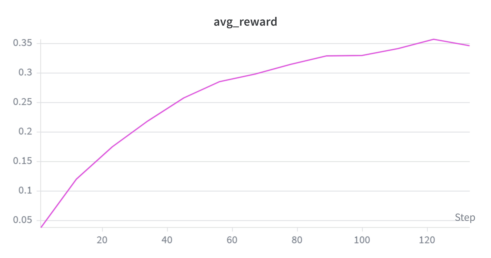

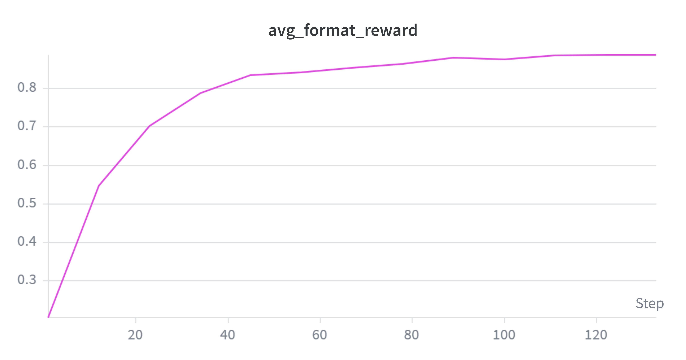

**关键观察：**

1. **答案正确率稳步线性增长。** `avg_reward` 从 step 0 的 0.0278 上升至 step 120 的 0.3458，增长曲线接近线性，未见明显的平台或饱和迹象——训练在 130 步处仍有持续提升的空间。

2. **格式正确率在前 40 步快速收敛。** `avg_format_reward` 从 step 0 的 0.203 快速攀升，step 40 时已达 0.834，此后进入缓慢增长阶段（step 40→120 仅从 0.834→0.888）。这一"S 型"曲线表明：学会 `<think>/<answer>` 格式对 GRPO 而言是一个相对简单的任务；后续增长主要来自答案正确率的提升，格式已不再是瓶颈。

3. **格式-推理解耦。** 格式正确率的快速收敛但答案正确率的缓慢爬坡，说明 RL 训练中格式习得与推理能力提升是两个**不同时间尺度的过程**，后者才是真正的挑战。

#### 训练奖励：组内波动与稀疏信号

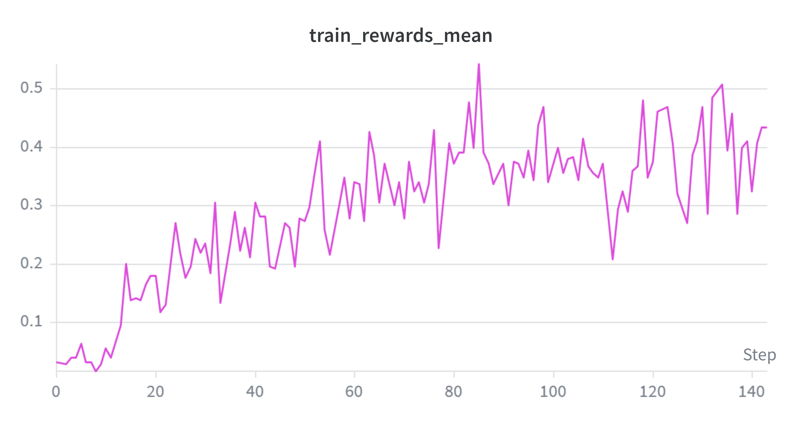

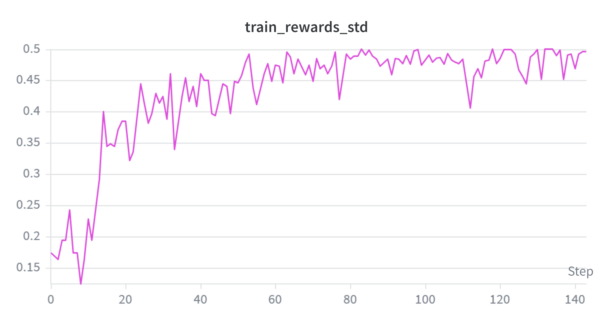

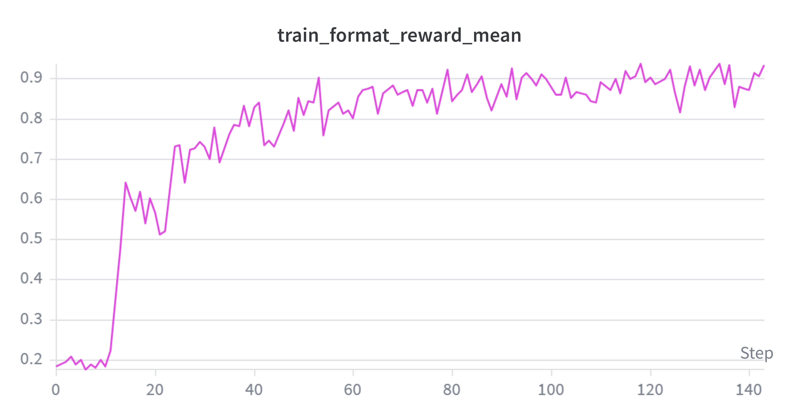

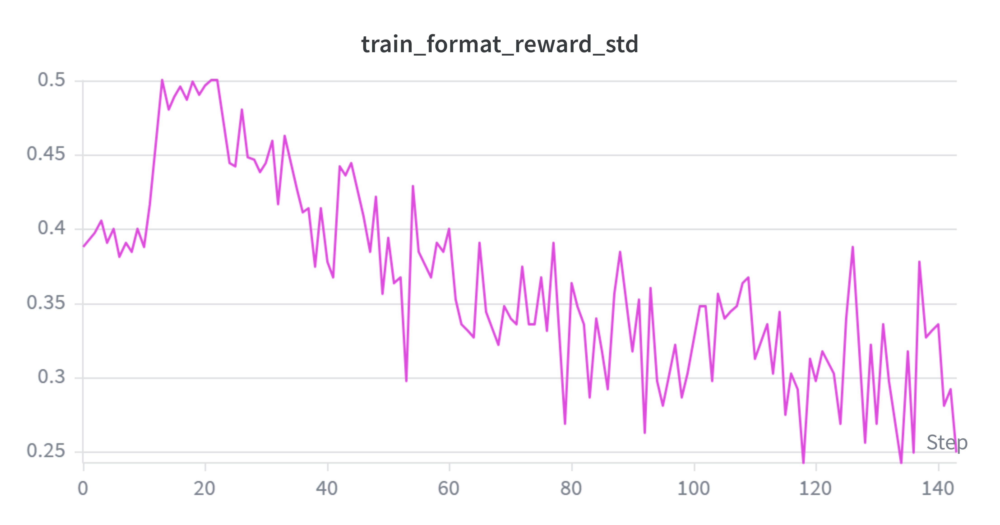

**关键观察：**

1. **训练奖励高度波动。** `train_rewards_mean` 在 0.02~0.54 之间剧烈波动。这是二值稀疏奖励（0 或 1）配合组内归一化的直接后果——每个 step 的 rollout 仅 32 题 × 8 条，统计样本小，正确率对采样随机性高度敏感。

2. **奖励标准差 ≈ 均值。** 由于二值奖励下 $\text{Var}(r) = p(1-p) \approx p$（当 $p$ 较小时），`train_rewards_std` 始终约等于 `train_rewards_mean`。这意味着优势值的组内归一化效果在不同步之间差异巨大——当 `rewards_std` 接近 0 时（同组 8 条全部答对或全部答错），优势值退化至接近 0，该步几乎无学习信号。

3. **后期奖励趋于上升但波动未减。** step 80 后 `train_rewards_mean` 的中位数在 0.35~0.45，但仍有低至 0.21 的"干枯步"。 这表明训练虽然在提升正确率，但奖励的稀疏性和小样本统计波动仍是主要挑战。

4. **格式奖励快速收敛且方差趋零。** `train_format_reward_mean` 从初始 ~0.03 快速上升至 ~0.93（与验证集趋势一致），而 `train_format_reward_std` 从 ~0.25 持续下降至 ~0.20 以下。格式标准差的下降意味着：到训练后期，256 条 rollout 中绝大多数都已遵循 `<think>/<answer>` 格式（93%），组内格式差异显著缩小。格式已不再是区分样本质量的有效信号——训练的重心完全落在了答案正确性上。

#### 训练损失与梯度范数：不稳定性和梯度爆炸

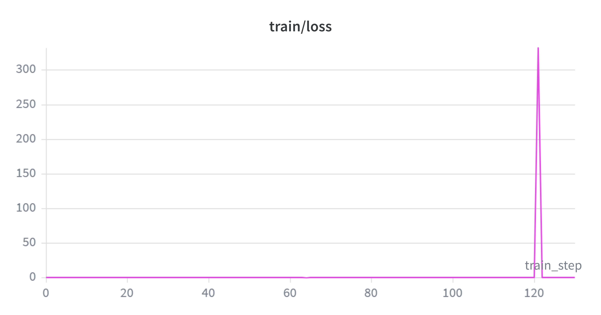

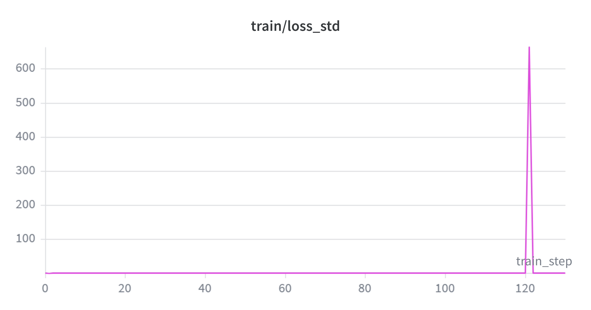

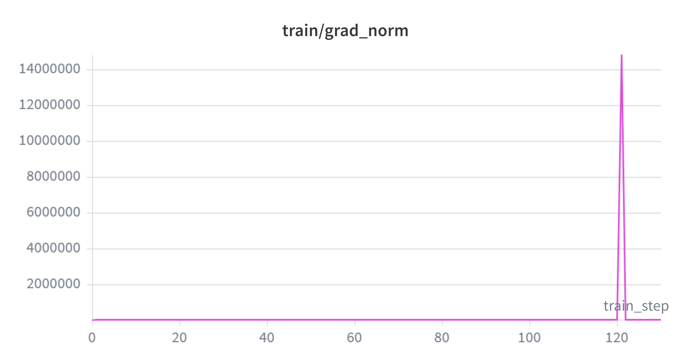

**关于 `train/grad_norm`。** 代码使用 `clip_grad_norm_(max_norm=1.0)`，实际更新梯度被裁剪到 ≤1.0，但函数返回的是裁剪前的原始范数（用于日志）。公式为 $\text{grad\_norm} = \sqrt{\sum_{p} \|\nabla_p \mathcal{L}\|_2^2}$。图中所有值均为裁剪前范数。

**关键观察：**

1. **`train/loss` 量级极低。** 稳定时约 $10^{-5} \sim 10^{-3}$，且可正可负。GRPO 的 loss = $-\min(r_t A_t, \text{clip}(r_t) A_t)$，并非 SFT 的 NLL（恒正），其绝对值与梯度范数无单调关系。

2. **梯度爆炸的根因：GRPO-Clip 在负优势下不提供保护。** 130 步中共 12 次 grad_norm > 1.0 的尖峰，最严重为 step 121（14.8M，伴随 `loss=332`、`loss_std=664`）。爆炸的机制链条为：

   - **ratio 指数膨胀**：$r_t = \exp(\log\pi_\theta - \log\pi_{\theta_{\text{old}}})$。off-policy 下（2 epoch/rollout），新策略可能大幅偏离旧策略，$\Delta\log p$ 可达 15 以上，$r_t = e^{15} \approx 3.3\times 10^6$。
   - **负优势绕过裁剪**：GRPO-Clip 的 $\min(r_t A_t, \text{clip}(r_t)A_t)$ 仅在 $A_t>0$ 且 ratio 超限时提供保护。当 $A_t<0$，`min` 必然选 $r_t A_t$（更负），per-token loss = $|r_t A_t|$ 无上界。该 token 贡献的 loss 可达 $10^6 \times 2.6 \approx 2.6\times 10^6$（正常值 ~0.1）。
   - **链式法则逐层放大**：异常 loss 经 28 层 Transformer 反向传播，总范数膨胀至 1.5×10⁷。

3. **梯度裁剪的局限。** `clip_grad_norm_` 将范数裁到 1.0，但无法改变梯度方向。若爆炸前方向已被单一异常 token 主导，裁剪后的更新仍指向该噪声方向。模型能自动恢复，说明该方向的更新幅度极小（范数被压缩到 1.0）且局部 loss landscape 足够平坦。

4. **后期尖峰频率增加。** 前 60 步无 >1.0 尖峰；60–90 步 3 次；90–130 步 10 次。随着策略偏离初始点，ratio 方差持续上升，`cliprange=0.2` 仅在 $A_t>0$ 时提供有效保护。

#### 响应长度：策略持续"收敛"

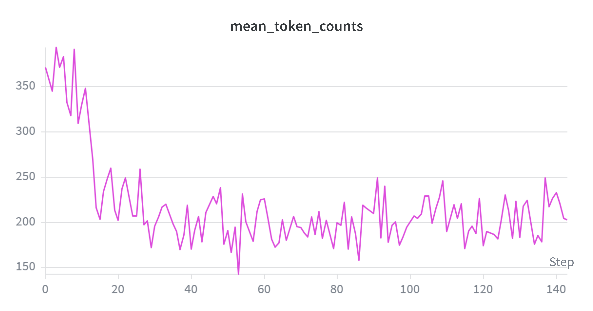

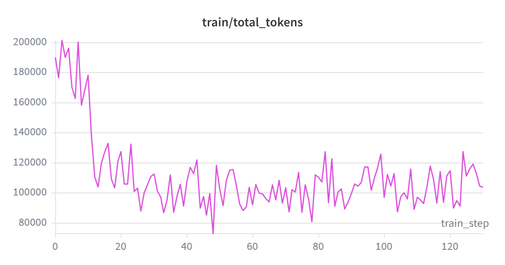

**关键观察：**

1. **响应长度持续下降。** `mean_token_counts` 从初始的 ~371 下降至 ~202（降幅 45%），`train/total_tokens`（每步训练总 token 数）同步从 ~190K 降至 ~103K。下降在前 20 步尤为剧烈（371→195），此后稳定在 170~230 的区间内波动。

2. **长度下降的双面性。** 对二值奖励的 GRPO 而言，长短答案在奖励上一视同仁，但短答案在每个 response token 上分摊的优势信号更强，因此策略被推向简洁。这一方面可能是正向的**效率提升**（模型学会更精炼的推理），但也可能隐含**推理简化**，模型可能会减少探索步骤以降低生成坏 token 的风险。需要进一步分析正确/错误答案的长度分布来区分这两种情况。

3. **total_tokens 与 mean_token_counts 高度一致。** 两者的 Pearson 相关接近 1.0，说明 token 总量的变化完全由平均长度的变化驱动，而非 batch 大小的波动——这确认了 DataLoader 和采样流程的稳定性。

### 6.5.3 最终评估结果

| 指标 | 零样本基线 | GRPO |
|:---|:---:|:---:|:---:|
| `avg_reward` | 0.0258 | **0.3458** |
| `avg_format_reward` | 0.1728 | **0.8880** |
| 条件正确率 | 14.9% | **~38.9%** |

### 6.5.4 核心发现与局限性

#### 核心发现

**1. GRPO 有效：从零教会 Base 模型推理。** 仅靠二值验证奖励，在 130 步内将条件正确率从 14.9% 推至 38.9%（+24pp）。模型无需推理示范，通过奖励信号自主探索出有效推理策略，印证了 DeepSeek-R1-Zero 的核心结论。

**2. 格式与推理解耦，学习速度差异巨大。** 格式正确率 40 步内即完成 S 型收敛（20%→83%），而答案正确率 120 步内近乎线性爬坡。格式习得是 low-hanging fruit，推理能力则需在巨大策略空间中逐步探索。

**3. 训练不稳定。** 训练后期尖峰频发，根因三点：二值稀疏奖励 + 组内归一化导致优势值极端分化；离策略训练（同一批数据更新 4 次）增大重要性采样比率方差；无 KL 正则化使策略可自由漂移。但模型每次爆炸后均能自动恢复。

**4. 响应长度减半。** `mean_token_counts` 从 ~371 降至 ~202（−45%）。二值奖励下长短答案等价，但短答案每 token 优势信号更强，策略被推向简洁——可能是正向效率提升，也可能隐含推理质量下降。

**5. 二值奖励区分度在训练后期退化。** 格式趋于饱和后奖励退化为纯"对/错"，组内方差进一步压缩。当同组响应全部正确格式但全错时，$\sigma_g=0$ 优势全零，该步无学习信号，构成限制 GRPO 持续进步的结构性瓶颈。

#### 局限性

**1. 非对称裁剪导致梯度无上界。** GRPO-Clip 仅在 $A_t > 0$ 时裁剪。当 $A_t < 0$，per-token loss 无理论上界，离策略下 $r_t$ 可膨胀至 $10^6$ 量级，造成梯度爆炸（本实验 step 121: 14.8M）。

**2. 组内归一化 + 二值奖励 → 方差退化。** 同组全对或全错时 $\sigma_g=0$，优势全零、无学习信号。训练后期格式饱和后奖励退化为一维，等效训练步数被稀释，这是二值奖励机制的内在局限。

**3. 二值奖励不惩罚长度，响应持续坍缩。** 短答案每 token 优势更强，`mean_token_counts` 降 45% 未见止跌。二值奖励无法区分"精炼推理"与"仓促猜测"。

**4. 无 KL 约束，策略无锚点。** 去除 KL 惩罚以降低显存的代价是策略可自由漂移，训练不稳定性增加。


# 7. 总结

本次作业以 Qwen 2.5 Math 1.5B Base 为基座，系统性地完成了从零样本评估到监督微调再到强化学习训练的完整流程。

**零样本基线**（第 4 节）表明，未经微调的 Base 模型完全不具备数学推理所需的格式遵循与解题能力——整体正确率仅 2.6%，82.7% 的输出格式错误。这为后续训练明确了起点。

**SFT 监督微调**（第 5 节）利用 DeepSeek R1 推理轨迹进行行为克隆，将答案正确率提升至 18.6%、格式正确率提升至 61.3%。一个反直觉的发现是：含 27.7% 错误答案的原始数据（SFT-raw）在所有指标上均优于仅用正确答案的筛选数据（SFT-filtered），揭示了数据多样性在 SFT 中的关键价值。补充实验进一步证实，即使纯粹的错误轨迹也能带来正向迁移。

**GRPO 强化学习**（第 6 节）从零开始，仅靠二值验证奖励，在 130 步训练内将答案正确率从 2.6% 推至 34.6%、格式正确率推至 88.8%，条件正确率达 38.9%。这印证了 DeepSeek-R1-Zero 的核心结论：纯 RL 足以教会 Base 模型逐步推理。然而，训练过程中也暴露出 GRPO-Clip 的结构性挑战：梯度不稳定、奖励信号退化、响应长度坍缩——这些问题根植于二值稀疏奖励与组内归一化的组合，非单纯调参可解。


