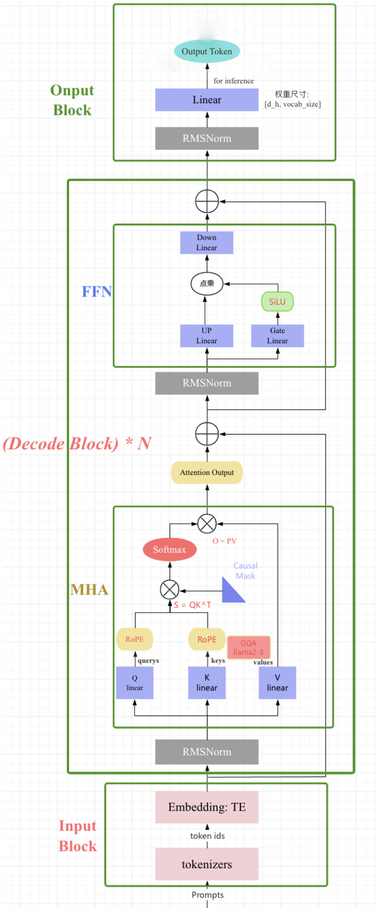
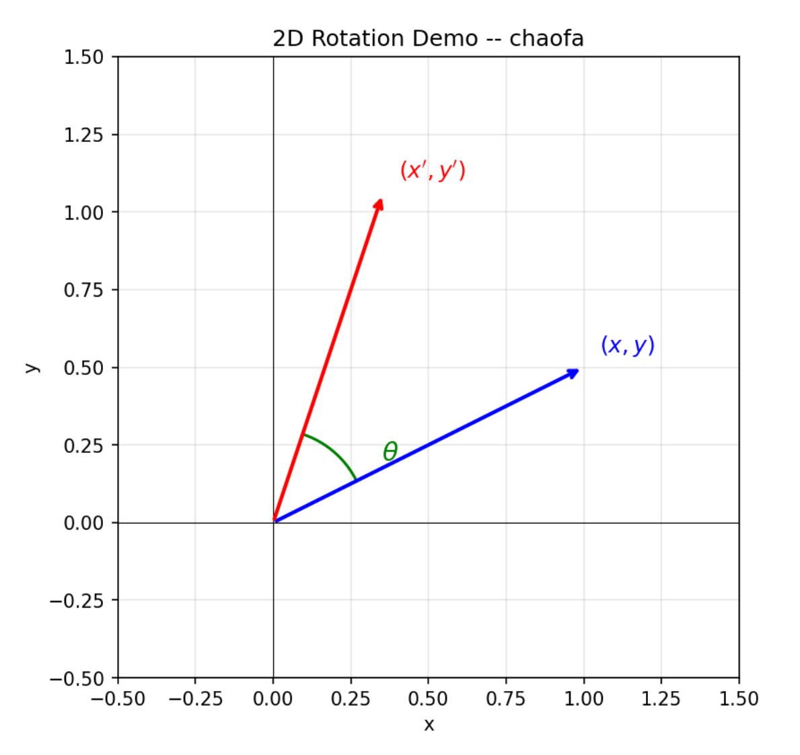
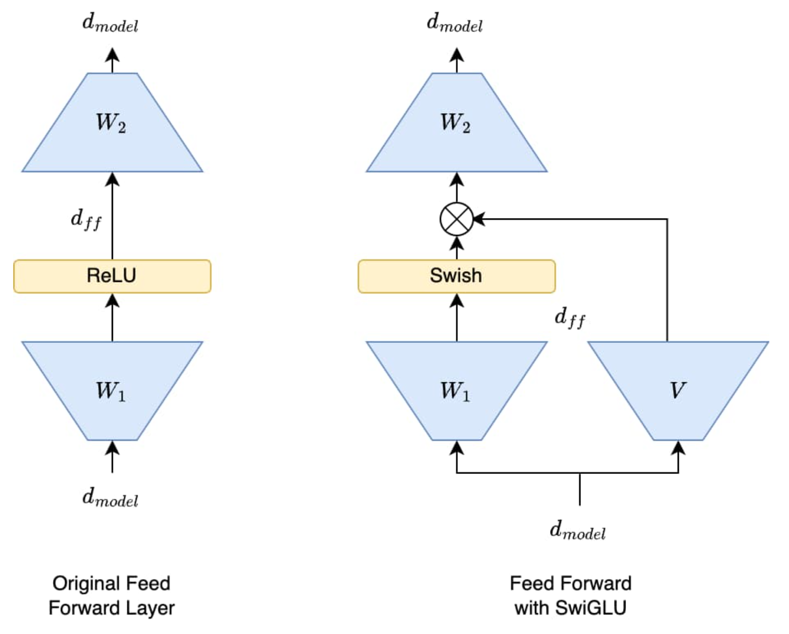
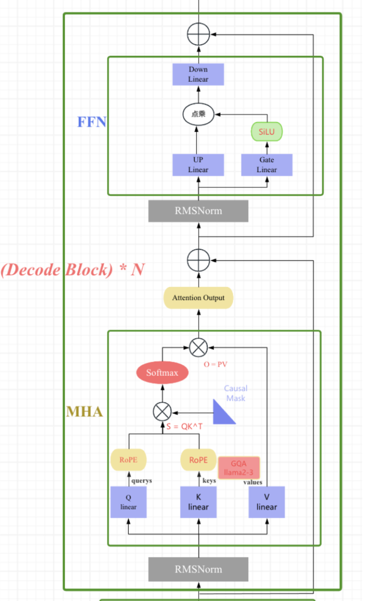
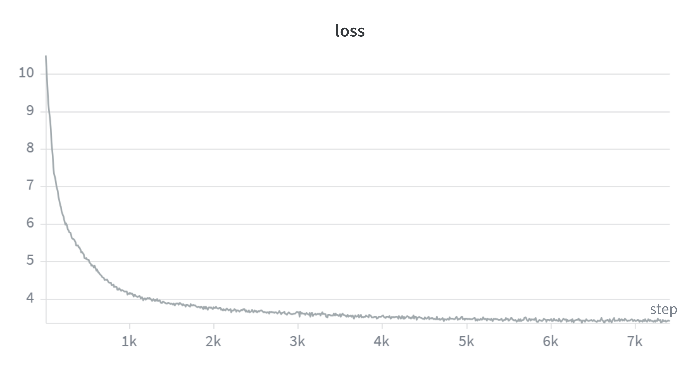
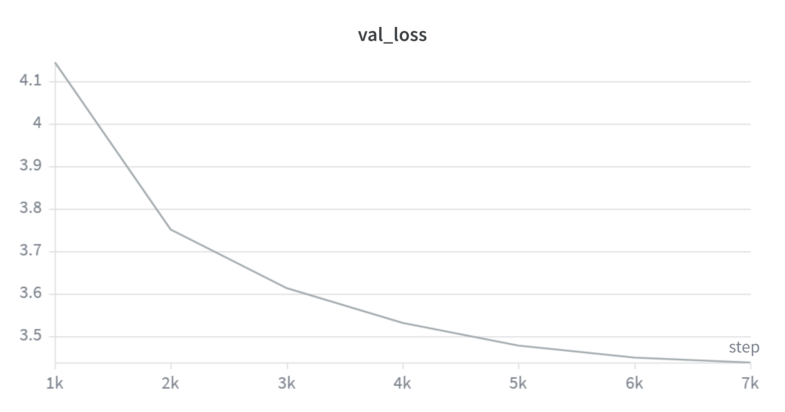
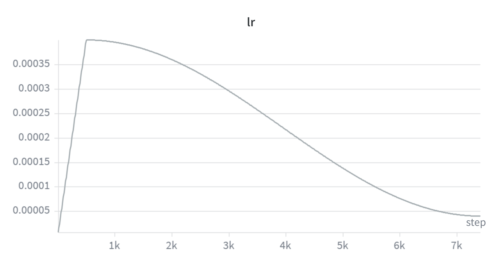
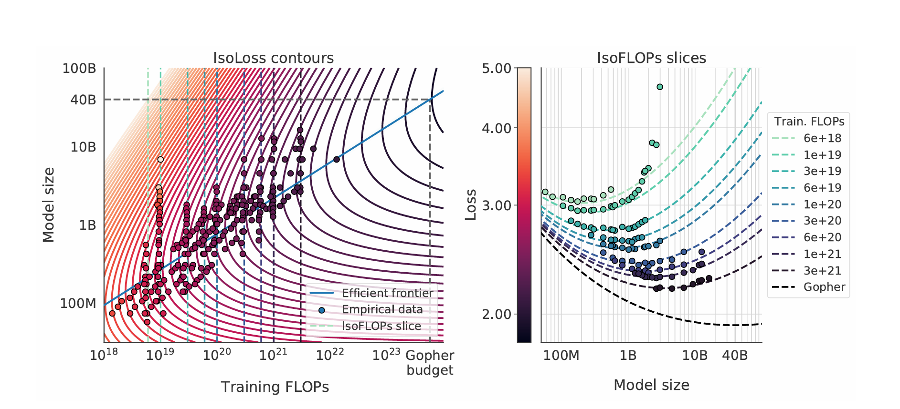

## 进展情况

项目名称：**从零构建LLM**。

项目分为以下四个模块：

| 模块 | 内容 | 状态 |
|------|------|------|
| 模块一 | 基础模块搭建与预训练 | 已完成 |
| 模块二 | 后训练（SFT + RL对齐） | 待完成 |
| 模块三 | 系统优化（训练优化 + 推理优化） | 已完成 |
| 模块四 | 训练数据工程 | 待完成 |
本实验报告是用qmd文件编写，建议查看网页版（报告.html）以获得更好的阅读体验。

地址：[报告](https://qsdong-bupt.github.io/posts/Projects/LLM_Pre-Training/)

## 1 About this Project

本项目从头实现了一个基于解码器（decoder-only）架构的因果 Transformer 语言模型，整体设计参考 LLaMA 模型的架构[LLaMA (2023)](https://arxiv.org/abs/2302.13971) 。
和 GPT 系列一样，LLaMA 模型也是 Decoder-only 架构，但结合前人的工作做了一些改进，比如：

1.  **Pre-normalization** [GPT3]. 为了提高训练稳定性，LLaMA 对每个 transformer 子层的输入进行归一化，使用 **RMSNorm** 归一化函数，Pre-normalization 由Zhang和Sennrich（2019）引入。使用 **RMSNorm** 的好处是不用计算样本的均值，速度提升了 40%
2.  **FFN_SWiGLU** [PaLM]。结构上使用门控线性单元，且为了保持 FFN 层参数数量不变，将隐藏单元的数量调整为 $\frac{2}{3}4d$ 而不是 PaLM 论文中的 $4d$，同时将 ReLU 替换为 **SiLU** [Shazeer,2020] 激活，引入以提高性能。
3.  **Rotary Embeddings** [GPTNeo]。模型的输入不再使用 positional embeddings，而是在网络的每一层添加了 positional embeddings（**RoPE**），RoPE 方法由Su等人（2021）引入。

完整的模型结构图如下图所示:


项目的核心特点包括：

- **全组件自定义实现**：不依赖 PyTorch 内置的 `nn.Linear`、`nn.Embedding` 等高层模块，所有组件（线性层、嵌入层、归一化层、注意力机制、前馈网络等）均从底层手动实现。
- **现代化 Transformer 架构**：
  - **RMSNorm**：均方根层归一化，替代传统的 LayerNorm
  - **RoPE**（Rotary Position Embedding）：旋转位置编码
  - **SwiGLU**：使用 SiLU 激活函数的门控前馈网络
  - **Pre-Norm**：在注意力/FFN 之前进行归一化的残差连接结构
- **BPE 分词器**：基于 GPT-2 风格的 Byte-Pair Encoding 算法，支持自定义词表大小
- **完整训练流程**：包含 AdamW 优化器、余弦学习率调度、梯度裁剪、梯度累积等训练基础设施

项目代码位于 [basics/](basics/) 目录下，按功能模块组织到 `model/`、`train/`、`tokenizer/`、`inference/` 等子目录中。

## 2 Create a Virtual Environment

### 2.1 虚拟环境设置

项目使用 Python 虚拟环境管理依赖，虚拟环境位于项目根目录下的 [`.venv/`](.venv/) 文件夹中。

```bash
# 创建虚拟环境
python -m venv .venv

# 激活虚拟环境 (Windows PowerShell)
.\.venv\Scripts\Activate.ps1

# 激活虚拟环境 (Windows CMD)
.venv\Scripts\activate.bat

# 激活虚拟环境 (Linux / macOS)
source .venv/bin/activate
```

### 2.2 核心依赖

| 依赖包    | 版本   | 用途                     |
|-----------|--------|--------------------------|
| `torch`   | ≥ 2.0  | 深度学习框架             |
| `numpy`   | ≥ 1.24 | 数值计算                 |
| `wandb`   | latest | 实验跟踪与日志记录       |
| `tqdm`    | latest | 进度条显示               |
| `regex`   | latest | 高级正则表达式（分词器） |
| `pickle`  | 内置   | 词汇表和合并规则的序列化 |

安装命令：

```bash
pip install torch numpy wandb tqdm regex
```

## 3 Dataset

- **语料**：OpenWebText（OWT），共 **1,458,472,895 个 token**（约 14.58 亿）
- **预处理**：原始文本 → BPE 编码 → token ID 序列 → 保存为 PyTorch 张量
- **文件**：
  - [basics/data/owt_32768_ids_train.pkl](basics/data/owt_32768_ids_train.pkl) — 训练集
  - [basics/data/owt_32768_ids_valid.pkl](basics/data/owt_32768_ids_valid.pkl) — 验证集

## 4 Tokenizer

### 4.1 BPE 训练

**文件：** [basics/tokenizer/train_bpe.py](basics/tokenizer/train_bpe.py)

BPE（Byte-Pair Encoding）分词器训练流程：

1. **基础词汇表**：以 256 个单字节（0-255）为基础，加上特殊标记（如 `<|endoftext|>`）
2. **预分词（Pre-tokenization）**：使用 GPT-2 风格的正则表达式进行预分词：

```
'(?:[sdmt]|ll|ve|re)| ?\p{L}+| ?\p{N}+| ?[^\s\p{L}\p{N}]+|\s+(?!\S)|\s+
```

   该正则保留英文缩写、字母序列、数字序列、标点符号和空白字符。

3. **训练循环**：
   - 统计所有相邻 token 对的频率（`pair_counts`）
   - 维护反向索引 `pair_to_tokens`，实现 $O(1)$ 查找受影响的 token
   - 每次选择频率最高的 token 对进行合并
   - 平局时按字节序选择最大的对
   - 更新受影响的 token 和 pair 计数
   - 重复直到词表达到目标大小

4. **词表规模**：项目中训练的词表大小为 32768

核心合并循环：

```python
# 初始化: vocab[0..255] = 单字节; pair_counts 统计所有相邻对频率
# pair_to_tokens: 反向索引，O(1) 查找受影响的 token
while len(vocab) < vocab_size:
    if not pair_counts:
        break
    # 选频率最高的 pair，平局选字节序最大
    max_count = max(pair_counts.values())
    candidates = [k for k, v in pair_counts.items() if v == max_count]
    best_pair = max(candidates)
    merges.append(best_pair)
    new_token_bytes = best_pair[0] + best_pair[1]
    vocab[current_next_id] = new_token_bytes
    current_next_id += 1

    # O(1) 获取受影响 tokens，更新 pair_counts 和 token_frequency_table
    affected_tokens = list(pair_to_tokens.get(best_pair, []))
    for token in affected_tokens:
        freq = token_frequency_table.get(token, 0)
        if freq == 0:
            continue
        # 从 pair_counts 中移除旧 token 的贡献
        for i in range(len(token) - 1):
            p = (token[i], token[i+1])
            pair_counts[p] -= freq
            pair_to_tokens[p].discard(token)
            if pair_counts[p] <= 0:
                del pair_counts[p]
        # 合并 best_pair 后重新添加
        new_token_seq = merge_token_sequence(token, best_pair, new_token_bytes)
        for i in range(len(new_token_seq) - 1):
            p = (new_token_seq[i], new_token_seq[i+1])
            pair_counts[p] += freq
            pair_to_tokens[p].add(new_token_seq)
        del token_frequency_table[token]
        token_frequency_table[new_token_seq] += freq
```


### 4.2 Tokenizer 类

**文件：** [basics/tokenizer/tokenizer.py](basics/tokenizer/tokenizer.py)

- **encode(text)**：正则分割 → 逐词 BPE 合并 → token ID 查找
- **decode(ids)**：ID → bytes 拼接 → UTF-8 解码
- **BPE 缓存**：对已编码的词进行缓存，避免重复计算

```python
class Tokenizer:
    def _get_bpe_merges(self, piece: bytes) -> List[bytes]:
        parts = [bytes([b]) for b in piece]    # 单字节列表
        while len(parts) > 1:
            pairs = set()
            for i in range(len(parts) - 1):
                pair = (parts[i], parts[i+1])
                if pair in self.merges_set:
                    pairs.add(pair)
            if not pairs:
                break
            # 选择 merges 优先级最高（最早被学习）的 pair
            best_pair = min(pairs, key=lambda p: self.merges_priority_map[p])
            # 合并 best_pair
            new_parts = []
            i = 0
            while i < len(parts):
                if i < len(parts)-1 and (parts[i], parts[i+1]) == best_pair:
                    new_parts.append(parts[i] + parts[i+1])
                    i += 2
                else:
                    new_parts.append(parts[i])
                    i += 1
            parts = new_parts
        return parts

    def encode(self, text: str) -> List[int]:
        if not text:
            return []
        chunks = regex.split('|'.join(map(regex.escape, self.special_tokens)), text)
        final_ids = []
        bpe_cache = {}
        for chunk in chunks:
            if not chunk:
                continue
            if chunk in self.special_tokens:
                final_ids.append(self.bytes_to_id[chunk.encode('utf-8')])
            else:
                for word in regex.findall(PAT, chunk):
                    if word not in bpe_cache:
                        bpe_cache[word] = self._get_bpe_merges(word.encode('utf-8'))
                    for b in bpe_cache[word]:
                        final_ids.append(self.bytes_to_id[b])
        return final_ids

    def decode(self, token_ids: List[int]) -> str:
        all_bytes = b''.join(self.vocab[id] for id in token_ids)
        return all_bytes.decode('utf-8', errors='replace')
```

### 4.3 数据编码

**文件：** [basics/tokenizer/encode_data.py](basics/tokenizer/encode_data.py)

将原始文本文件编码为 token ID 张量，保存为 `.pkl` 文件供训练使用。

## 5 Model

模型整体架构采用 decoder-only Transformer（类似 Llama），由嵌入层、多个 Transformer 块、最终 RMSNorm 和 LM 头组成。以下逐一介绍各组件。

### 5.1 参数初始化
我们训练神经网络的目的是为了找到一组参数，使得模型在训练数据上的表
现最好。但是，如果初始参数设置不当，可能会导致模型无法收敛或者收敛到局
部最优解甚至出现梯度爆炸、梯度消失等问题。

最常见的两种参数初始化方法：**Xavier 初始化**和 **He 初始化**。

**Xavier 初始化 (Glorot Initialization)**

Xavier 初始化由 Xavier Glorot 和 Yoshua Bengio 在 2010 年提出。
它的核心思想是保持每一层激活值的方差和反向传播时梯度的方差，在前向和反向传播中保持不变。
Xavier 初始化适用于 **Sigmoid、Tanh** 等对称激活函数。

Xavier 初始化通常有两种分布形式：

- **均匀分布 (Uniform)**
  权重从均匀分布 $U[-r, r]$ 中采样，其中：
  $$
  r = \sqrt{\frac{6}{\text{fan}_{in} + \text{fan}_{out}}}
  $$
  均匀分布的方差为 $\frac{(b-a)^2}{12} = \frac{r^2}{3}$。
  这里的 $\text{fan}_{in}$ 是一层网络输入神经元数量，$\text{fan}_{out}$ 是输出神经元数量。

- **正态分布 (Normal)**
  权重从均值为 0、标准差为 $\sigma$ 的正态分布中采样，其中：
  $$
  \sigma = \sqrt{\frac{2}{\text{fan}_{in} + \text{fan}_{out}}}
  $$
  这是由于每经过一层，权重的方差就会变成原来的 $\frac{1}{\text{fan}}$，其中 $\text{fan}$ 表示这一层的神经元数量。

工作原理简述：
通过同时考虑输入和输出神经元的数量，Xavier 初始化试图在层与层之间找到一个平衡点，使得信号的方差既不会在传播中衰减，也不会无限放大。

**He 初始化 (Kaiming Initialization)**

He 初始化由 Kaiming He（何凯明，残差网络也是他提出的）在 2015 年提出。
针对 Xavier 初始化在 **ReLU 激活函数**上效果不佳的问题，He 初始化专门适配于 ReLU 系列激活函数。

ReLU 函数 $f(x) = \max(0, x)$ 的特性是，它会将所有负输入都变为 0。
这破坏了 Xavier 初始化所依赖的“激活函数关于原点对称”的假设，并导致大约一半的神经元输出为 0，从而改变了输出的方差。

He 初始化考虑到 ReLU 会将一半的输入置为零，这会使得输出方差减半。
为了补偿这一点，He 初始化在计算方差时引入了一个因子 2，其他思路与 Xavier 初始化一致。

- **均匀分布 (Uniform)**
  权重从均匀分布 $U[-r, r]$ 中采样，其中：
  $$
  r = \sqrt{\frac{6}{\text{fan}_{in}}}
  $$

- **正态分布 (Normal)**
  权重从均值为 0、标准差为 $\sigma$ 的正态分布中采样，其中：
  $$
  \sigma = \sqrt{\frac{2}{\text{fan}_{in}}}
  $$

之所以 Kaiming 初始化只考虑 $\text{fan}_{in}$，是因为它更注重前向传播，对反向传播的影响考虑较少。

**实验中参数初始化标准**

- **词嵌入权重**：$\mathcal{N}(\mu = 0, \sigma^2 = 0.02^2)$，范围限制在 $\pm 3\sigma$ 以内。
- **线性层权重**：$\mathcal{N}(\mu = 0, \sigma^2 = 0.02^2)$，范围限制在 $\pm 3\sigma$ 以内。
- **RMSNorm 权重**：$1$


### 5.2 Embedding

**文件：** [basics/model/embedding.py](basics/model/embedding.py)

嵌入层将 token ID 映射为稠密向量。本实现使用自定义的 `nn.Parameter` 矩阵，而非 PyTorch 内置的 `nn.Embedding`：

- **权重矩阵**：形状为 `[vocab_size, d_model]` 的可训练参数
- **初始化**：使用截断正态分布（Truncated Normal），标准差 $\sigma = 0.02$，截断范围 $[-3\sigma, 3\sigma]$
- **前向传播**：通过索引查找 `embedding_matrix[token_ids]` 获取嵌入向量


**为什么选择截断正态分布？** 标准正态分布理论上可以产生任意大的值（如 $+4\sigma$ 甚至 $+5\sigma$），这些离群值会导致少数 token 的嵌入向量初始范数过大，在注意力点积中形成异常大的权重，扰乱前几轮训练的梯度流。截断到 $[-3\sigma, 3\sigma]$ 后，正态分布中 99.7% 的样本被完整保留，同时每个维度的绝对值永远不会超过 $3\sigma = 0.06$——相当于给初始嵌入加了硬上限，训练初期的数值更加稳定。$\sigma=0.02$ 是 GPT 系列（GPT-2/3）沿用的经验值。选用这么小的初始化的另一个重要原因是：嵌入向量和输出层的权重都很小时，模型初始输出的 logits 接近零，softmax 近似均匀分布，交叉熵损失自然从 $\log(\text{vocab\_size})$ 附近开始（本项目词表大小为 32768，对应约为 $\ln(32768) \approx 10.4$）。

由于 `erfinv` 不支持 `bfloat16`，初始化在 `float32` 精度下完成后再转换为目标精度。

```python
class EmbeddingModule(nn.Module):
    def __init__(self, vocab_size, d_model, device=None, dtype=torch.bfloat16):
        super().__init__()
        temp_matrix = torch.empty(vocab_size, d_model, device=device, dtype=torch.float32)
        std = 0.02
        torch.nn.init.trunc_normal_(temp_matrix, std=std, a=-3*std, b=3*std)
        self.embedding_matrix = nn.Parameter(temp_matrix.to(dtype))

    def forward(self, token_ids: torch.Tensor) -> torch.Tensor:
        return self.embedding_matrix[token_ids]
```

### 5.3 Linear

**文件：** [basics/model/Linear.py](basics/model/Linear.py)

自定义线性层替代 PyTorch 的 `nn.Linear`：

- 前向传播：$y = xW^T + b$
- 权重初始化：正态分布，均值 0，标准差 $\sigma = 0.02$
- 偏置初始化：均匀分布 $\mathcal{U}(-\frac{1}{\sqrt{d_{in}}}, \frac{1}{\sqrt{d_{in}}})$
- 支持可选的偏置（`bias=True/False`）

```python
class Linear(nn.Module):
    def __init__(self, in_features, out_features, device=None, dtype=None, bias=True):
        super().__init__()
        self.weight = nn.Parameter(torch.empty(out_features, in_features, device=device, dtype=dtype))
        self.bias = nn.Parameter(torch.empty(out_features, device=device, dtype=dtype)) if bias else None
        self._init_weight()

    def _init_weight(self):
        std = 0.02
        with torch.no_grad():
            temp_weight = self.weight.to(torch.float32)
            torch.nn.init.normal_(temp_weight, mean=0.0, std=std)
            self.weight.copy_(temp_weight.to(orig_dtype))
        if self.bias is not None:
            fan_in = self.weight.shape[1]
            bound = 1 / (fan_in ** 0.5) if fan_in > 0 else 0
            torch.nn.init.uniform_(self.bias, -bound, bound)

    def forward(self, x):
        o = x @ self.weight.T
        if self.bias is not None:
            o = o + self.bias
        return o
```

### 5.4 RMSNorm

**文件：** [basics/model/RMSnorm.py](basics/model/RMSnorm.py)

#### Pre-Norm vs Post-Norm

在 Transformer 中，归一化层（LayerNorm / RMSNorm）与残差连接的相对位置有两种范式，这对训练稳定性的影响至关重要。

**Post-Norm（后归一化）** 是原始 Transformer（Vaswani et al., 2017）的设计——先做残差加法，再归一化：

$$\mathbf{x}_{l+1} = \text{LayerNorm}\big(\mathbf{x}_l + F_l(\mathbf{x}_l)\big)$$

其中 $F_l$ 是子层函数（注意力或 FFN），归一化包裹了残差连接。在一个完整的 Transformer Block 中：

$$\begin{aligned}
\mathbf{x}_{l+\frac{1}{2}} &= \text{LN}\big(\mathbf{x}_l + \text{MHA}(\mathbf{x}_l)\big) \\
\mathbf{x}_{l+1} &= \text{LN}\big(\mathbf{x}_{l+\frac{1}{2}} + \text{FFN}(\mathbf{x}_{l+\frac{1}{2}})\big)
\end{aligned}$$

**Pre-Norm（前归一化）** 是现代 LLM（GPT-2/3/4、LLaMA、PaLM）的标准做法——先归一化，再做子层计算，最后残差加法：

$$\mathbf{x}_{l+1} = \mathbf{x}_l + F_l\big(\text{LayerNorm}(\mathbf{x}_l)\big)$$

$$\begin{aligned}
\mathbf{x}_{l+\frac{1}{2}} &= \mathbf{x}_l + \text{MHA}\big(\text{LN}(\mathbf{x}_l)\big) \\
\mathbf{x}_{l+1} &= \mathbf{x}_{l+\frac{1}{2}} + \text{FFN}\big(\text{LN}(\mathbf{x}_{l+\frac{1}{2}})\big)
\end{aligned}$$

两种范式的根本区别在于**残差路径是否经过归一化**：

| 对比维度 | Post-Norm | Pre-Norm |
|----------|-----------|----------|
| 残差路径 | 经过 LN，非恒等映射 | 恒等映射（$\mathbf{I}$），直通 |
| 反向传播梯度 | 通过 LN Jacobian，逐层指数衰减 | 恒等项保证梯度下界 ≥ 1 |
| 深层训练 | 超过 ~20 层梯度消失 | GPT-3 96 层、PaLM 118 层均稳定 |
| 学习率预热（warmup） | **必需**，否则发散 | **不需要**，从零步即可正常训练 |
| 各层贡献 | 均衡，每层输出归一化 | 后期层贡献递减（depth dilution） |
| 历史模型 | Transformer、BERT | GPT-2→4、LLaMA、PaLM、Chinchilla |

**Pre-Norm 为什么更稳定？** 从反向传播的梯度看，Post-Norm 每一层的梯度都必须通过 LayerNorm 的 Jacobian 矩阵（其特征值 < 1），$L$ 层连乘后梯度呈指数衰减 $\sim O(1/2^{L/2})$，深层网络早期层几乎收不到梯度。而 Pre-Norm 的残差路径是恒等映射 $\mathbf{I}$，梯度始终保底为 1：

$$\nabla_{\theta_i}\mathcal{L} = \frac{\partial\mathcal{L}}{\partial \mathbf{x}_N} \left[\prod (\mathbf{I} + \mathbf{J}_{F_j} \cdot \mathbf{J}_{\text{LN}_j})\right] \frac{\partial \mathbf{x}_{i+1}}{\partial\theta_i}$$

即使子层梯度消失，恒等项 $\mathbf{I}$ 仍保证信号无损回传。Xiong et al. (ICML 2020) 用平均场理论证明：Post-LN 在初始化时刻靠近输出层的参数的梯度期望呈 $\Theta(c_d^{N-i})$ 增长（$c_d > 1$），即输出层处梯度爆炸；而 Pre-LN 所有层的梯度均被 $\Theta(1)$ 界限，与深度无关。

本项目采用 **Pre-Norm + RMSNorm** 的组合——Pre-Norm 保证深层训练的梯度稳定性，RMSNorm 提供比 LayerNorm 更高效的计算。

#### RMSNorm 本身

RMSNorm 是 LayerNorm 的简化版本，去除了均值中心化，只保留缩放：

$$\text{RMSNorm}(x) = \frac{x}{\sqrt{\text{mean}(x^2) + \epsilon}} \cdot \gamma$$

- 在 `float32` 精度下计算以提高数值稳定性，计算完成后转回原始精度
- 可学习的缩放参数 $\gamma$（`weight`），初始化为全 1

移除均值计算可以带来以下好处：

- **计算效率更高**：计算均值需要对所有元素求和再除以维度，这本身是一个 $O(D)$ 的操作。移除这一步可以减少计算量，尤其是在硬件层面上可能更高效。

- **内存占用更少**：不计算和存储均值，也不需要 $\beta$ 参数。

- **简化模型**：参数更少，模型更简洁。

```python
class RMSnorm(nn.Module):
    def __init__(self, d_model, eps=1e-5, device=None, dtype=None):
        super().__init__()
        self.eps = eps
        self.weight = nn.Parameter(torch.ones(d_model, device=device, dtype=dtype))

    def _rms(self, x):
        return self.weight * (x / torch.sqrt(torch.mean(x**2, dim=-1, keepdim=True) + self.eps))

    def forward(self, x):
        input_dtype = x.dtype
        x = x.to(torch.float32)         # 高精度计算
        x_normed = self._rms(x)
        return x_normed.to(input_dtype)
```

### 5.5 RoPE

**文件：** [basics/model/rope.py](basics/model/rope.py)

#### 为什么需要位置编码？

Self-Attention 的公式为：

$$\text{Attention}(Q, K, V) = \text{softmax}\left(\frac{QK^T}{\sqrt{d_k}}\right)V$$

其中 $QK^T$ 计算的是 token 之间的相似度权重。这个运算本质上是**位置无关的**——对 "我写代码" 和 "代码写我"，Attention 看到的 token 间权重关系完全相同。显然这不符合自然语言的性质：顺序不同，语义完全不同。因此需要**位置编码（Position Encoding）** 告诉模型每个 token 在序列中的位置。

位置编码分为两类：

- **绝对位置编码**：给每个位置一个固定的向量标识（如原始 Transformer 的正弦位置编码），位置 0 用 $\text{PE}_0$，位置 1 用 $\text{PE}_1$，以此类推。
- **相对位置编码**：关注的是两个 token 之间的**距离**，而非绝对位置。例如 "我" 和 "代码" 在 "今天我写代码" 和 "我写代码" 中的相对距离都是 2，关系应当一致。

RoPE 的巧妙之处在于：它用**旋转操作**注入位置信息，使得 Attention 内积天然只依赖相对位置。

#### 核心思想：从 2D 旋转出发

在 2D 平面中，向量 $(x, y)$ 逆时针旋转角度 $\theta$ 得到：

$$\begin{pmatrix} x' \\ y' \end{pmatrix} = \begin{pmatrix} \cos\theta & -\sin\theta \\ \sin\theta & \cos\theta \end{pmatrix} \begin{pmatrix} x \\ y \end{pmatrix}$$


RoPE 的目标是找到一个位置编码函数 $f$，使得 $Q$ 和 $K$ 的内积仅依赖相对位置 $(m - n)$：

$$\langle f_q(\mathbf{q}, m), f_k(\mathbf{k}, n) \rangle = g(\mathbf{q}, \mathbf{k}, m-n)$$

RoPE 发现：这个函数 $f$ 正是**旋转函数**。假设嵌入维度 $d=2$，对位置 $m$ 上的向量 $\mathbf{q}$ 旋转 $m\theta$，对位置 $n$ 上的 $\mathbf{k}$ 旋转 $n\theta$：

$$f_q(\mathbf{q}, m) = R_{m\theta} \cdot \mathbf{q}, \quad f_k(\mathbf{k}, n) = R_{n\theta} \cdot \mathbf{k}$$

利用三角恒等式 $\cos A \cos B + \sin A \sin B = \cos(A-B)$ 和 $\sin A \cos B - \cos A \sin B = \sin(A-B)$，可以证明：

$$\langle f_q(\mathbf{q}, m), f_k(\mathbf{k}, n) \rangle = \mathbf{q}^T \cdot R_{(m-n)\theta} \cdot \mathbf{k}$$

内积结果中的旋转矩阵仅依赖 $(m-n)$，**绝对位置 $m$、$n$ 消失了**。这就是 RoPE 被称为"旋转位置编码"的原因——位置信息通过旋转注入，内积自动只保留相对位置。

为了将我们在二维空间中的结果推广到任意 $\boldsymbol{x}_i \in \mathbb{R}^d$（其中 $d$ 为偶数），我们将 $d$ 维空间划分为 $d/2$ 个子空间，并利用内积的线性性质将它们组合起来，将 $f_{\{q,k\}}$ 转化为：

$$
f_{\{q,k\}}(\boldsymbol{x}_m, m) = \boldsymbol{R}^d_{\Theta,m} \boldsymbol{W}_{\{q,k\}} \boldsymbol{x}_m 
$$

其中

$$
\boldsymbol{R}^d_{\Theta,m} = 
\begin{pmatrix}
\cos m\theta_1 & -\sin m\theta_1 & 0 & 0 & \cdots & 0 & 0 \\
\sin m\theta_1 & \cos m\theta_1 & 0 & 0 & \cdots & 0 & 0 \\
0 & 0 & \cos m\theta_2 & -\sin m\theta_2 & \cdots & 0 & 0 \\
0 & 0 & \sin m\theta_2 & \cos m\theta_2 & \cdots & 0 & 0 \\
\vdots & \vdots & \vdots & \vdots & \ddots & \vdots & \vdots \\
0 & 0 & 0 & 0 & \cdots & \cos m\theta_{d/2} & -\sin m\theta_{d/2} \\
0 & 0 & 0 & 0 & \cdots & \sin m\theta_{d/2} & \cos m\theta_{d/2}
\end{pmatrix} 
$$

是旋转矩阵，其预定义参数为 $\Theta = \{\theta_i = 10000^{-2(i-1)/d}, i \in [1, 2, ..., d/2]\}$。将我们的 RoPE 应用于自注意力机制，我们得到：

$$
\boldsymbol{q}_m^{\intercal} \boldsymbol{k}_n = (\boldsymbol{R}^d_{\Theta,m} \boldsymbol{W}_q \boldsymbol{x}_m)^{\intercal} (\boldsymbol{R}^d_{\Theta,n} \boldsymbol{W}_k \boldsymbol{x}_n) = \boldsymbol{x}^{\intercal} \boldsymbol{W}_q \boldsymbol{R}^d_{\Theta,n-m} \boldsymbol{W}_k \boldsymbol{x}_n 
$$

#### 频率设计：多频率覆盖不同距离

对于 $d$ 维向量，RoPE 将维度两两配对，共 $d/2$ 对。第 $i$ 对使用的旋转频率为：

$$\theta_i = 10000^{-2i/d}, \quad i = 0, 1, ..., d/2 - 1$$

这个频率设计的精妙之处：

- **低维度（$i$ 小）**：$\theta_i$ 接近 1，频率高，旋转快 → 擅长捕捉**短距离依赖**
- **高维度（$i$ 大）**：$\theta_i$ 接近 0，频率低，旋转慢 → 擅长捕捉**长距离依赖**

由此，RoPE 用一组从高到低的频率同时建模了不同的距离尺度。

#### 完整的逐对旋转形式

对于位置 $m$ 上的向量 $\mathbf{x} = [x_0, x_1, x_2, x_3, ..., x_{d-1}]$，RoPE 对每一对维度施加旋转：

$$\text{RoPE}(\mathbf{x}, m) = \begin{pmatrix}
x_0 \cos(m\theta_0) - x_1 \sin(m\theta_0) \\
x_1 \cos(m\theta_0) + x_0 \sin(m\theta_0) \\
x_2 \cos(m\theta_1) - x_3 \sin(m\theta_1) \\
x_3 \cos(m\theta_1) + x_2 \sin(m\theta_1) \\
\vdots
\end{pmatrix}$$

在 Self-Attention 中，RoPE 仅作用于 Q 和 K（V 不施加位置编码）：

$$\text{Attention}(Q, K, V) = \text{softmax}\left(\frac{\text{RoPE}(Q, m) \cdot \text{RoPE}(K, n)^T}{\sqrt{d}}\right) V$$

#### 本项目的实现

- 频率计算：$\text{freqs}_i = \theta^{-2i/d_k}$，其中 $i = 0, 1, ..., d_k/2 - 1$
- 预计算所有位置的正弦/余弦值并缓存（`cos_cache`、`sin_cache`）
- 前向传播时通过索引查找对应位置的正余弦值，使用高效的两两旋转公式：
  - $x'_{2i} = x_{2i} \cos(\text{pos}) - x_{2i+1} \sin(\text{pos})$
  - $x'_{2i+1} = x_{2i} \sin(\text{pos}) + x_{2i+1} \cos(\text{pos})$

RoPE 相比其他位置编码有五个显著优势：

1. **天然相对位置**：内积仅依赖相对位置，适合语言建模
2. **良好的外推性**：配合 NTK/YaRN 等方法可泛化到更长序列
3. **计算高效**：无需额外的位置嵌入参数，仅做旋转操作
4. **无额外参数**：基于固定的三角函数，不增加可学习参数
5. **KV Cache 友好**：缓存的 K 值无需因位置变化而重新计算位置编码

```python
class RoPE(nn.Module):
    def __init__(self, theta, d_k, max_seq_len, device=None):
        super().__init__()
        freqs = 1 / (theta ** (torch.arange(0, d_k, 2).float() / d_k))   # [d_k//2]
        positions = torch.arange(max_seq_len)
        sinusoids = torch.outer(positions, freqs)                         # [max_seq_len, d_k//2]
        self.register_buffer("cos_cache", sinusoids.cos(), persistent=False)
        self.register_buffer("sin_cache", sinusoids.sin(), persistent=False)

    def forward(self, x, token_positions):
        cos = self.cos_cache[token_positions].to(x.dtype)
        sin = self.sin_cache[token_positions].to(x.dtype)
        x_even, x_odd = x[..., 0::2], x[..., 1::2]
        out_even = x_even * cos - x_odd * sin
        out_odd  = x_even * sin + x_odd * cos
        out = torch.stack([out_even, out_odd], dim=-1)
        return out.flatten(-2)
```

### 5.6 Softmax

**文件：** [basics/model/softmax.py](basics/model/softmax.py)

数值稳定的 Softmax 实现：

$$\text{softmax}(x_i) = \frac{\exp(x_i - x_{\max})}{\sum_j \exp(x_j - x_{\max})}$$

通过减去最大值防止指数运算溢出。

```python
def softmax(x: torch.Tensor, dim: int) -> torch.Tensor:
    x_max = x.max(dim=dim, keepdim=True)[0]
    x_exp = torch.exp(x - x_max)
    return x_exp / x_exp.sum(dim=dim, keepdim=True)
```

### 5.7 Multi-Head Attention {#sec-multi-head-attention}

**文件：** [basics/model/multi_head_attention.py](basics/model/multi_head_attention.py)

完整的因果多头注意力实现：

1. **线性投影**：Q、K、V 分别通过独立的 Linear 层投影（无偏置）
2. **维度变换**：`[batch, seq, d_model]` → `[batch, n_heads, seq, head_dim]`
3. **RoPE 编码**：对 Q 和 K 应用旋转位置编码
4. **缩放点积注意力**：$\text{Attention}(Q, K, V) = \text{softmax}(\frac{QK^T}{\sqrt{d_k}} + \text{mask})V$
5. **因果掩码**：使用 `torch.tril` 创建下三角掩码，确保每个位置只能关注其之前的 token
6. **输出投影**：拼接所有注意力头后通过 W_o 线性层

```python
def scaled_dot_product_attention(query, key, value, mask=None):
    d_k = query.size(-1)
    scores = torch.matmul(query, key.transpose(-2, -1)) / (d_k ** 0.5)
    if mask is not None:
        scores = scores.masked_fill(mask == 0, float("-inf"))
    attn_weights = softmax(scores, dim=-1)
    return torch.matmul(attn_weights, value)

class MultiHeadAttention(nn.Module):
    def __init__(self, d_model, n_heads, theta, max_seq_len, device=None, dtype=None):
        super().__init__()
        self.n_heads = n_heads
        self.head_dim = d_model // n_heads
        self.W_q = Linear(d_model, d_model, bias=False, device=device, dtype=dtype)
        self.W_k = Linear(d_model, d_model, bias=False, device=device, dtype=dtype)
        self.W_v = Linear(d_model, d_model, bias=False, device=device, dtype=dtype)
        self.W_o = Linear(d_model, d_model, bias=False, device=device, dtype=dtype)
        self.rope = RoPE(theta, self.head_dim, max_seq_len, device=device)

    def _create_causal_mask(self, seq_len, device):
        mask = torch.tril(torch.ones(seq_len, seq_len, device=device)).bool()
        return mask.unsqueeze(0).unsqueeze(0)

    def forward(self, x, token_positions=None):
        mask = self._create_causal_mask(x.size(1), x.device)
        B, S, _ = x.shape
        Q = self.W_q(x).view(B, S, self.n_heads, self.head_dim).transpose(1, 2)
        K = self.W_k(x).view(B, S, self.n_heads, self.head_dim).transpose(1, 2)
        V = self.W_v(x).view(B, S, self.n_heads, self.head_dim).transpose(1, 2)
        if token_positions is not None:
            Q = self.rope(Q, token_positions)
            K = self.rope(K, token_positions)
        attn_out = scaled_dot_product_attention(Q, K, V, mask=mask)
        attn_out = attn_out.transpose(1, 2).contiguous().view(B, -1, self.d_model)
        return self.W_o(attn_out)
```

### 5.8 SwiGLU

SwiGLU 的核心思想是用**门控机制（Gating）**替代传统 FFN 中单一的激活函数（如 ReLU、GeLU）。标准 FFN 对输入直接做线性变换后通过激活函数，而 SwiGLU 将输入分别送入两条路径：一条经过 SiLU 激活作为"门"（gate），另一条保持线性作为"值"（value），两者逐元素相乘后再投影回原始维度。这种门控设计让网络能够**自适应地控制信息流动**——门的值接近 0 时阻断信息，接近 1 时放行，接近负值时不仅阻断还能反转符号，从而赋予模型更灵活的表达能力。



**文件：** [basics/model/SwiGLU.py](basics/model/SwiGLU.py)

基于 [Shazeer (2020)](https://arxiv.org/abs/2002.05202) 的 SwiGLU 激活：

$$\text{SwiGLU}(x) = W_2(\text{SiLU}(W_1(x)) \odot W_3(x))$$

其中 $\text{SiLU}(x) = x \cdot \sigma(x)$（$\sigma$ 为 sigmoid 函数）。

- $W_1$：`d_model → d_ff`（gate 投影）
- $W_3$：`d_model → d_ff`（value 投影）
- $W_2$：`d_ff → d_model`（输出投影）
- 所有投影均无偏置

```python
class SwiGLU(nn.Module):
    def __init__(self, d_model, d_ff, device=None, dtype=None):
        super().__init__()
        self.w1 = Linear(d_model, d_ff, bias=False, device=device, dtype=dtype)
        self.w2 = Linear(d_ff, d_model, bias=False, device=device, dtype=dtype)
        self.w3 = Linear(d_model, d_ff, bias=False, device=device, dtype=dtype)

    def silu(self, x):
        return x * torch.sigmoid(x)

    def forward(self, x):
        return self.w2(self.silu(self.w1(x)) * self.w3(x))
```

### 5.9 Transformer Block

**文件：** [basics/model/transformer_block.py](basics/model/transformer_block.py)

采用 Pre-Norm 残差结构：

```
x → RMSNorm → Multi-Head Attention (+RoPE) → + x (残差)
  → RMSNorm → SwiGLU → + x1 (残差) → output
```


```python
class transformer_block(nn.Module):
    def __init__(self, d_model, n_heads, theta, max_seq_len, d_ff, device=None, dtype=None):
        super().__init__()
        self.RMSnorm_1 = RMSnorm(d_model, eps=1e-5, device=device, dtype=dtype)
        self.RMSnorm_2 = RMSnorm(d_model, eps=1e-5, device=device, dtype=dtype)
        self.multi_head_attention = MultiHeadAttention(d_model, n_heads, theta, max_seq_len, device, dtype)
        self.swiglu = SwiGLU(d_model, d_ff, device, dtype)

    def forward(self, x):
        token_positions = torch.arange(x.shape[1], device=x.device)
        x1 = self.RMSnorm_1(x)
        x1 = self.multi_head_attention(x1, token_positions)
        x1 = x1 + x                                    # 残差连接
        x2 = self.RMSnorm_2(x1)
        x2 = self.swiglu(x2)
        out = x2 + x1                                   # 残差连接
        return out
```

### 5.10 TransformerModule

**文件：** [basics/model/transformermodule.py](basics/model/transformermodule.py)

完整的 Transformer 模型将上述组件组合为端到端的语言模型：

```
Token IDs → Embedding → N × TransformerBlock → RMSNorm → Linear(LM Head) → Logits
```


```python
class TransformerModule(nn.Module):
    def __init__(self, d_model, n_heads, theta, max_seq_len, d_ff, n_layers, vocab_size, device=None, dtype=torch.bfloat16):
        super().__init__()
        self.embedding_module = EmbeddingModule(vocab_size, d_model, device=device, dtype=dtype)
        self.transformer_blocks = nn.ModuleList([
            transformer_block(d_model, n_heads, theta, max_seq_len, d_ff, device=device, dtype=dtype)
            for _ in range(n_layers)
        ])
        self.final_norm = RMSnorm(d_model, eps=1e-5, device=device, dtype=dtype)
        self.linear_module = Linear(d_model, vocab_size, bias=False, device=device, dtype=dtype)

    def forward(self, x):
        x = self.embedding_module(x)
        for block in self.transformer_blocks:
            x = block(x)
        x = self.final_norm(x)
        x = self.linear_module(x)
        return x
```

## 6 Pre-training Strategy

### 6.1 Optimizer

**文件：** [basics/train/adamw.py](basics/train/adamw.py)

**AdamW 实现**

Adam 优化器（Kingma & Ba, 2015）将**动量（Momentum）**和 **RMSProp** 两种思想结合：通过一阶动量 $m_t$（梯度的指数移动平均）提供惯性、通过二阶动量 $v_t$（梯度平方的指数移动平均）为每个参数提供自适应的学习率缩放。这使得 Adam 在稀疏梯度和非平稳目标上表现优异。

然而，Adam 中存在一个被忽视的问题：**L2 正则化与权重衰减在 Adam 中不等价**。在 SGD 中，对 loss 加 $\frac{\lambda}{2}\|\theta\|^2$（L2 正则化）等价于更新时令 $\theta \leftarrow \theta - \alpha\lambda\theta$（权重衰减）。但 Adam 的自适应学习率 $\frac{1}{\sqrt{\hat{v}_t} + \epsilon}$ 会作用于合并了 L2 的梯度，导致权重衰减的实际强度被每个参数的梯度历史扭曲——梯度大的参数反而受到更弱的正则化。这导致 Adam 的泛化能力往往不如 SGD。

**AdamW（Loshchilov & Hutter, 2019）的核心思想**：将权重衰减从自适应梯度更新中**解耦（decouple）**出来。具体而言：梯度保持 $g_t = \nabla L$（不含正则化项），Adam 更新完成后再**独立执行**权重衰减 $\theta \leftarrow \theta - \alpha \lambda \theta$。权重衰减与学习率、梯度统计三者独立，互不干扰。

自定义 AdamW 优化器基于 [Loshchilov & Hutter (2019)](https://arxiv.org/abs/1711.05101)，将权重衰减从 Adam 的梯度更新中解耦：

**一阶/二阶动量更新：**

$$m_t = \beta_1 m_{t-1} + (1-\beta_1) g_t$$
$$v_t = \beta_2 v_{t-1} + (1-\beta_2) g_t^2$$

**偏差修正：**

$$\hat{m}_t = \frac{m_t}{1 - \beta_1^t}, \quad \hat{v}_t = \frac{v_t}{1 - \beta_2^t}$$

**参数更新（Adam）：**

$$\theta_t = \theta_{t-1} - \alpha \cdot \frac{\hat{m}_t}{\sqrt{\hat{v}_t} + \epsilon}$$

**解耦权重衰减（独立执行）：**

$$\theta_t = \theta_t - \alpha \cdot \lambda \cdot \theta_{t-1}$$

其中 $\lambda$ 为 `weight_decay`，$\alpha$ 为学习率。

```python
class AdamW(optim.Optimizer):
    def __init__(self, params, lr=1e-3, betas=(0.9, 0.999), eps=1e-8, weight_decay=1e-2):
        defaults = dict(lr=lr, betas=betas, eps=eps, weight_decay=weight_decay)
        super().__init__(params, defaults)

    def step(self):
        for group in self.param_groups:
            for p in group['params']:
                if p.grad is None:
                    continue
                grad = p.grad.data
                state = self.state[p]
                if len(state) == 0:
                    state['step'] = 0
                    state['m'] = torch.zeros_like(p.data)   # 一阶动量
                    state['v'] = torch.zeros_like(p.data)   # 二阶动量

                m, v = state['m'], state['v']
                beta1, beta2 = group['betas']
                state['step'] += 1

                # Adam 更新（动量 + 偏差修正）
                m.mul_(beta1).add_(grad, alpha=1 - beta1)
                v.mul_(beta2).addcmul_(grad, grad, value=1 - beta2)
                bias_correction1 = 1 - beta1 ** state['step']
                bias_correction2 = 1 - beta2 ** state['step']
                step_size = group['lr'] / bias_correction1
                denom = (v / bias_correction2).sqrt().add_(group['eps'])
                p.data.addcdiv_(m, denom, value=-step_size)

                # 解耦权重衰减
                p.data.add_(p.data, alpha=-group['weight_decay'] * group['lr'])
```


### 6.2 CrossEntropyLoss

**文件：** [basics/train/cross_entropy.py](basics/train/cross_entropy.py)

自定义实现的交叉熵损失，采用数值稳定的 log-softmax 计算：

$$\mathcal{L} = -\frac{1}{B \cdot S}\sum_{i=1}^{B\cdot S} \log P(y_i|x_i)$$

其中数值稳定的 log-softmax 计算为：

$$\log\text{softmax}(x_i) = (x_i - x_{\max}) - \log\left(\sum_j \exp(x_j - x_{\max})\right)$$

**输入输出格式：**
- 输入 `logits`：`[batch, seq, vocab_size]`
- 目标 `targets`：`[batch, seq]`（真实 token ID）
- 输出：标量损失值（所有 token 位置的平均值）

```python
class CrossEntropyLoss:
    def forward(self, input: torch.Tensor, target: torch.Tensor):
        # input: [batch, seq, vocab_size] -> [batch*seq, vocab]
        # target: [batch, seq] -> [batch*seq]
        batch, seq, vocab = input.shape
        input = input.view(batch * seq, vocab)
        target = target.view(batch * seq)

        # 数值稳定的 log_softmax
        max_logits = torch.max(input, dim=1, keepdim=True).values
        input_shifted = input - max_logits
        log_sum_exp = torch.log(torch.sum(torch.exp(input_shifted), dim=1, keepdim=True))
        log_softmax_out = input_shifted - log_sum_exp

        log_p = log_softmax_out[range(batch * seq), target]
        loss = -torch.sum(log_p) / (batch * seq)
        return loss
```

### 6.3 DataLoader

**文件：** [basics/train/dataloader.py](basics/train/dataloader.py)

语言模型的训练采用**下一 token 预测**（next-token prediction）任务：

- **训练批次**：随机采样 $B$ 个起始位置，取 $x = \text{data}[i:i+L]$，$y = \text{data}[i+1:i+L+1]$
  - 其中 $B$ 为 `batch_size`，$L$ 为 `context_length`
- **验证批次**：按顺序遍历整个验证集，每次返回连续的 $B \times L$ 个 token

这种设计使得模型在每个位置上都需要预测下一个 token，即语言模型的标准自监督训练方式。

```python
class DataLoader:
    def __init__(self, dataset, batch_size, context_length, shuffle=True, device="cpu"):
        self.data = dataset
        self.batch_size = batch_size
        self.context_length = context_length

    def get_train_batch_data(self):
        max_start = self.data_len - self.context_length
        idxs = np.random.randint(0, max_start, size=(self.batch_size,))
        x = np.stack([self.data[i : i + self.context_length] for i in idxs])
        y = np.stack([self.data[i+1 : i + self.context_length + 1] for i in idxs])
        return torch.tensor(x), torch.tensor(y)
```

### 6.4 lr_cosine_shedule

**文件：** [basics/train/lr_cosine_shedule.py](basics/train/lr_cosine_shedule.py)

采用**线性预热 + 余弦退火**策略：

$$\text{lr}(t) = \begin{cases}
\eta_{\max} \cdot \frac{t}{t_{\text{warmup}}} & t < t_{\text{warmup}} \\[6pt]
\eta_{\min} + \frac{1}{2}(\eta_{\max} - \eta_{\min}) \left(1 + \cos\left(\pi \cdot \frac{t - t_{\text{warmup}}}{t_{\text{cycle}} - t_{\text{warmup}}}\right)\right) & t_{\text{warmup}} \leq t \leq t_{\text{cycle}} \\[6pt]
\eta_{\min} & t > t_{\text{cycle}}
\end{cases}$$

其中 $\eta_{\max} = 4\times10^{-4}$，$\eta_{\min} = 4\times10^{-5}$，$t_{\text{warmup}} = 500$。

```python
class CosineSchedule:
    def __init__(self, max_learning_rate, min_learning_rate, warmup_iters, cosine_cycle_iters):
        self.max_learning_rate = max_learning_rate
        self.min_learning_rate = min_learning_rate
        self.warmup_iters = warmup_iters
        self.cosine_cycle_iters = cosine_cycle_iters

    def __call__(self, it):
        if it < self.warmup_iters:
            return self.max_learning_rate * it / self.warmup_iters
        elif it > self.cosine_cycle_iters:
            return self.min_learning_rate
        else:
            progress = (it - self.warmup_iters) / (self.cosine_cycle_iters - self.warmup_iters)
            return self.min_learning_rate + (1 + math.cos(math.pi * progress)) * \
                   (self.max_learning_rate - self.min_learning_rate) / 2
```

### 6.5 gradient_clip

**文件：** [basics/train/gradient_clip.py](basics/train/gradient_clip.py)

全局 L2 范数梯度裁剪，防止梯度爆炸：

$$g_{\text{clipped}} = \begin{cases}
g \cdot \frac{v}{\|g\|_2 + \epsilon} & \text{if } \|g\|_2 > v \\
g & \text{otherwise}
\end{cases}$$

其中 $v = 1.0$ 为裁剪阈值，$g$ 为所有参数梯度的拼接。

```python
class GradientClip:
    def __init__(self, parameters, max_l2_norm, epsilon=1e-6):
        self.parameters = parameters
        self.max_l2_norm = max_l2_norm
        self.epsilon = epsilon

    def __call__(self):
        grads = [p.grad for p in self.parameters if p.grad is not None]
        all_grads = torch.cat([grad.flatten() for grad in grads])
        grad_l2 = torch.norm(all_grads, 2)
        if grad_l2 > self.max_l2_norm:
            clip_coeff = self.max_l2_norm / (grad_l2 + self.epsilon)
            for grad in grads:
                grad.mul_(clip_coeff)
```

## 7 Pre-Training

### 7.1 训练脚本

**文件：** [basics/final_train.py](basics/final_train.py)

每步训练执行以下操作：

1. **梯度累积**：循环 `accumulation_steps` 次：
   - 从 DataLoader 获取一个微批次
   - 前向传播计算 logits
   - 计算交叉熵损失并除以累积步数
   - 反向传播累积梯度
2. **学习率调度**：根据余弦调度器更新当前步的学习率
3. **梯度裁剪**：对所有参数梯度进行全局 L2 范数裁剪
4. **优化器更新**：`optimizer.step()` + `optimizer.zero_grad()`

核心训练循环代码：

```python
for epoch in range(start_epoch, config["epochs"]):
    total_loss = 0.0
    for step in range(global_step + 1, config["train_steps"]):
        # 梯度累积
        accumulated_loss = 0.0
        for micro_step in range(config["accumulation_steps"]):
            x, y = train_data_loader.get_train_batch_data()
            x, y = x.to(device), y.to(device)
            logits = model(x)
            loss = loss_fn.forward(logits, y) / config["accumulation_steps"]
            loss.backward()
            accumulated_loss += loss.item()

        # 学习率调度
        new_lr = lr_scheduler(global_step)
        for param_group in optimizer.param_groups:
            param_group['lr'] = new_lr

        # 梯度裁剪
        GradientClip(model.parameters(), config["grad_clip"])()

        optimizer.step()
        optimizer.zero_grad()
        total_loss += accumulated_loss
        global_step += 1

        # 每 10 步记录 W&B
        if global_step % 10 == 0:
            wandb.log({"epoch": epoch, "step": global_step, "loss": accumulated_loss, "lr": new_lr})

        # 每 1000 步验证 + 保存检查点
        if global_step % 1000 == 0:
            avg_val_loss = evaluate_validation_loss(model, valid_data_loader, loss_fn, device, val_steps=1000)
            wandb.log({"epoch": epoch, "step": global_step, "val_loss": avg_val_loss})
            torch.save({
                'epoch': epoch, 'step': global_step,
                'model_state_dict': model.state_dict(),
                'optimizer_state_dict': optimizer.state_dict(),
            }, f"checkpoints/{timestamp}/model_step_{global_step}.pth")
```

### 7.2 检查点与恢复

**文件：** [basics/checkpoint.py](basics/checkpoint.py)

- 每 1000 步保存一次检查点
- 每个 epoch 结束额外保存一次检查点
- 检查点包含模型权重、优化器状态、当前 epoch / step 和 W&B run id
- 支持从指定检查点恢复训练 ([final_train.py:35-45](basics/final_train.py#L35-L45))
- 检查点命名格式：`model_step_{step}.pth` / `model_epoch_{epoch}.pth`

### 7.3 验证评估

训练过程中每 1000 步进行一次验证评估（[final_train.py:204](basics/final_train.py#L204)）：

1. 将模型设为 `eval()` 模式
2. 不计算梯度 (`torch.no_grad()`)
3. 从验证集**随机采样 1000 个批次**（每批次按训练方式随机取偏移量）计算平均验证损失
4. 将验证损失记录到 W&B

此外，每个 epoch 结束时会自动保存一次检查点。

### 7.4 实验追踪

使用 **Weights & Biases (W&B)** 进行实验追踪，记录以下指标：

| 指标      | 记录频率     | 含义                |
|-----------|-------------|---------------------|
| `loss`    | 每 10 步    | 训练损失（梯度累积后）|
| `lr`      | 每 10 步    | 当前学习率           |
| `val_loss`| 每 1000 步  | 验证集交叉熵损失     |

### 7.5 推理

**文件：** [basics/inference/inference.py](basics/inference/inference.py)

推理采用自回归解码：

1. **温度缩放**：将 logits 除以温度参数 $T$ 后使用 softmax 转换为概率分布
2. **Top-p 采样（核采样）**：从累积概率超过阈值 $p$ 的最小 token 集合中随机采样
3. **自回归生成**：将采样的 token 拼接回输入序列，重复生成直到达到最大长度

```python
def temperature_scaling(logits, temperature=1.0):
    probabilities = torch.softmax(logits[:, -1, :] / temperature, dim=-1)
    return probabilities

def top_p_sampling(probabilities, top_p=0.9):
    sort_probs, idx = torch.sort(probabilities, dim=-1, descending=True)
    cumulative = torch.cumsum(sort_probs, dim=-1)
    mask = cumulative > top_p
    mask[..., 1:] = mask[..., :-1].clone()     # 确保至少保留一个 token
    mask[..., 0] = 0
    sort_probs[mask] = 0
    sort_probs.div_(sort_probs.sum(dim=-1, keepdim=True))
    next_token_idx = torch.multinomial(sort_probs, 1)
    return torch.gather(idx, dim=-1, index=next_token_idx)

def decode_token(input_tokens, model, max_tokens_to_generate, top_p=0.9, temperature=1.0):
    model.eval()
    input_tokens = torch.tensor(input_tokens).unsqueeze(0)
    with torch.no_grad():
        for _ in range(max_tokens_to_generate):
            logits = model(input_tokens)
            probs = temperature_scaling(logits, temperature)
            next_token = top_p_sampling(probs, top_p)
            input_tokens = torch.cat([input_tokens, next_token], dim=-1)
    return input_tokens
```


## 8 Pre-Training details

### 8.1 训练配置
- 训练设备：CUDA GPU 4090
- 数据类型：bfloat16（混合精度），float32 用于需要高精度的操作（如 RMSNorm）
- 总训练 token 数：1,458,472,895（约 14.58 亿）

#### 训练配置

| 超参数                 | 值    | 说明                       |
|------------------------|-------|----------------------------|
| `micro_batch_size`     | 32    | 单步批次大小（受显存限制）  |
| `effective_batch_size` | 256   | 等效批次大小                |
| `accumulation_steps`   | 8     | 梯度累积步数                |
| `max_learning_rate`    | 4e-4  | 峰值学习率                  |
| `min_learning_rate`    | 4e-5  | 最小学习率                  |
| `lr_warmup_steps`      | 500   | 学习率预热步数              |
| `weight_decay`         | 0.1   | 权重衰减系数                |
| `grad_clip`            | 1.0   | 梯度裁剪的 L2 范数阈值      |
| `epochs`               | 1     | 训练轮数（全量数据）        |
| `context_length`       | 768   | 上下文窗口                  |

#### 初始化参数：

| 参数           | 含义               | 值         |
|----------------|-------------------|-----------|
| `d_model`      | 隐藏层维度          | 768       |
| `n_heads`      | 注意力头数          | 8         |
| `n_layers`     | Transformer 块数   | 8         |
| `d_ff`         | FFN 中间层维度      | 2048      |
| `vocab_size`   | 词汇表大小          | 32768     |
| `max_seq_len`  | 最大序列长度        | 768       |
| `rope_theta`   | RoPE 频率底数      | 10000.0   |

#### 参数量：

| 组件 | 计算公式 | 参数量 |
|------|---------|--------|
| Embedding | `vocab_size × d_model` = 32768 × 768 | 25,165,824 |
| Attention | 4 × `d_model²` = 4 × 768² | 2,359,296 × 8 = 18,874,368 |
| SwiGLU    | 3 × `d_model × d_ff` = 3 × 768 × 2048 | 4,718,592 × 8 = 37,748,736 |
| RMSNorm | `d_model` = 768 | 768 × 17 = 13,056 |
| LM Head | 与 Embedding 权重共享（tied） | 0 |
| **合计** | | **≈ 81.80M（约 80M）** |

其中 8 个 Transformer Block 共约 56.64M 参数，占总参数量的 69%；Embedding 层约 25.17M，占 31%。

### 8.2 BPE

BPE（Byte-Pair Encoding）分词器的训练与数据编码是预训练的前置步骤。本项目在 OpenWebText 数据集上的实际运行耗时：

- **BPE 训练**：从原始文本语料中学习词汇表（词表大小 32768），约耗时 **2 小时**，占内存约 **64 GB**
- **数据编码**：将训练好的 BPE 模型应用于全部语料（约 14.58 亿 token），将原始文本转换为 token ID 序列，约耗时 **20 分钟**

### 8.3 pre-training

模型（80M 参数）在单张 NVIDIA RTX 4090（24 GB 显存）上完成 1 个 epoch 的完整预训练，共处理约 14.58 亿 token，训练耗时约 **6 小时**。以下为训练过程中的关键曲线：

- **训练损失曲线**：损失从约 10.4（接近 $\ln(32768)$，即初始均匀分布对应的交叉熵）逐步下降，训练初期下降最快，随后进入平稳下降阶段，最终在3.45附近，未观察到明显的过拟合或发散迹象。

- **验证损失曲线**：每 1000 步评估一次验证损失，整体趋势与训练损失一致且始终略高于训练损失，二者之间未见明显 gap，说明模型泛化良好。

- **学习率曲线**：采用线性预热（前 500 步）+ 余弦退火策略，学习率从 0 线性增至峰值 4e-4 后沿余弦曲线衰减至最小值 4e-5。


### 8.4 结果

预训练完成后，我们从验证集中挑选了 4 个不同领域的文本片段（新闻时事、技术科学、文学叙事、百科知识），分别截取其中一部分作为 Prompt 输入模型进行续写，观察模型的生成能力和局限性。

**生成样例**（模型输出续写部分）：

| 领域 | Prompt（截取） | 模型续写（截取） |
|------|------|------|
| 新闻时事 | *(CNN) -- A gunman critically injured a doctor at Johns Hopkins Hospital in Baltimore, Maryland, and later killed himself and his mother, police say.* | A spokesman for the Ronald Johns Hopkins Medical Center told the Washington Post at the time, "We have thoughts on our deceased patient." The director of the facility, Peter Davie, said at a hearing... President Trump said last week that he was aware of the safety concerns with a female spokesperson... |
| 技术科学 | *In recent years, research on quantum information has achieved a series of remarkable results.* | Quantum energy in quantum systems is known as "a quantum particle of quantum quantity" and by talking about atomic combinations in the language. In the discovery of this paper we show how the electric field and the quantum combination can respond to quantum activities... |
| 文学叙事 | *"Back, are you?" said Aberforth. "What happened here?" Albus replied, though he could already guess.* | "I'm keeping you all out here." Her voice turned to roar, but she turned and the shadows settled to shadows. Albus could feel it, but it was too many things. "Are you still in prison?" his voice caught up with his face, but his eyes still looked just the same as his father's... |
| 百科知识 | *Traces of ancient civilization to be searched in Adıyaman. Following the expropriation works, excavation activities will be carried out in the ancient city of Perre, one of the five big cities of the Commagene civilization.* | With its cultivation the most clearly defined areas were Kazakhstan (organic and ancient) and southeast Syria (recognised by Istanbul). In recent years, this number has gone from 10,000 to 60,000, especially the Brahmin cities (Paramural, Stadebel, Pina Galathi, Samajtar...) |

模型能够生成语法通顺、结构合理的英文文本，续写内容在句法和局部语义上基本连贯。但受限于 80M 参数量级和仅 1 个 epoch 的训练，输出存在以下局限：

- (1) 事实性错误较多，如编造人名、地名、事件；
- (2) 长距离逻辑一致性较弱，主题漂移明显；
- (3) 偶有重复生成或提前输出 `<|endoftext|>` 终止符。

## 9 实验

### 9.1 Chinchilla 缩放定律

在大语言模型预训练中，一个核心问题是如何在**给定的计算预算（FLOPs）**下，最优地分配**模型参数量 $N$** 和**训练数据量 $D$**（token 数）。DeepMind 的 Chinchilla 论文（Hoffmann et al., 2022）通过大规模实验系统性地回答了这个问题。

**背景：Kaplan et al. (2020) 的结论**

OpenAI 的 Kaplan et al. (2020) 最早研究了缩放定律，其主要结论为：给定计算预算 $C$，模型大小的最优缩放指数为 $N_{\text{opt}} \propto C^{0.73}$，而数据量的最优缩放指数为 $D_{\text{opt}} \propto C^{0.27}$。这意味着计算预算增加时，模型大小应比数据量增长得更快。这一结论深刻影响了 GPT-3 等大模型的训练策略——当时的普遍做法是训练越来越大的模型，但在相对较少的数据上训练不足（undertraining）。

**Chinchilla 的三条实验路线**

Chinchilla 论文通过三条独立路线得出了不同于 Kaplan et al. 的结论：

1. **方法一：固定模型大小，变化数据量**。对 9 种不同大小的模型（70M 至 16B），分别在 4 种不同数据量上训练，观察损失随 $N$ 和 $D$ 的变化。
2. **方法二：IsoFLOP 剖面**。固定 9 种不同的计算预算（$6 \times 10^{17}$ 至 $3 \times 10^{21}$ FLOPs），对每种预算变化模型大小，寻找使损失最小的最优 $N$ 和 $D$ 组合。
3. **方法三：参数化损失函数拟合**。将损失建模为 $L(N, D) = E + \frac{A}{N^\alpha} + \frac{B}{D^\beta}$，通过拟合所有实验数据点确定参数 $E$、$A$、$B$、$\alpha$、$\beta$，进而推导出任意计算预算下的最优配置。

三种方法得出了高度一致的结论。

**核心结论**

Chinchilla 的最终参数拟合结果为：

$$L(N, D) = 1.69 + \frac{406.4}{N^{0.34}} + \frac{410.7}{D^{0.28}}$$

其中 $E = 1.69$ 为不可约损失（数据的熵），$\alpha = 0.34$ 和 $\beta = 0.28$ 分别控制模型容量和数据量对损失下降的贡献速率。由此推导出计算最优配置：

$$N_{\text{opt}} \propto C^{0.50}, \quad D_{\text{opt}} \propto C^{0.50}$$

即**模型大小和训练数据量应当等比例缩放**——计算预算翻倍时，模型参数量和训练 token 数应同时翻倍。这一结论与 Kaplan et al. 的 $N_{\text{opt}} \propto C^{0.73}$ 有本质区别。


**Chinchilla 缩放定律验证**

本项目训练了 80M 参数的模型，计算量 6h 4090，处理了约 14.58 亿 token（1 个 epoch），loss = 3.45 。 $D/N \approx 19$：

| 组件 | 计算公式 | 参数量 |
|------|---------|--------|
| Embedding | `vocab_size × d_model` = 32768 × 768 | 25,165,824 |
| Attention | 4 × `d_model²` = 4 × 768² | 2,359,296 × 8 = 18,874,368 |
| SwiGLU    | 3 × `d_model × d_ff` = 3 × 768 × 2048 | 4,718,592 × 8 = 37,748,736 |
| RMSNorm | `d_model` = 768 | 768 × 17 = 13,056 |
| LM Head | 与 Embedding 权重共享（tied） | 0 |
| **合计** | | **≈ 81.80M（约 80M）** |


此外，本项目还训练了一个更大的 185M 参数模型作为对比，计算量 6h 4090，处理了约 6.3 亿 token，loss = 3.35 ， $D/N \approx 3.4$，

| 组件 | 计算公式 | 参数量 |
|------|---------|--------|
| Embedding | `vocab_size × d_model` = 32768 × 1024 | 33,554,432 |
| Attention | 4 × `d_model²` = 4 × 1024² | 4,194,304 × 12 = 50,331,648 |
| SwiGLU | 3 × `d_model × d_ff` = 3 × 1024 × 3072 | 9437184 × 12 = 113246208 |
| RMSNorm | `d_model` = 1024 | 1024 × 25 = 25,600 |
| LM Head | 与 Embedding 权重共享（tied） | 0 |
| **合计** | | **≈ 197.13M（约 197M）** |

从主观上来看，80M 参数模型的 $D/N$ 比较接近最优值（约 20），而 197M 参数模型的 $D/N$ 明显偏低（约 3），因此 80M 模型的训练效率更高，损失更低。

为了证明这一点，我从验证集中抽出八个类别1000条数据的子集，分别用两个模型进行推理，并用deepseekv4模型对结果进行打分来评判模型的生成质量，结果如下：

| 轮数 | 80M（win）  | 197M（win） |
|------|---------|--------|
| 1 | 483|517|
| 2 | 471|529|
| 3 | 490|510|

**实验结果分析与讨论**

实验结果显示 80M 与 197M 模型在生成质量上整体接近，197M 模型甚至略占优势（三轮 pairwise 评测平均胜率约 51.9% vs 48.1%）。这与最初的直觉预期——80M 模型的 $D/N \approx 18.3$ 更接近 Chinchilla 最优比例 20，应当明显优于 $D/N \approx 3.4$ 的 197M 模型——并不一致。

然而，重新审视 Chinchilla 论文的 IsoFLOP 曲线后可以发现，这一结果实际上与 Chinchilla 的结论完全吻合。

本实验的计算条件为单张 RTX 4090 训练约 6 小时，有效算力预估在 ${\sim}1\times10^{18}$ FLOPs 量级。对应 Chinchilla IsoFLOP 曲线，该算力水平下的最优模型规模恰好在 100M 参数量级附近，且曲线在 100M 右侧已趋于平缓——这意味着在 80M 到 197M 区间内，模型损失对参数量的变化并不敏感。因此，197M 模型与 80M 模型表现相近甚至略优，是 IsoFLOP 曲线平坦区域的必然结果，而非对 Chinchilla 定律的反驳。本实验从侧面验证了 Chinchilla 的结论，同时也揭示了一个重要的实践启示：**在低算力预算（如 ${\sim}10^{18}$ FLOPs）下，最优 $D/N$ 比例远小于经典建议的 20，应当优先保证模型参数量，而非追求数据量的匹配。**


### 9.2 kv_cache
#### KV Cache 的核心思想

KV Cache 是 Transformer 解码器在自回归推理阶段的核心优化技术。在标准的自回归（autoregressive）解码中，模型逐 token 生成序列：给定已有的 $N$ 个 token，预测第 $N+1$ 个 token；然后将第 $N+1$ 个 token 拼接到输入中，继续预测第 $N+2$ 个 token，以此类推。这一机制的瓶颈在于——每一步都需要对整个序列重新计算注意力。

具体来说，在第 $N$ 步解码时，输入序列长度为 $N$，注意力矩阵 $QK^T$ 的尺寸为 $N \times N$，其计算量随 $N$ 线性增长，总解码 $N$ 个 token 的计算复杂度为 $O(N^2)$。然而，观察 self-attention 的计算过程可以发现：对于已经计算过的历史 token，其键向量 $K$ 和值向量 $V$ 在后续步骤中**完全不变**——因为因果掩码（causal mask）确保当前 token 不会影响历史 token 的表示。唯一增加的只是当前新 token 的查询向量 $Q_{\text{new}}$ 与所有历史 $K$、$V$ 之间的交互。

KV Cache 正是利用这一性质：在生成每个新 token 时，只计算新 token 的 $Q$、$K$、$V$，将新 token 的 $K$、$V$ 追加到缓存中，然后用新 token 的 $Q$ 与缓存中全部历史 $K$ 计算注意力分数，最终从缓存的 $V$ 中加权聚合。这样，每步解码的计算量从 $O(N^2)$ 降至 $O(N)$，总解码复杂度从 $O(N^2)$ 降至 $O(N^2)$ 中的常数因子大幅减小（约减少一半乘法运算）。

#### KV Cache 的实现

基于 [5.7](#sec-multi-head-attention) 节中的 `MultiHeadAttention`，我们在 [flash_att/kv_cache_module.py](flash_att/kv_cache_module.py) 中实现了支持 KV Cache 的多头注意力模块 `MultiHeadAttentionKV`（继承自 `MultiHeadAttention`），以及配套的 `TransformerBlockKV` 和 `TransformerModuleKV`。

**MultiHeadAttentionKV 核心逻辑：**

```python
class MultiHeadAttentionKV(MultiHeadAttention):
    """MultiHeadAttention with KV cache support. Inherits all weights from parent."""

    def forward(self, x, token_positions=None, past_kv=None, use_cache=False):
        batch_size, seq_len, _ = x.size()
        # 计算当前步的 Q, K, V
        Q = self.W_q(x).view(batch_size, seq_len, self.n_heads, self.head_dim).transpose(1, 2)
        K_cur = self.W_k(x).view(batch_size, seq_len, self.n_heads, self.head_dim).transpose(1, 2)
        V_cur = self.W_v(x).view(batch_size, seq_len, self.n_heads, self.head_dim).transpose(1, 2)

        if token_positions is not None:
            Q = self.rope(Q, token_positions)
            K_cur = self.rope(K_cur, token_positions)

        # 拼接历史 KV
        past_K = past_V = None
        if past_kv is not None:
            past_K, past_V = past_kv

        if past_K is not None:
            K = torch.cat([past_K, K_cur], dim=2)   # [B, H, past+cur, D]
            V = torch.cat([past_V, V_cur], dim=2)
        else:
            K, V = K_cur, V_cur

        present_kv = (K, V) if use_cache else None

        # Attention 计算（优先使用 flash_attn 的 kvcache API）
        # ...
        return output, present_kv
```

**KV Cache 推理函数**（[basics/inference/inference_kv.py](basics/inference/inference_kv.py)）：

```python
def decode_token_kv(input_tokens, model_kv, max_tokens_to_generate, top_p=0.9, temperature=1.0):
    model_kv.eval()
    input_tokens = input_tokens.clone().detach().unsqueeze(0)
    past_kvs = None

    with torch.no_grad():
        # Prefill: 处理完整 prompt，建立 KV cache
        logits, past_kvs = model_kv(input_tokens, past_kvs=past_kvs, use_cache=True)

        for _ in range(max_tokens_to_generate):
            probabilities = temperature_scaling(logits, temperature)
            next_token_idx = top_p_sampling(probabilities, top_p)
            input_tokens = torch.cat([input_tokens, next_token_idx], dim=-1)

            # Decode: 仅将新 token 送入模型，复用缓存的 K/V
            logits, past_kvs = model_kv(next_token_idx, past_kvs=past_kvs, use_cache=True)

    return input_tokens
```

与无 KV Cache 的推理函数对比：标准推理每步将整个（不断增长的）序列重新输入模型 → 注意力每步从头计算 $O(N^2)$；而 KV Cache 推理在 Prefill 后将每步输入缩减为单个 token → 注意力仅算新 token 对缓存的查询 $O(N)$。

#### 3. 实验结果

为验证 KV Cache 的有效性，我们在 CPU 环境下设计了对照实验（代码见 [kvcache实验/](kvcache实验/) 目录）。实验使用相同的模型检查点（80M 参数，8 层，8 头），对 4 种 prompt 长度（10、100、1000、10000 tokens）各测试 10 条相同 prompt，每条生成 2 个新 token。对比方法为：

- **无 KV Cache**：每步将完整序列送入 `TransformerModule`，注意力从头计算
- **有 KV Cache**：Prefill 处理完整 prompt 后，每步仅送入 1 个新 token 至 `TransformerModuleKV`

两种方法固定相同的随机种子以确保可比性。**加速比按 decode 阶段的 per-token 耗时计算**，排除 prefill 的干扰，直接反映每步生成新 token 的加速效果。

**实验结果：**

| Prompt 长度 | Prefill 时间 | 无 KV Cache decode 均值 | 有 KV Cache decode 均值 | 加速比 |
|---|---|---|---|---|
| **10** | 0.0222 ± 0.0019 s | 0.0219 ± 0.0018 s/token | 0.0172 ± 0.0020 s/token | **1.29 ×** |
| **100** | 0.0497 ± 0.0011 s | 0.0508 ± 0.0020 s/token | 0.0163 ± 0.0004 s/token | **3.13 ×** |
| **1000** | 0.3759 ± 0.0042 s | 0.3880 ± 0.0046 s/token | 0.0199 ± 0.0014 s/token | **19.59 ×** |
| **10000** | 22.6064 ± 0.3626 s | 22.8818 ± 0.3043 s/token | 0.0508 ± 0.0040 s/token | **452.80 ×** |


**实验结果分析**

##### Prefill 阶段加速

**Prefill 时间组成**

| 组件 | 操作 | FLOPs | 备注 |
|------|------|-------|------|
| Embedding | 查表 $N \to [N, d]$ | — | 可忽略 |
| QKVO 投影（$n_{\text{layers}}$ 层） | $4 \times$ MatMul $[N,d]\times[d,d]$ | $8 n_{\text{layers}} N d^2$ | |
| FFN（$n_{\text{layers}}$ 层） | $3 \times$ MatMul $[N,d]\times[d,d_{\text{ff}}]$ | $6 n_{\text{layers}} N d d_{\text{ff}}$ | |
| Attention $QK^T$（$n_{\text{layers}}$ 层） | MatMul $[N,d_{\text{head}}]\times[d_{\text{head}},N]$ | $2 n_{\text{layers}} N^2 d$ | 平方项，长序列瓶颈 |
| Attention $\text{Score}\!\cdot\!V$（$n_{\text{layers}}$ 层） | MatMul $[N,N]\times[N,d_{\text{head}}]$ | $2 n_{\text{layers}} N^2 d$ | 平方项，长序列瓶颈 |
| LM Head | MatMul $[N,d]\times[d,V]$ | $2 N d V$ | 只执行一次 |
| 采样 | Temperature + Top-P | — | 可忽略 |

**瓶颈分析**

从实验数据验证了时间组成随序列长度 N 的迁移规律——L=10 → 100 增长约 2.2 倍（GPU kernel launch overhead 主导），L=100 → 1000 增长约 7.6 倍（$O(N)$ 线性投影项主导），L=1000 → 10000 增长约 60 倍（接近平方关系，$O(N^2)$ 注意力项开始显著贡献）：

| 序列长度 | 主导开销 | 瓶颈本质 |
|---------|---------|---------|
| 短序列（N < 100） | GPU kernel launch + 内存带宽 | 计算量小，硬件利用率低 |
| 中等序列（100 ~ 2048） | 线性投影 QKVO + FFN（$O(N \cdot d d_{\text{ff}})$） | 每层需做 7 次大矩阵乘法，计算密集 |
| 长序列（N > 2048） | Attention $QK^T$ + Score$\cdot V$（$O(N^2 \cdot d)$） | 注意力矩阵 $N \times N$ 的计算与存储随 N 平方增长 |

在本实验的 80M 参数小模型（d=768, d_ff=2048, n_layers=8）中，交叉点约在 N ≈ 2048 附近。当 N = 10000 时，$O(N^2)$ 注意力项的计算量约占总 FLOPs 的 87%，成为绝对瓶颈，直接导致 Prefill 时间从 0.38s 飙升至 22.6s。所以加速 Prefill 的核心目标是削减 Attention 的 $O(N^2)$ 计算量，并提升大矩阵乘法的硬件利用率。

**Prefill 加速技术**

| 方法 | 原理 | 论文 |
|------|------|------|
| FlashAttention / FA2 | 分块计算 + 在线 softmax，SRAM 内完成注意力。复杂度不变（仍 $O(N^2 d)$），但 HBM 读写从 $O(N^2)$ 降至 $O(N)$，显存从 $O(N^2)$ 降至 $O(N)$，实际加速 2--4× | Dao et al., *FlashAttention*, NeurIPS 2022; Dao, *FlashAttention-2*, 2023 |
| 稀疏 / 滑动窗口注意力 | 限制每个 token 只关注局部窗口（大小 $w$）或稀疏模式（stride / global+local），复杂度从 $O(N^2 d)$ 降至 $O(N w d)$，$w \ll N$，如 Sliding Window 取 $w = 4096$ | Beltagy et al., *Longformer*, 2020; Child et al., *Sparse Transformer*, NeurIPS 2019; Zaheer et al., *BigBird*, NeurIPS 2020 |
| 低精度量化（FP8 / INT8） | 将激活/权重量化为 FP8 或 INT8，利用 GPU Tensor Core 提升吞吐量。FP8 相比 BF16 吞吐提升 2×，INT8 提升 4×；不改变复杂度，但降低单位运算开销 | Micikevicius et al., *FP8 Formats for Deep Learning*, 2022; Dettmers et al., *LLM.int8()*, NeurIPS 2022 |

##### Decode 阶段加速

**Decode 时间组成（有 KV Cache）**

在 KV Cache 模式下，Decode 阶段每步只处理一个新 token（$N_{\text{new}} = 1$）：

| 模块 | 操作 | 复杂度 | 计算量（FLOPs） |
|------|------|--------|----------------|
| QKVO 投影 | $4 \times$ MatMul $[1, d] \times [d, d]$ | $O(d^2)$ | $8 d^2$ |
| FFN（gate + up + down） | $3 \times$ MatMul $[1, d] \times [d, d_{\text{ff}}]$ | $O(d \cdot d_{\text{ff}})$ | $6 d d_{\text{ff}}$ |
| Attention $QK^T$ | MatMul $[1, d_{\text{head}}] \times [d_{\text{head}}, N]$ | $O(N \cdot d)$ | $2 N d$ |
| Attention $\text{score} \cdot V$ | MatMul $[1, N] \times [N, d_{\text{head}}]$ | $O(N \cdot d)$ | $2 N d$ |


**瓶颈分析**

Decode 的核心问题不是计算量，而是**内存带宽瓶颈**。每生成一个 token：

1. **加载模型权重**：80M 参数 × 2 bytes（bf16）= 约 160 MB，每步都需要完整遍历一次
2. **读取 KV Cache**：$2 \times n_{\text{layers}} \times n_{\text{heads}} \times N \times d_{\text{head}}$ 个元素。当 N=10000 时，KV Cache 约 $2 \times 8 \times 8 \times 10000 \times 96 \times 2$ bytes ≈ 246 MB，且随 N 线性增长
3. **计算密度极低**：每个参数每步仅参与一次乘加运算（arithmetic intensity ≈ 1-2 FLOPs/byte），远低于 GPU 的计算峰值（约 300+ FLOPs/byte 的硬件能力），Decode 完全受限于 HBM 带宽


| 因素 | 无 KV Cache Decode | 有 KV Cache Decode |
|------|-------------------|-------------------|
| 每步计算量 | $O(N \cdot d^2 + N^2 \cdot d)$ | $O(d^2 + N \cdot d)$ |
| 硬件瓶颈 | 计算受限（compute-bound） | 内存带宽受限（memory-bound） |
| BLAS 效率 | 高（GEMM, $[N,d] \times [d,d]$） | 低（GEMV, $[1,d] \times [d,d]$） |
| 每步加载模型权重 | 一次 | 一次（相同） |
| 每步加载 KV Cache | 无（重新计算） | 全量历史 K/V |

**Decode 加速技术（经典论文）**

| 技术 | 针对的瓶颈 | 核心思想 | 代表论文 |
|------|-----------|---------|---------|
| **Multi-Query / Grouped-Query Attention** | KV Cache 体积 | 减少 K, V 的 head 数量，MQA 压缩 $n_{\text{heads}}$ 倍，GQA 压缩 $n_{\text{heads}}/n_{\text{groups}}$ 倍，直接减少 KV Cache 读取带宽需求 | Shazeer, 2019; Ainslie et al., 2023 |
| **KV Cache 量化** | KV Cache 内存占用与带宽 | 将 FP16 K/V 量化为 INT4/INT8 甚至 INT2，以微小精度损失换取 4-8× 的 Cache 压缩比，降低内存访问压力 | Sheng et al., 2023; Liu et al., 2024; Hooper et al., 2024 |
| **PagedAttention (vLLM)** | KV Cache 显存碎片与利用率 | 借鉴操作系统分页机制，将 KV Cache 划分为固定大小的 Page，按需分配、动态回收，近消除碎片，提升 batch 推理吞吐 | Kwon et al., 2023 |
| **Speculative Decoding** | Decode 串行依赖（每步 1 token） | 用小草稿模型快速生成 k 个候选 token，再用大模型一次 forward 并行验证，接受匹配前缀，实现每步生成多 token 而不损质量 | Leviathan et al., 2023; Chen et al., 2023 |


### 9.3 FlashAttention-2

FlashAttention-2 是 FlashAttention 的改进版本，其核心思想是通过**分块（Tiling）计算**将注意力计算从高带宽内存（HBM）移至片上 SRAM 中完成，避免在 HBM 中物化完整的 $N \times N$ 注意力矩阵。标准注意力需将 $QK^T$ 的完整结果写回 HBM 再读回做 softmax，当序列长度 $N$ 较大时，这一读写带来的内存带宽瓶颈远超过计算本身。FlashAttention 通过在线 safe softmax 算法将 softmax 分解为可合并的分块统计量，使得每个块仅在 SRAM 中完成"读取→计算→写回"循环，核心优化点包括：
(1) 减少 HBM 访问次数——将中间注意力矩阵留存在 SRAM；(2) 在线更新 softmax 归一化因子，无需全局同步；(3) 反向传播时通过重计算（recomputation）代替存储中间激活，将显存开销从 $O(N^2)$ 降为 $O(N)$。

FlashAttention-2 在第一代基础上进一步优化：(1) 将外层循环从 batch/head 维度移至序列长度维度，提高 GPU 并行度；(2) 减少非矩阵乘法运算（non-matmul FLOPs）占比；(3) 优化 warp 间的工作划分以适配新的 GPU 架构。

**预期效果**：相比标准注意力，训练和推理速度提升 2--4 倍，显存占用从 $O(N^2)$ 降至 $O(N)$，使更长上下文窗口（如 32K、128K tokens）的训练在单 GPU 上变得可行。

**本模型实测结果（80M 参数，单 GPU）：**

| 配置                 | 训练时间 | 显存占用 |
|----------------------|----------|----------|
| 标准注意力（无 FlashAttention） | 约 6 小时  | 约 24 GB |
| 启用 FlashAttention-2            | 约 4 小时  | 约 18 GB |
| **改善幅度**                     | **-33%**   | **-25%**  |

由此可见，FlashAttention-2 在本项目小规模模型上依然带来了可观的加速与显存节省，验证了其减少 HBM 访问和中间激活存储的核心收益。

## 10 建议

### 优先阅读代码而非训练实操

如果你想要学习大模型的预训练，我们推荐你去看模型和训练部分的代码，而不是投入大量时间进行训练实操。

原因有三：其一，80M 的模型参数量太小，模型最终效果有限，生成质量与真正的大模型相去甚远；其二，80M 规模的预训练耗时并不短（本项目在单张 4090 上仍需约 6 小时），但换来的体验却非常有限；其三，也是最重要的一点——80M 大小的预训练**无法让你体验到现代大模型训练过程中的各种优化技术和实际挑战**。

#### 代码测试非常重要

本项目中我们踩过两个印象深刻的 bug，都是因为缺少充分的单元测试导致的，浪费了大量训练时间：

**Bug 1：TransformerBlock 忘记继承 `nn.Module`。** 在模型搭建部分，`transformer_block` 类忘记写 `(nn.Module)` 继承。这导致该类的所有 `nn.Parameter` 和子模块（RMSNorm、MultiHeadAttention、SwiGLU）无法被 PyTorch 的 `model.parameters()` 自动发现——这些参数在优化器中"不存在"，**完全不参与训练**。损失只能降到 5 左右就再也下不去了（正常的训练损失应当降到 3.5 左右），我们排查了很久才发现是继承缺失的问题。加上 `nn.Module` 继承后，损失立刻正常下降。

**Bug 2：Tokenizer 忘记加入特殊符号。** 在 BPE 训练和编码阶段，我们忘记将 `>` 等特殊符号加入数据预处理流程。结果是——模型训练完成后虽然能生成通顺的文本，但**无法输出终止符号**，只能靠我们手动设置的最大长度来截断生成。生成内容往往会一直絮叨下去，直到达到 `max_tokens` 上限。这个 bug 的修复只需要在编码数据时确保特殊 token 被正确加入词表和训练数据中，但因为没有在 tokenizer 层面写测试，直到推理阶段才发现问题.

这两个 bug 的教训是：**每个模块写完之后一定要写测试**。Tokenizer 的测试（编码-解码一致性、特殊 token 处理）、模型的测试（参数可训练性验证、前向-反向完整性检查、梯度流动检查）都应该在开始正式训练之前完成。花 30 分钟写测试，可能省下 6 小时的无效训练。

### 10.3 一定要看数据集内容！！！


### 10.4 参数初始化对本实验影响不大

我们在这个项目中对参数初始化做了详细的调研和自定义实现（见 [5.1 节](#sec-param-init)），使用了截断正态分布、精心选择了 $\sigma=0.02$ 等参数。但实验结果表明：在本项目的规模（80M 参数、1 个 epoch、14.58 亿 token）下，**参数初始化对最终训练结果几乎没有影响**。

无论是 Xavier 初始化、He 初始化、还是我们的截断正态分布，只要初始化的方差不过大（不导致梯度爆炸）或过小（不导致梯度消失），模型都能在几百步内迅速调整到相近的损失水平。这是因为：

- 80M 参数模型的优化空间相对简单，优化器（AdamW）能够在足够多的训练步数内补偿初始化的差异
- 14.58 亿 token 的训练量足以让模型"忘记"初始化的影响
- Pre-Norm 架构本身就降低了对初始化的敏感度

参数初始化真正变得关键是在**更大规模模型**（1B+ 参数）和**更深网络**（48+ 层）上，那时不当的初始化会导致训练前期梯度爆炸或梯度消失，直接导致训练失败。但对于本项目这种小规模实验，初始化的重要性被高估了——**把时间花在检查数据和写测试上，性价比远高于调初始化参数**.

数据集
数据量多少？
pertaring效果 知识储备 续写能力 
损失函数 2以下


