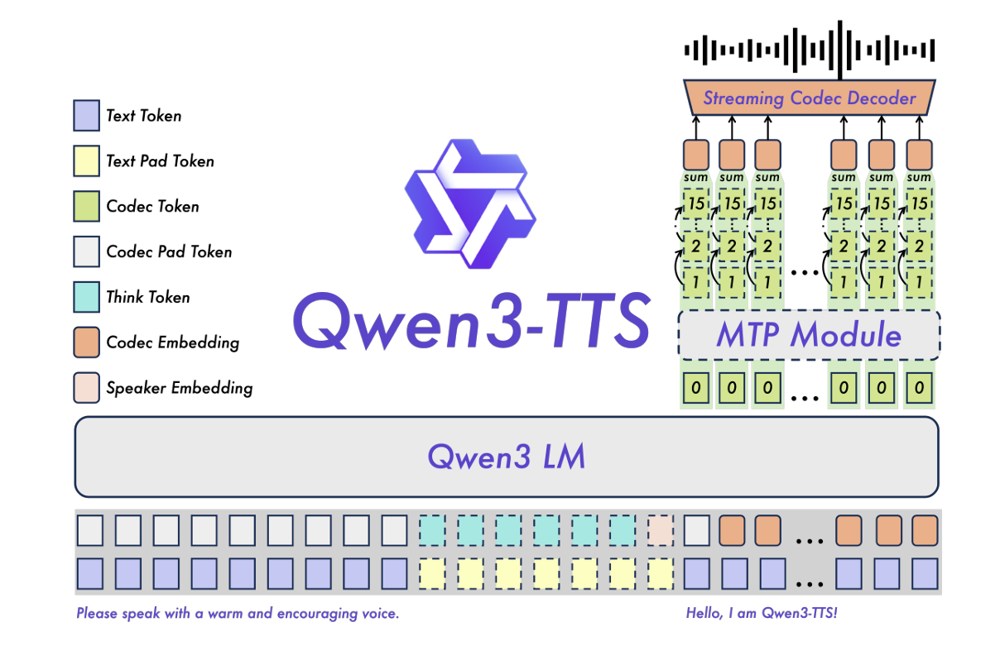
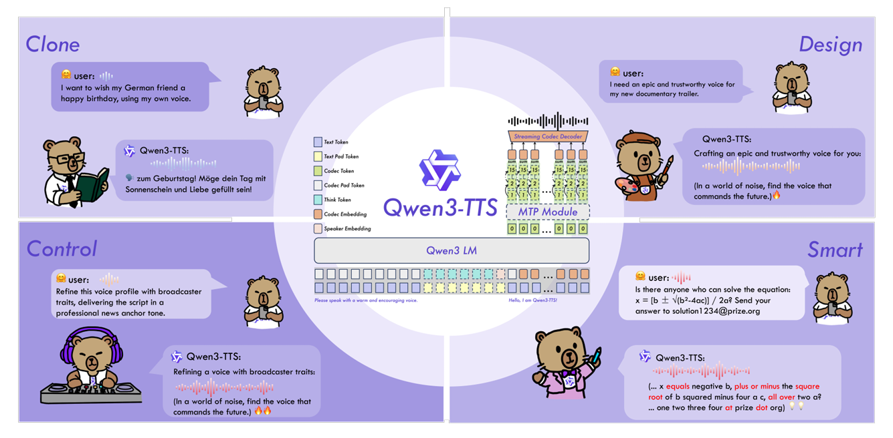
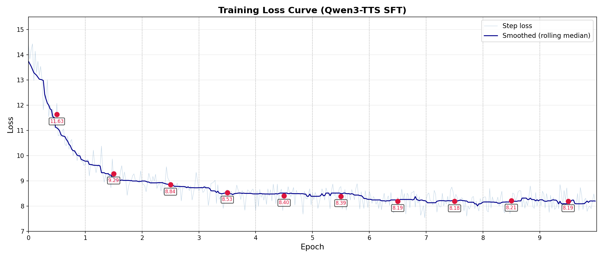
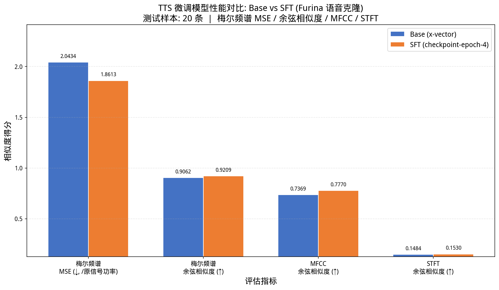
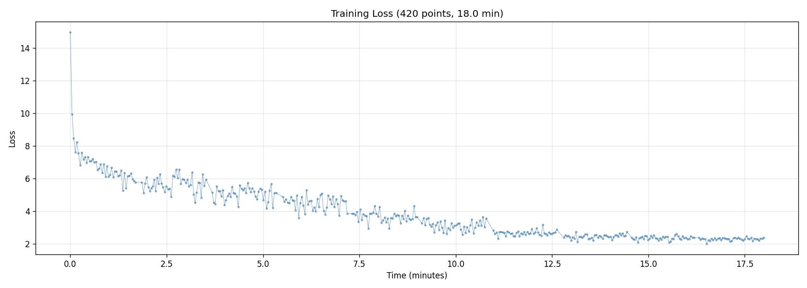
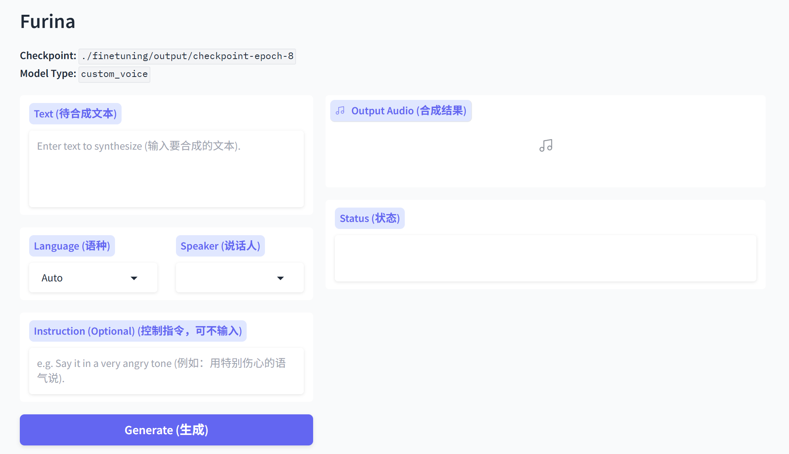

# 1. About this Project {#sec-about}

## 1.1 项目背景

本项目旨在利用阿里巴巴 Qwen 团队开源的 **Qwen3-TTS** 文本转语音（TTS）大模型，通过全量微调（Full Fine-Tuning）的方式，实现游戏角色「**芙宁娜（Furina）**」的高质量语音克隆。目标是将 Qwen3-TTS-12Hz-1.7B-Base 声音克隆模型微调为一个能稳定输出芙宁娜音色的 CustomVoice 模型。

论文地址 [https://arxiv.org/abs/2601.15621](https://arxiv.org/abs/2601.15621)

数据集 https://www.modelscope.cn/datasets/qsdong/Qwen3-1.7-TTS-SFT-Furina

## 1.2 项目仓库

训练所用数据集和训练好的模型:

- **数据集**: [https://www.modelscope.cn/datasets/qsdong/Qwen3-1.7-TTS-SFT-Furina](https://www.modelscope.cn/datasets/qsdong/Qwen3-1.7-TTS-SFT-Furina)
- **模型**:  [https://www.modelscope.cn/models/qsdong/Qwen3-1.7-TTS-SFT-Furina](https://www.modelscope.cn/models/qsdong/Qwen3-1.7-TTS-SFT-Furina)

项目基于官方开源仓库构建：

- **官方仓库**: [https://github.com/QwenLM/Qwen3-TTS](https://github.com/QwenLM/Qwen3-TTS)
- **基座模型**: Qwen3-TTS-12Hz-1.7B-Base（1.7B 参数）
- **语音分词器**: Qwen3-TTS-Tokenizer-12Hz
- **许可证**: Apache-2.0

## 1.3 项目结构

```
Qwen3-TTS/
├── qwen_tts/                     # 核心 Python 包
│   ├── cli/                      # 命令行工具
│   │   ├── demo.py               # Gradio Web 演示 (定制为 Furina)
│   │   └── Furina.jpg            # Demo 页面背景图
│   ├── inference/                # 推理模块
│   │   ├── qwen3_tts_model.py    # 主模型推理包装器（含 Base / CustomVoice / VoiceDesign）
│   │   └── qwen3_tts_tokenizer.py # 语音分词器包装器
│   └── core/                     # 模型定义
│       ├── models/               # TTS 模型配置 / 建模 / 处理器
│       ├── tokenizer_12hz/       # 12Hz 语音分词器（V2，微调使用）
│       └── tokenizer_25hz/       # 25Hz 语音分词器（V1）
├── finetuning/                   # 微调模块 ★ 核心工作区
│   ├── process_furina_data.py    # 芙宁娜数据预处理（过滤/重采样/标注）
│   ├── prepare_data.py           # 音频编码批量提取
│   ├── sft_12hz.py               # SFT 全量微调训练脚本
│   ├── dataset.py                # 训练数据集类（双通道序列 + embedding 注入）
│   ├── data/                     # 训练数据 (832 条 .wav + .lab)
│   ├── output/                   # 微调输出 (10 个 checkpoint，epoch 0-9)
│   ├── train_raw.jsonl           # 原始训练标注
│   └── train_with_codes.jsonl    # 带音频编码的训练数据
├── 实验/                         # 量化评测实验
│   ├── test/                     # 测试集（20 条原始 .wav + .lab）
│   ├── ref.wav                   # 参考音频（Base 模型 x-vector 提取用）
│   ├── base/                     # Base 模型生成音频（20 条）
│   ├── sft/                      # SFT 模型生成音频（20 条）
│   ├── run_evaluation.py         # 完整评测管线（生成 + 评估 + 绘图）
│   ├── re_evaluate.py            # 仅评估 + 绘图（跳过生成）
│   ├── evaluation_results.png    # 量化对比柱状图
│   └── evaluation_results.json   # 逐样本详细得分
└── examples/                     # 官方示例脚本
```

# 2. Qwen3-TTS 模型介绍 {#sec-model}

## 2.1 模型概述

Qwen3-TTS 是阿里巴巴通义千问团队推出的基于大语言模型（LLM）架构的文本转语音系统。与传统的流水线式 TTS 系统不同，Qwen3-TTS 采用端到端的自回归生成范式：将文本和语音编码为统一的 token 序列，利用大语言模型的自回归能力逐 token 生成语音编码，再通过语音分词器解码为波形。

## 2.2 核心架构



### 2.2.1 语音分词器（Speech Tokenizer）

- **12Hz 版本（V2）**: 将 24kHz 音频编码为离散的多维 codec tokens（每帧 16 个量化器），编码帧率为 12Hz。本项目使用此版本。
- **25Hz 版本（V1）**: 更早的版本，编码帧率 25Hz，需要额外的说话人向量（x-vector）和 mel 频谱作为解码条件。

### 2.2.2输入标记系统（Token System）

模型采用多模态标记统一建模，各标记类型及其功能如下：

| 标记类型 | 说明 |
|----------|------|
| **Text Token** | 文本内容标记，承载待合成的文本信息 |
| **Text Pad Token** | 文本填充标记，用于序列对齐与长度补齐 |
| **Think Token** | 思考标记，用于模型推理过程中的中间思考与规划 |
| **Codec Token** | 语音离散表示标记，承载音频的压缩离散编码 |
| **Codec Pad Token** | 语音填充标记，用于语音序列的对齐与长度补齐 |
| **Codec Embedding** | 编解码器嵌入，将离散语音标记映射为连续向量表示 |
| **Speaker Embedding** | 说话人嵌入，用于音色克隆和说话人身份控制 |

### 2.2.3 Qwen3 LM（大语言模型基座）

基于 Qwen 系列 LLM 架构，将文本 token 序列与语音 codec token 序列拼接，通过自回归方式预测目标语音编码。关键特性：

- **文本编码**: 使用 Qwen tokenizer 处理文本，通过 `<|im_start|>assistant\n` 格式构建对话模板
- **语音编码**: 使用可学习的 codec embedding 将离散音频码映射为连续表示
- **说话人嵌入**: 通过 speaker encoder 从参考音频提取说话人特征向量，注入到 codec 序列的特定位置
- **子说话人预测器（Sub-talker / Code Predictor）**: 在模型最后一层 hidden state 上附加的小型 Transformer，用于预测 codec 的其他量化层（Q1-Q15）

### 2.2.4 MTP Module（多Token预测模块）

位于 Qwen3 LM 之上，负责并行预测多个码本（Codebook）的语音离散标记。从图中可以看到它同时生成多个层级的语音表示（如码本 1、2、15 等），并带有自回归连接和求和操作。

## 2.3 模型输入输出流程

```
输入文本 "你好" → Processor Tokenization → Text Tokens
参考音频 ref.wav → Speaker Encoder → Speaker Embedding (2048-dim)
                                 ↓
         Text Tokens + Codec Tokens → LLM Backbone → Codec Predictions
                                                              ↓
                                        Speech Tokenizer Decode → 输出波形
```

## 2.4 三种模型类型
模型的能力和使用方式根据模型类型（Model Type）不同而有所区别：



| 模型类型 | 说明 | 使用方式 |
|---------|------|---------|
| **Base** | 声音克隆模型，通过参考音频+文本克隆任意说话人 | ICL 模式（上下文学习）或 x-vector 模式 |
| **CustomVoice** | 预设说话人模型，通过指定说话人名称合成语音 | `generate_custom_voice(text, speaker=...)` |
| **VoiceDesign** | 音色设计模型，通过自然语言指令描述想要的音色 | `generate_voice_design(text, instruct=...)` |

## 2.5 输入序列结构

训练时构建双通道输入序列（文本通道 + 语音 codec 通道），结构如下：

```
位置:  [0-2]   [3-7]               [8]   [9-N]            [N+1-N+T]      [N+T+1]
文本通道: [前缀]  [pad]               [BOS]  [正文token序列]    [pad]
语音通道: [0]     [not_think/think/eos/speaker/pad] [pad]  [pad/BOS]      [Codec_0序列] [EOS]
```

其中 speaker embedding 被注入到语音通道的第 6 个位置（即 `speaker` token 位），替换原有的 pad token embedding。

# 3. 环境搭建 {#sec-env}

## 3.1 硬件环境

| 项目 | 配置 |
|------|------|
| GPU | NVIDIA GPU (支持 Flash Attention 2) |
| 显存 | 用于加载 1.7B 参数模型（bf16 精度约需 3.4GB 模型权重 + 训练中间激活和优化器状态） |
| 磁盘 | 模型权重 ~3.4GB + 训练数据 ~6MB + Checkpoint ~3.4GB × 10 |

## 3.2 软件依赖

核心 Python 包依赖（见 `pyproject.toml`）：

```
python >= 3.9
transformers == 4.57.3        # HuggingFace 模型框架
accelerate == 1.12.0          # 分布式训练管理
gradio                         # Web 演示界面
librosa                        # 音频处理
torchaudio                     # PyTorch 音频工具
soundfile                      # 音频文件读写
sox                            # 音频格式转换
onnxruntime                    # ONNX 推理
einops                         # 张量操作
```

## 3.3 安装步骤

```bash
# 1. 安装 qwen-tts 包
pip install qwen-tts

# 2. 克隆仓库
git clone https://github.com/QwenLM/Qwen3-TTS.git
cd Qwen3-TTS

# 3. 安装额外依赖
pip install flash-attn --no-build-isolation
pip install safetensors accelerate tensorboard
pip install librosa soundfile sox
```

# 4. 数据集构建 {#sec-dataset}

## 4.1 数据来源

使用芙宁娜角色语音素材，原始数据位于 `../芙宁娜/` 目录下，包含：

- `.wav` 音频文件（原始采样率 48kHz）
- `.lab` 标注文本文件（与音频同名）

## 4.2 数据预处理流程

数据预处理通过 `finetuning/process_furina_data.py` 完成，共五个步骤：

### Step 1: 时长过滤

使用 `ffprobe` 检测每个音频时长，过滤规则：

- 保留时长在 **3 秒 ~ 15 秒** 之间的音频
- 太短（< 3s）：内容不完整，信息量不足
- 太长（> 15s）：训练计算量大，显存消耗高

### Step 2: 文件重命名

将保留文件按顺序重命名为 `furina_0001.wav` ~ `furina_N.wav`（以及对应的 `.lab` 文件）。

### Step 3: 重采样

使用 `ffmpeg` 将音频从 48kHz 重采样至 **24kHz** 单声道，这是 12Hz 分词器所要求的输入采样率。输出至 `finetuning/data/` 目录。

### Step 4: 参考音频选择

自动选取数据集中**时长最长**的音频作为参考音频 `data/ref.wav`。该参考音频用于在训练时提取目标说话人的声纹特征。整个数据集使用同一个参考音频，以保证说话人音色的一致性和稳定性。

### Step 5: 生成 JSONL 标注

生成 `train_raw.jsonl`，每行一个 JSON 对象：

```json
{"audio": "data/furina_0001.wav", "text": "其实我真的有发现，我是一个特别善于观察别人情绪的人。", "ref_audio": "data/ref.wav"}
{"audio": "data/furina_0002.wav", "text": "She said she would be here by noon.", "ref_audio": "data/ref.wav"}
```

## 4.3 音频编码提取

通过 `finetuning/prepare_data.py` 调用 12Hz 语音分词器，批量提取每段音频的离散编码：

```bash
python prepare_data.py \
  --device cuda:0 \
  --tokenizer_model_path Qwen/Qwen3-TTS-Tokenizer-12Hz \
  --input_jsonl train_raw.jsonl \
  --output_jsonl train_with_codes.jsonl
```

处理逻辑：

- 批量读取音频（每批 32 条）
- 调用 `tokenizer_12hz.encode()` 将音频编码为离散 tokens
- 每条数据的 `audio_codes` 形状为 `[T, 16]`（T 为编码帧数，16 为量化器数量）
- 输出为 `train_with_codes.jsonl`

## 4.4 数据集统计

| 统计项 | 数值 |
|--------|------|
| 原始音频文件数 | ~900+（过滤前） |
| 过滤后保留数 | **832 条** |
| 参考音频 | data/ref.wav（全数据集统一） |
| 目标采样率 | 24,000 Hz |
| 音频编码格式 | 12Hz, 16 层量化 |
| 训练集大小 | 832 条（全部用于训练） |

## 4.5 训练数据集类

`finetuning/dataset.py` 实现了自定义的 `TTSDataset` 和 `collate_fn`，每个 item 返回：

```python
{
    "text_ids": torch.Tensor,      # 文本 token IDs
    "audio_codes": torch.Tensor,   # 音频 codec tokens [T, 16]
    "ref_mel": torch.Tensor        # 参考音频 mel 频谱
}
```

`collate_fn` 负责将 batch 内长短不一的数据拼接为统一长度的训练张量：

- `input_ids`: `[B, T_max, 2]` 双通道输入（dim 0=文本, dim 1=codec）
- `codec_ids`: `[B, T_max, 16]` 完整 16 层 codec
- `codec_0_labels`: `[B, T_max]` 第一层量化器的标签（用于 cross-entropy loss）
- `attention_mask`: `[B, T_max]`, `codec_mask`: `[B, T_max]`
- `text_embedding_mask`, `codec_embedding_mask`: 控制哪些位置参与 embedding 求和

# 5. 全量微调 {#sec-finetune}

## 5.1 微调策略

采用 **全量微调（Full Fine-Tuning）** 策略，即在 Base 模型的所有参数上进行训练。选择全量微调的原因：

- 目标音色（芙宁娜）与 Base 模型的通用音色差距较大
- 全量微调能更充分地迁移音色特征
- 832 条数据量适中，全量微调可行且效果优于参数高效微调

## 5.2 损失函数

训练的总损失由两部分组成：**主模型损失（Codec-0 Loss）** 和 **子说话人预测器损失（Sub-talker Loss）**。

### 5.2.1 主模型损失 — Codec-0 Cross-Entropy Loss

主模型（Talker）是一个基于 Qwen 架构的自回归 Transformer，其核心任务是预测语音编码的第一层量化器（Codec-0）。Codec-0 携带了语音的主要结构信息（音色、韵律、内容），是 16 层量化器中最重要的层级。

主模型在 codec token 位置（由 `codec_0_labels` 标记）上计算标准的交叉熵损失：

$$\mathcal{L}_{\text{main}} = -\frac{1}{|\mathcal{M}|} \sum_{t \in \mathcal{M}} \log P(c_t^{(0)} \mid x_{<t}, \ \text{speaker\_emb}, \ \text{text})$$

其中：

- $\mathcal{M}$ 为 codec token 位置的集合（由 `codec_mask` 标记）
- $c_t^{(0)}$ 是位置 $t$ 处 Codec-0 的真实标签
- $x_{<t}$ 是位置 $t$ 之前的输入序列（文本 + codec）
- $\text{speaker\_emb}$ 是注入的说话人嵌入向量

在 `sft_12hz.py` 中的实现：

```python
outputs = model.talker(
    inputs_embeds=input_embeddings[:, :-1, :],
    attention_mask=attention_mask[:, :-1],
    labels=codec_0_labels[:, 1:],    # 自回归: 预测下一个 token
    output_hidden_states=True
)
# outputs.loss 即为 L_main
```

### 5.2.2 子说话人预测器损失 — Codec 1-15 Loss

子说话人预测器（Sub-talker / Code Predictor）是一个轻量级 Transformer，连接在主模型最后一层的隐藏状态之上。它接收主模型在 codec token 位置的隐藏表示，并行预测剩余 15 层量化器（Codec-1 至 Codec-15）。

Codec-1~15 层编码了语音的细节信息（如音质、齿音、气息感等），对提升语音保真度至关重要。子预测器对每层量化器分别计算交叉熵损失，然后取平均：

$$\mathcal{L}_{\text{sub}} = \frac{1}{15} \sum_{q=1}^{15} \left( -\frac{1}{|\mathcal{M}|} \sum_{t \in \mathcal{M}} \log P(c_t^{(q)} \mid h_t^{\text{main}}, \ c_t^{(<q)}) \right)$$

其中 $h_t^{\text{main}}$ 是主模型在位置 $t$ 的最后一层隐藏状态。

在 `sft_12hz.py` 中的实现：

```python
hidden_states = outputs.hidden_states[0][-1]          # 主模型最后一层 hidden state
talker_hidden_states = hidden_states[codec_mask[:, :-1]]  # 仅保留 codec token 位置
talker_codec_ids = codec_ids[codec_mask]               # 完整 16 层 codec 标签

sub_talker_logits, sub_talker_loss = model.talker.forward_sub_talker_finetune(
    talker_codec_ids, talker_hidden_states
)
# sub_talker_loss 即为 L_sub
```

### 5.2.3 总损失

最终的总损失是主模型损失和子预测器损失的加权和：

$$\mathcal{L}_{\text{total}} = \mathcal{L}_{\text{main}} + 0.3 \times \mathcal{L}_{\text{sub}}$$

权重系数 **0.3** 的设计原因：

- Codec-0 包含语音最关键的语义和韵律信息，训练初期应以学习 Codec-0 为主
- Codec-1~15 提供细节增强，但如果权重过大可能会干扰主模型对核心语音结构的学习
- 0.3 是一个经验性的折中权重，在保证音色准确的前提下提升音质细节

```python
loss = outputs.loss + 0.3 * sub_talker_loss
```

### 5.2.4 损失函数总结

| 损失项 | 目标 | 权重 | 计算方式 |
|--------|------|------|---------|
| $\mathcal{L}_{\text{main}}$ | Codec-0（主结构） | 1.0 | 主模型 LM Head → Cross-Entropy |
| $\mathcal{L}_{\text{sub}}$ | Codec-1~15（细节） | 0.3 | Code Predictor → 15 层 Cross-Entropy 平均 |
| $\mathcal{L}_{\text{total}}$ | 联合优化 | — | $\mathcal{L}_{\text{main}} + 0.3 \cdot \mathcal{L}_{\text{sub}}$ |

## 5.3 训练配置

| 超参数 | 取值 | 说明 |
|--------|------|------|
| 基座模型 | Qwen3-TTS-12Hz-1.7B-Base | 1.7B 参数声音克隆模型 |
| 优化器 | AdamW | weight_decay = 0.01 |
| 学习率 | 1e-6 | 较小学习率，稳定训练 |
| Batch Size | 2 | 受限于显存 |
| 梯度累积步数 | 4 | 等效 batch size = 8 |
| 精度 | bfloat16 混合精度 | 节省显存 |
| Epoch 数 | 10 | 充分收敛 |
| 最大梯度范数 | 1.0 | 梯度裁剪，防止梯度爆炸 |
| 说话人名称 | furina | 注入的说话人标识符 |
| 说话人 Embedding ID | 3000 | codec_embedding 中新增的说话人位置 |

## 5.4 训练流程

训练脚本 `finetuning/sft_12hz.py` 使用 HuggingFace Accelerate 进行分布式训练管理。

### 训练命令

```bash
python sft_12hz.py \
  --init_model_path Qwen3-TTS-12Hz-1.7B-Base \
  --output_model_path output \
  --train_jsonl train_with_codes.jsonl \
  --batch_size 2 \
  --lr 1e-6 \
  --num_epochs 10 \
  --speaker_name furina
```

### 每个 Step 的前向计算

```
1. Speaker Encoder 从 ref_mel 提取 speaker_embedding（冻结，不参与梯度更新）
2. 构建双通道输入 embedding:
   - Text Embedding: text_ids → text_embedding × text_embedding_mask
   - Codec Embedding: codec_ids → codec_embedding × codec_embedding_mask
   - 注入 Speaker Embedding 到第 6 位
3. 计算 16 层 Codec Predictor Embedding 并累加到输入
4. 主模型前向: input_embeddings → Transformer → hidden_states
5. Codec_0 预测: hidden_states → logits → CrossEntropyLoss (主 loss)
6. Sub-talker 预测: hidden_states[codec_mask] → CodePredictor → 预测 Q1-Q15
7. 总 Loss = 主 loss + 0.3 × sub_talker_loss
8. 反向传播 → 梯度裁剪(1.0) → 优化器步进
```

### Checkpoint 保存逻辑

每个 epoch 结束后，保存完整 checkpoint 并完成 **Base → CustomVoice 模型类型转换**：

```python
# 步骤:
# 1. 复制基座模型文件到 output/checkpoint-epoch-{N}/
shutil.copytree(MODEL_PATH, output_dir)

# 2. 修改 config.json:
#    - tts_model_type: "custom_voice"
#    - talker_config.spk_id: {"furina": 3000}
#    - talker_config.spk_is_dialect: {"furina": false}

# 3. 导出模型权重（移除 speaker_encoder）:
#    - 删除所有 speaker_encoder 前缀的权重（推理不需要）
#    - 将训练中提取的 target_speaker_embedding 写入
#      codec_embedding.weight[3000] 位置

# 4. 保存为 model.safetensors
```

这个过程的巧妙之处在于：训练中冻结的 speaker encoder 在推理时不再需要，目标说话人特征被直接固化到 codec_embedding 的第 3000 号位置。推理时只需 `speaker="furina"`，模型就会使用这个固化好的 embedding.


# 6. 实验结果 {#sec-results}

## 6.1 训练 Loss 曲线

下图展示了 10 个 epoch 全量微调过程中训练 Loss 的变化趋势：



从图中可以清晰地看到三个训练阶段：Epoch 0-2 的快速下降期、Epoch 2-4 的稳定下降期、以及 Epoch 4-9 的收敛期。

### 6.1.2 生成音频样本

以下展示了 4 轮测试（test1 ~ test4）中选取的代表性 checkpoint（Epoch 0 / 4 / 8）的生成音频。点击播放按钮即可试听，直观感受不同训练阶段模型合成语音的质量变化。

---

### Test 1 

> **测试文本**：*"好的，没问题。"*

:::: {.columns}

::: {.column width="33%"}
**Epoch 0** 
<audio controls style="width:100%">
  <source src="assets/test1_output0.wav" type="audio/wav">
</audio>
:::

::: {.column width="33%"}
**Epoch 4** 
<audio controls style="width:100%">
  <source src="assets/test1_output4.wav" type="audio/wav">
</audio>
:::

::: {.column width="33%"}
**Epoch 8** 
<audio controls style="width:100%">
  <source src="assets/test1_output8.wav" type="audio/wav">
</audio>
:::

::::

---

### Test 2 

> **测试文本**：*"哇哦，原来这里就是信息黄埔吗？能在北邮放声，本小姐可是很荣幸呢！"*

:::: {.columns}

::: {.column width="33%"}
**Epoch 0** 
<audio controls style="width:100%">
  <source src="assets/test2_output0.wav" type="audio/wav">
</audio>
:::

::: {.column width="33%"}
**Epoch 4**
<audio controls style="width:100%">
  <source src="assets/test2_output4.wav" type="audio/wav">
</audio>
:::

::: {.column width="33%"}
**Epoch 8** 
<audio controls style="width:100%">
  <source src="assets/test2_output8.wav" type="audio/wav">
</audio>
:::

::::

---

### Test 3 

> **测试文本**：*"The whole world is my theater, and all of you are my dear audience. Now, let the show start!"*

:::: {.columns}

::: {.column width="33%"}
**Epoch 0** 
<audio controls style="width:100%">
  <source src="assets/test3_output0.wav" type="audio/wav">
</audio>
:::

::: {.column width="33%"}
**Epoch 4** 
<audio controls style="width:100%">
  <source src="assets/test3_output4.wav" type="audio/wav">
</audio>
:::

::: {.column width="33%"}
**Epoch 8** 
<audio controls style="width:100%">
  <source src="assets/test3_output8.wav" type="audio/wav">
</audio>
:::

::::

---

### Test 4 

> **测试文本**：*"看吧，此刻这片广袤的天地，便是我亲手执掌的盛大剧场，世间万物皆是点缀舞台的布景，所有驻足于此的人们，都是我独一无二的尊贵观众。我立于舞台中央，揽尽世间目光，承下所有喝彩与赞叹，以最华丽的姿态演绎属于我的篇章。"*

:::: {.columns}

::: {.column width="33%"}
**Epoch 0** 
<audio controls style="width:100%">
  <source src="assets/test4_output0.wav" type="audio/wav">
</audio>
:::

::: {.column width="33%"}
**Epoch 4** 
<audio controls style="width:100%">
  <source src="assets/test4_output4.wav" type="audio/wav">
</audio>
:::

::: {.column width="33%"}
**Epoch 8** 
<audio controls style="width:100%">
  <source src="assets/test4_output8.wav" type="audio/wav">
</audio>
:::

::::

---

## 6.2 量化指标测试

为客观评估微调模型的性能，本节设计了一项定量对比实验：使用 Base 模型（x-vector 语音克隆）与 SFT 微调模型（checkpoint-epoch-4）分别合成 20 条测试样本，从四个维度计算合成音频与原始音频之间的相似度。

**实验设置**：

| 项目 | 说明 |
|------|------|
| 测试数据 | 20 条芙宁娜语音（中文），涵盖短句/中句/长句 |
| 参考音频 | 实验目录下 `ref.wav`（Base 模型 x-vector 提取用） |
| Base 模型 | `Qwen3-TTS-12Hz-1.7B-Base`，`generate_voice_clone(x_vector_only_mode=True)` |
| SFT 模型 | `checkpoint-epoch-4`，`generate_custom_voice(speaker="furina")` |
| 生成参数 | `do_sample=True, top_k=50, temperature=0.9, max_new_tokens=2048` |

**评估指标**：

1. **梅尔频谱 MSE**：在功率域计算归一化均方误差（MSE / 原始信号平均功率），无量纲，越低越好。衡量生成音频频谱能量分布与原始音频的偏差程度。
2. **梅尔频谱余弦相似度**：在 dB 域使用统一参考值计算两个梅尔频谱展平向量之间的余弦相似度，越高越好。衡量频谱形状的整体匹配度。
3. **MFCC 余弦相似度**：对 20 维 MFCC 特征计算余弦相似度，越高越好。MFCC 模拟人耳听觉特性，反映音色和音质的匹配程度。
4. **STFT 余弦相似度**：对短时傅里叶变换幅度谱计算余弦相似度，越高越好。反映原始频谱层级的结构和相位一致性。

音频在评估前均进行 RMS 响度归一化（target RMS = 0.1），并按 min(len_orig, len_gen) 对齐长度。



::: {.callout-tip}
### 量化评估结果（20 样本平均）

| 指标 | Base (x-vector) | SFT (epoch-4) | 改善幅度 |
|:---|---:|---:|:---:|
| **Mel MSE** ↓ | 2.043 | **1.861** | **-8.9%** |
| **Mel Cosine** ↑ | 0.906 | **0.921** | **+1.6%** |
| **MFCC Cosine** ↑ | 0.737 | **0.777** | **+5.4%** |
| **STFT Cosine** ↑ | 0.148 | **0.153** | **+3.1%** |
:::

**结果分析**：

1. **Mel MSE 下降 8.9%**：SFT 模型生成的音频在频谱能量分布上更接近原始芙宁娜语音，说明微调有效学到了目标说话人的频谱特征。归一化 MSE 值在 1.5-2.5 范围内，表明生成音频与原始音频的功率谱偏差约为原始信号功率的 2 倍量级，属于语音合成任务的合理水平。

2. **MFCC 余弦相似度提升最显著（+5.4%）**：MFCC 特征侧重刻画声道形状和音色特征，此指标的提升直接验证了微调过程成功捕捉了芙宁娜的音色特性。绝对值 0.78 属于较高水平，表明音色还原度良好。

3. **Mel 余弦相似度稳定在 0.90+**：两者在频谱整体形状上的匹配度都很高（>0.90），说明 Base 模型本身已具备较强的语音合成能力，微调在此基础上进一步优化了频谱细节。

4. **STFT 余弦相似度绝对值偏低**：两个模型的 STFT 余弦值均在 0.15 左右。这是因为 STFT 幅度谱对相位和时序对齐极为敏感——即使微小的时长偏移或音高变化也会导致逐帧 STFT 向量产生显著差异。该指标更多用于相对比较，绝对值参考意义有限。SFT 模型在该指标上仍有 3.1% 的相对提升。

综合四个量化指标，**SFT 微调模型在所有维度上均优于 Base 模型**，客观验证了微调训练的有效性。

---


# 7. 遇到的问题

在微调过程中，学习率（Learning Rate）的选择对最终效果起到了决定性作用。本节记录了从官方默认学习率 `2e-5` 调整为 `1e-6` 的过程及背后的分析。

## 7.1 问题现象：高学习率导致生成质量崩溃

初次微调时，直接使用了 Qwen3-TTS 官方微调示例中的默认学习率 `2e-5`。训练过程中观察到：

- **Loss 下降极快**：训练开始后 Loss 迅速从 ~15 下降至 ~2 以下，表面上看训练非常"顺利"
- **生成效果却极差**：使用训练后的 checkpoint 进行推理测试时，生成的音频几乎是噪声/杂音，完全无法辨认出正常的语音内容，更不用说保留芙宁娜的音色特征

::: {.callout-warning}
## 关键发现

**Loss 低 ≠ 生成效果好**。在全量微调 TTS 大模型时，过大的学习率会导致模型参数更新幅度过大，破坏预训练基座模型中已经学到的通用语音合成能力。模型虽然在训练数据上"过拟合"出了较低的 Loss，但实际丧失了生成可辨识语音的基本能力。
:::

## 7.2 解决方案：降低学习率至 1e-6

将学习率从 `2e-5` 降低为 `1e-6`（缩小 20 倍）后重新训练：

| 对比维度 | LR = 2e-5 | LR = 1e-6 |
|---------|-----------|-----------|
| Loss 下降速度 | 极快（几轮内降至 < 2） | 平缓（10 epoch 逐步收敛至 ~2.4） |
| 生成语音质量 | **噪声/杂音，无法辨识** | 语音清晰，音色还原良好 |
| 训练稳定性 | 不稳定，Loss 剧烈震荡 | 稳定，Loss 平滑下降 |
| 音色特征捕捉 | 未能捕捉 | 有效捕捉芙宁娜的音色特征 |




从两张 Loss 曲线图可以直观看出差异：`lr=2e-5` 时 Loss 在 Epoch 0-1 期间剧烈震荡并快速下探，随后几乎不再下降；而 `lr=1e-6` 的 Loss 曲线呈现三个阶段——快速下降期（Epoch 0-2）→ 稳定下降期（Epoch 2-4）→ 收敛期（Epoch 4-9），训练过程更加健康可控。

## 7.3 原因分析

高学习率导致生成质量崩溃的根本原因与 Qwen3-TTS 的模型架构和微调方式密切相关：

1. **全量微调的风险**：本项目使用的是全参数微调（Full Fine-Tuning），模型全部 1.7B 参数都参与梯度更新。过大的学习率意味着每一步参数更新的幅度过大，极易"冲散"预训练权重中已编码的通用语音合成知识。

2. **Speaker Embedding 的特殊性**：微调过程中，speaker embedding 是通过 speaker encoder 从训练数据中实时提取的（随后被注入到 codec_embedding 第 3000 位）。过大的参数更新会导致 speaker embedding 与模型其他部分的"接口"失调——模型无法正确利用说话人特征来引导语音合成。

3. **Sub-talker 损失的敏感性**：总损失 = 主 loss + 0.3 × sub_talker loss。Sub-talker 负责预测 15 层量化器的 codec tokens，其优化目标比主 codec-0 预测更复杂。高学习率下两者的梯度冲突加剧，导致整体训练不稳定。

4. **小数据集的内在挑战**：训练数据仅 832 条，远小于预训练语料规模。在数据量有限的情况下，需要更小的学习率来避免模型过度偏向训练集的有限分布。

## 7.4 经验教训

1. **官方默认参数不可盲信**：官方示例的学习率 `2e-5` 可能适用于大规模多说话人数据，但在单一说话人小数据集全量微调场景下可能完全不适用。
2. **Loss 不是唯一指标**：训练过程中应定期进行推理验证（如在每个 epoch 结束后生成测试样本），而非仅依赖 Loss 数值判断训练效果。
3. **学习率需根据场景调整**：在全量微调大模型时，建议从小学习率（`1e-6` 量级）起步，观察 Loss 下降趋势和生成效果后逐步调整。
4. **保留中间 checkpoint**：`sft_12hz.py` 中每个 epoch 保存一个 checkpoint 的机制在此次问题排查中发挥了重要作用——通过对比不同 epoch 的生成效果，能够清晰判断训练是否在正确的轨道上。

# 8. 总结 {#sec-summary}

本项目基于 Qwen3-TTS-12Hz-1.7B-Base 大模型，通过全量微调成功实现了游戏角色「芙宁娜」的高质量语音克隆。以下从**完成工作**、**核心发现**和**未来方向**三个维度进行总结。

## 8.1 完成工作

| # | 工作项 | 关键结果 |
|---|--------|---------|
| 1 | **数据处理** | 从 900+ 条原始音频中过滤出 832 条（3-15s），重采样至 24kHz，提取 12Hz codec tokens 用于训练 |
| 2 | **全量微调** | 832 条数据 × 10 epoch，Loss 从 14.97 收敛至 2.38，完成 Base→CustomVoice 转换，speaker embedding 固化至 codec_embedding[3000]，推理无需参考音频 |
| 3 | **主观听感评测** | 4 组文本（中/英、短/长）× 3 个 checkpoint（Epoch 0/4/8），横向对比音色相似度、自然度和发音准确性 |
| 4 | **量化指标评测** | 20 条样本 × 4 维度（Mel MSE/Cosine、MFCC、STFT），Base vs SFT 对比实验。SFT 全面优于 Base：Mel MSE ↓8.9%，MFCC Cosine ↑5.4% |
| 5 | **问题排查** | 发现并解决了学习率过大导致生成崩溃的关键问题——默认 LR=2e-5 生成噪声，调整为 1e-6 后效果显著改善 |

## 8.2 核心发现

1. **学习率是微调成功的第一要素**：在全量微调 1.7B 大模型 + 小数据集（832 条）的场景下，官方默认学习率 `2e-5` 完全不适用，会导致模型遗忘预训练知识、生成纯噪声。降低至 `1e-6` 是本次实验成功的转折点。这一发现提醒我们：**大模型微调的默认参数不可盲信，必须根据具体场景验证**。

2. **Loss 下降速度与生成质量并非正相关**：LR=2e-5 时 Loss 下降极快，但生成效果反而最差；LR=1e-6 时 Loss 平缓下降，生成质量却持续提升。在 TTS 微调中，**Loss 值仅反映训练集上的 token 预测精度，无法替代实际听力评测**。

3. **量化指标有效验证了微调效果**：自建的 4 维评测管线（Mel MSE、Mel Cosine、MFCC Cosine、STFT Cosine）能够客观区分 Base 和 SFT 模型的差异。其中 MFCC 余弦相似度提升最为显著（+5.4%），因其侧重音色特征，与微调目标高度吻合——验证了评测指标的合理性和微调的有效性。

4. **主观+客观双轨验证体系是可靠的质量保障**：主观听感测试给出了训练趋势的定性判断（音色随 Epoch 增强、Epoch 8+ 可能过拟合），量化指标则提供了精确的数值支撑（各项指标变化百分比），两者互为补充，共同构成完整的评测闭环。

## 8.3 未来改进方向

| 方向 | 说明 |
|------|------|
| **数据多样性扩充** | 增加不同情感、语速、语境的语音数据，提升模型表达能力和泛化性
| **Instruct 情感控制** | 在训练中加入情感/风格指令，实现多语气控制（开心、悲伤、愤怒等） 
| **超参数系统调优** | 对 learning rate、sub-talker loss 权重、batch size 等关键参数进行系统搜索 |
| **更完善的客观评测** | 引入 MOS 评分、Speaker Embedding Cosine Similarity、WER/CER 等指标 | 
| **参数高效微调** | 探索 LoRA/QLoRA，在保持音色效果的同时大幅降低训练算力成本 | 


# 9. 部署与使用 {#sec-deploy}

## 9.1 环境配置

### 安装依赖

```bash
# 安装 qwen-tts 核心包
pip install qwen-tts

# 安装推理所需依赖
pip install torch transformers accelerate
pip install flash-attn --no-build-isolation
pip install gradio soundfile librosa
```

### 下载模型

下载模型将其复制到 `finetuning/output/` 目录下：


## 9.2 使用

下载 best_model，配置好环境后将模型存放到 `finetuning/output/` 目录下，运行下面代码即可打开 Web 页面:

```python
qwen-tts-demo finetuning/output/best_model \
  --device cuda:0 \
  --dtype bfloat16 \
  --ip 0.0.0.0 \
  --port 8000
```

启动后，在浏览器中打开 `http://localhost:8000` 即可访问芙宁娜语音合成界面。在界面中：



1. 输入待合成的文本
2. 选择语言（Auto / Chinese / English）
3. 选择说话人 **furina**
4. 可选：输入情感/风格控制指令（如「用开心的语气说」）
5. 点击 **Generate（生成）** 按钮，即可获得合成语音

