# 实验目标

通过本实验，深入学习和实践语音信息处理中有关语音合成与转换的核心方法：

1. 基于 Griffin-Lim 算法的声码器实现，从幅度频谱图中迭代重建相位信息并生成语音；
2. 部署并微调 RVC（Retrieval-based Voice Conversion）声音转换模型，理解内容特征提取、F0 建模和特征检索融合的完整流程；
3. （选做）探索基于深度学习的语音合成模型。

实验的核心目标是掌握从频域表示恢复时域波形的相位重建算法原理，以及现代语音转换系统中特征解耦与检索增强的技术路线。

# 实验一：Griffin-Lim 算法实现声码器

## 实验原理

### 短时傅里叶变换（STFT）

**基本原理**：语音信号是非平稳信号，但其统计特性在短时间内（约 20–50ms）近似平稳。STFT 通过在信号上滑动窗函数，将长时域信号分割为一系列短时帧，对每一帧分别计算傅里叶变换，从而获得时变频谱表示。

**数学表达**：对于信号 $x[n]$，其 STFT 定义为：

$$X(m, k) = \sum_{n=-\infty}^{\infty} x[n] w[n - mH] e^{-j 2\pi k n / N}$$

其中 $w[n]$ 为分析窗函数（如汉明窗），$H$ 为帧移（hop length），$N$ 为 FFT 点数，$m$ 和 $k$ 分别为时间和频率索引。

**频谱图与相位**：STFT 结果为复数矩阵 $X(m,k) = |X(m,k)| \cdot e^{j\phi(m,k)}$，其中幅度谱 $|X(m,k)|$ 反映各频段的能量分布，相位谱 $\phi(m,k)$ 编码信号的时域结构细节。在语音合成与转换任务中，幅度谱通常作为操作对象，而相位信息则需要额外的方法来恢复。

### Griffin-Lim 算法

**基本原理**：Griffin-Lim 算法是一种从已知幅度谱中迭代重建时域信号的经典方法。其核心思想是利用 STFT 与逆 STFT（ISTFT）之间的对偶关系，通过交替投影的方式在时域和频域之间迭代，使得重建信号的 STFT 幅度谱逐步逼近目标幅度谱。

**数学表达**：设目标幅度谱为 $S = |X(m,k)|$，从随机初始化相位开始迭代：

1. 初始化：随机生成相位 $\phi_0(m,k) \sim U(0, 2\pi)$
2. 频域合成：$\hat{X}_i(m,k) = S \cdot e^{j\phi_i(m,k)}$
3. 逆变换到时域：$y_i[n] = \text{ISTFT}(\hat{X}_i)$
4. 再次 STFT：$X_{i+1}(m,k) = \text{STFT}(y_i)$
5. 提取新相位：$\phi_{i+1}(m,k) = \angle X_{i+1}(m,k)$
6. 重复步骤 2–5 直至收敛

该迭代过程等价于在约束集上寻找满足以下最小化目标的解：

$$\min_{y} \sum_{m,k} \left( |\text{STFT}(y)(m,k)| - S(m,k) \right)^2$$

**收敛性**：Griffin 和 Lim 在原始论文中证明了该算法在每次迭代后均方误差单调不增，保证收敛到局部最优解。收敛速度取决于帧移相对于窗长的比例——帧移越小（帧间重叠越大），收敛越快，因为相邻帧相位之间的冗余约束增强。

## 实验流程

### 定义 STFT/ISTFT 辅助函数与参数

首先设定 STFT 的关键参数 `n_fft`（FFT 点数 $N$）、`hop_length`（帧移 $H$）、`win_length`（窗长 $L$），并封装 `librosa.stft` 和 `librosa.istft`。STFT 将时域信号 $x[n]$ 变换到时频域：

$$X(m,k) = \sum_{n=-\infty}^{\infty} x[n]\, w[n - mH]\, e^{-j 2\pi kn/N}$$

其中 $w[n]$ 为窗函数，$m$ 为帧索引，$k$ 为频率索引。ISTFT 则通过重叠相加（overlap-add）将复数频谱重建回时域波形。

```python
n_fft, hop_length, win_length = 720, 160, 720  # TODO 尝试改变参数

def _stft(y):
    return librosa.stft(y=y, n_fft=n_fft,
                        hop_length=hop_length,
                        win_length=win_length)

def _istft(y):
    return librosa.istft(y, hop_length=hop_length,
                         win_length=win_length)
```

### Griffin-Lim 核心算法实现

这是实验的核心——实现 `_griffin_lim(S, gl_iters)` 函数。Griffin-Lim 的优化目标是使重建信号的幅度谱逼近给定的目标幅度谱：

$$\min_{y}\; \sum_{m,k} \Big( |\text{STFT}(y)(m,k)| - |S(m,k)| \Big)^2$$

迭代中保持幅度不变、逐步修正相位。下面对照代码逐行说明数学原理。

```python
def _griffin_lim(S, gl_iters):
    # TODO 随机生成一个与频谱图S形状相同的复数数组
    angles = np.exp(2j * np.pi * np.random.random_sample(S.shape))
```

> 随机初始化相位 $\phi_0(m,k) \sim U(0, 2\pi)$，并以复数指数形式表示 $e^{j\phi_0(m,k)}$。由于真实相位未知，从随机起点出发，迭代收敛到满足幅度约束的可行解。

```python
    # TODO 计算频谱图S的绝对值，然后将其转换为双精度复数类型
    S_complex = np.abs(S).astype(np.complex128)
```

> 从复数谱 $S \in \mathbb{C}^{F \times T}$ 中提取幅度 $|S|$，记为 $A(m,k) = |S(m,k)|$。迭代全程中幅度 $A$ 固定不变，仅更新相位估计。

```python
    # TODO 使用ISTFT转换回音频
    y = _istft(S_complex * angles)
```

> 初始重建 $y_0 = \text{ISTFT}\big(A \cdot e^{j\phi_0}\big)$。将固定的目标幅度与随机相位结合，通过 ISTFT 得到第一个时域估计。

```python
    for i in range(gl_iters):
        # TODO 对当前音频信号y进行STFT，取其相位角，
        # np.exp(1j * ...)将相位角转换回复数形式，与幅度谱匹配
        angles = np.exp(1j * np.angle(_stft(y)))
```

>第 $i$ 次迭代中，对当前估计 $y_i$ 做 STFT 得到
> $\hat{X}_i = \text{STFT}(y_i) = |\hat{X}_i| \cdot e^{j\angle\hat{X}_i}$，
> 丢弃其幅度 $|\hat{X}_i|$，仅提取相位 $\phi_{i+1} = \angle\hat{X}_i$ 作为新的相位估计。

```python
        y = _istft(S_complex * angles)
```

> 用固定幅度 $A$ 与新相位 $\phi_{i+1}$ 组合 $A \cdot e^{j\phi_{i+1}}$，经 ISTFT 得到更新后的时域信号
> $y_{i+1} = \text{ISTFT}(A \cdot e^{j\phi_{i+1}})$。重复此过程直至达到设定迭代次数。

```python
    return y
```

### 加载音频并计算 STFT

加载音频并重采样至 16kHz 单声道，得到时域信号 $x[n]$。通过 STFT 获得复数频谱 $D(m,k)$：

```python
AudioData, sr = librosa.load(input_path, sr=16000, mono=True)
D = librosa.stft(AudioData, n_fft=n_fft,
                 hop_length=hop_length, win_length=win_length)
```

STFT 输出 $D \in \mathbb{C}^{F \times T}$，其中 $F = N/2 + 1$（仅保留正频率），$T$ 为帧数，每一帧 $t$ 的频率分量 $D(:,t)$ 均为复数。

### 运行 Griffin-Lim 迭代重建

设定迭代次数 $\text{iters} = 200$，调用 `_griffin_lim` 从频谱 $D$ 重建波形：

```python
gl_iters = 200  # TODO 设置 Griffin-Lim 算法重复迭代的次数
ReAudio = _griffin_lim(D, gl_iters)
```

每次迭代均使 $\sum_{m,k}\big(|\text{STFT}(y_i)| - |D|\big)^2$ 单调不增，200 次迭代后相位估计基本收敛，重建波形在包络上与原始信号高度吻合。

## 实验结果及分析

### 迭代次数对重建质量的影响

实验固定 STFT 参数为 `n_fft=720, win_length=720, hop_length=160`（窗长 45ms，帧移 10ms），在 4 种不同迭代次数下运行 Griffin-Lim 算法，对比重建效果。

| 迭代次数 | 重建效果主观评价 | 波形与原始吻合程度 |
|---|---|---|
| 10 | 音频刺耳、有明显金属音，语音内容勉强可辨 | 波形包络模糊，细节丢失严重 |
| 50 | 金属音减弱，音质有所改善但仍有失真 | 包络基本可见，辅音段细节不足 |
| 200 | 音质较自然，与原始音频听感接近 | 波形包络与原始高度吻合 |
| 1000 | 音质与 200 次接近，改善幅度很小 | 与 200 次差异肉眼难辨，边际收益递减 |

#### 迭代 10 次

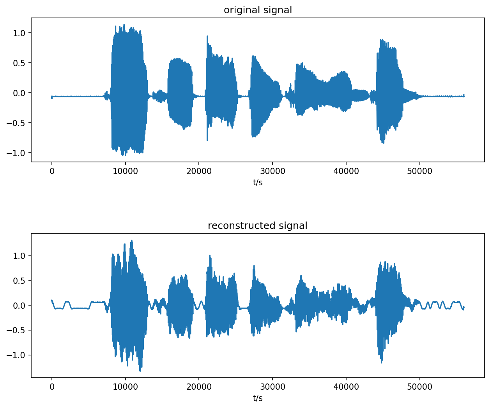{width=80%}

<audio controls style="width:80%"><source src="assets/audios/nfft720_win720_hop160_iter10.wav" type="audio/wav"></audio>

#### 迭代 50 次

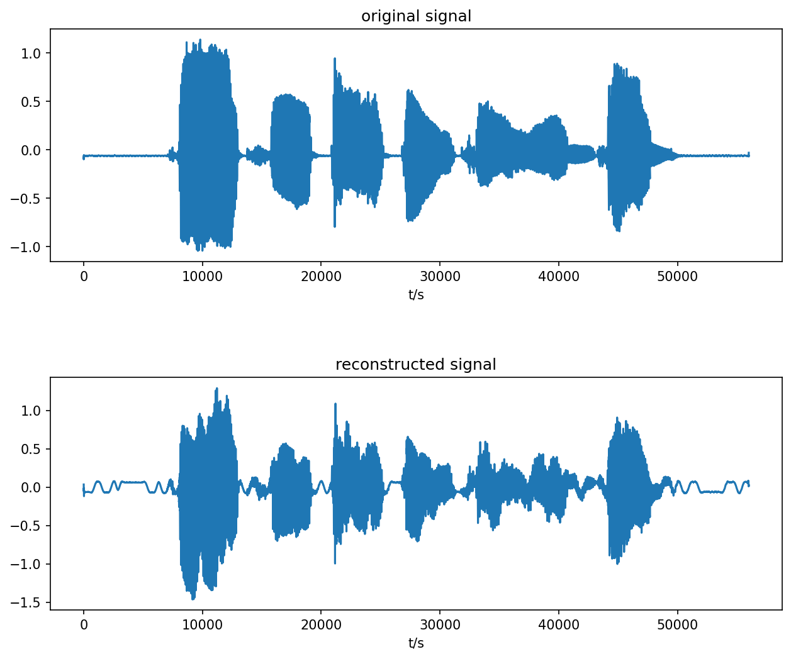{width=80%}

<audio controls style="width:80%"><source src="assets/audios/nfft720_win720_hop160_iter50.wav" type="audio/wav"></audio>

#### 迭代 200 次

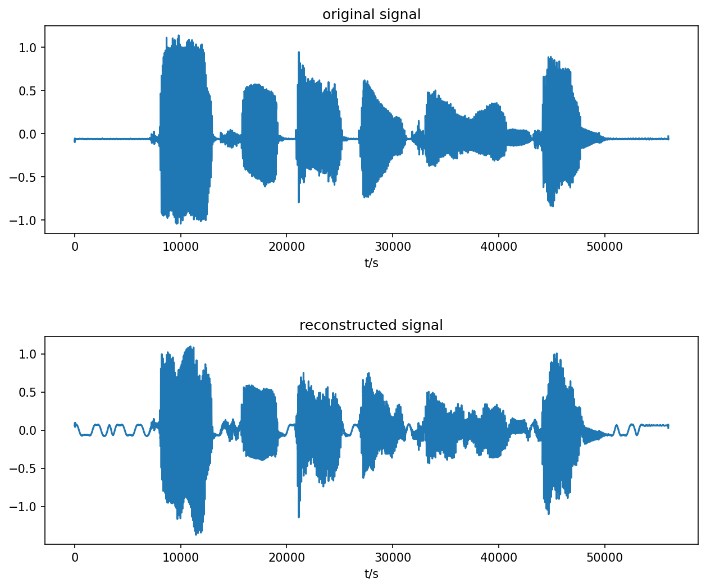{width=80%}

<audio controls style="width:80%"><source src="assets/audios/nfft720_win720_hop160_iter200.wav" type="audio/wav"></audio>

#### 迭代 1000 次

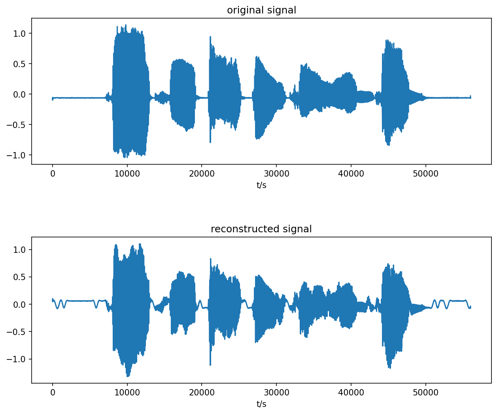{width=80%}

<audio controls style="width:80%"><source src="assets/audios/nfft720_win720_hop160_iter1000.wav" type="audio/wav"></audio>

#### 结果分析

**迭代次数对重建质量的影响**

Griffin-Lim 算法以交替投影方式逐步逼近真实相位。从上述四组实验可以清晰观察到迭代次数对重建质量的边际收益递减规律：

- **10 次迭代**：相位远未收敛，重建音频存在严重的金属音伪影。波形的宏观包络尚可分辨，但微观振荡模式与原始信号差异显著。此时 MSE（均方误差）仍处于高位。
- **50 次迭代**：相位估计已有明显改善，金属音减弱，语音内容清晰可辨。波形包络基本正确，但在清辅音等弱能量段的细节恢复仍不充分。
- **200 次迭代**：相位基本收敛，重建音质自然度较高，与原始音频听感差距很小。波形对比图中上（原始）下（重建）两条曲线高度一致。此时优化目标 $\sum_{m,k}\big(|\text{STFT}(y)| - |D|\big)^2$ 已下降至低点。
- **1000 次迭代**：继续增加迭代次数带来的改善微乎其微，人耳难以察觉差异。这表明算法已收敛到局部最优解，受限于幅度约束本身无法唯一确定真实相位，进一步迭代无意义。

该趋势符合 Griffin & Lim 原始论文中证明的均方误差单调递减且收敛到驻点的理论结论。

**收敛速度与帧移的关系**

本实验中 hop_length=160（帧移 10ms），帧间重叠率为 $\frac{720-160}{720} \approx 77.8\%$。高重叠率为相邻帧的相位提供了强冗余约束，使得算法在 200 次迭代内即可基本收敛。若使用更大的帧移（如 hop_length=360，重叠率 50%），收敛速度将显著减慢，需更多迭代次数才能达到相似质量。

**算法局限性**

Griffin-Lim 算法不能保证恢复真实相位——它只保证收敛到满足幅度约束的某个可行解。这在语音信号中表现为：即使波形看上去相似，听感上仍可能存在轻微的"相位失真"痕迹（一种不自然的音色）。现代神经声码器（如 HiFi-GAN）通过数据驱动的方式学习幅度到相位的映射，正是为了突破这一局限。

### STFT 参数对重建质量的影响

前面的实验固定了 `n_fft=720, hop_length=160, win_length=720`，本节分析这三个参数各自的物理含义和对 Griffin-Lim 重建质量的影响，并给出三组推荐配置的对比实验。

#### 参数物理含义（采样率 16kHz 下）

| 参数 | 公式 | 物理含义 | 当前值 | 对应时间/频率 |
|------|------|----------|--------|---------------|
| `n_fft` | $N$ | FFT 点数，决定频率分辨率 | 720 | $\Delta f = f_s / N = 16000/720 \approx 22.2\text{ Hz}$ |
| `win_length` | $L$ | 窗长度（每帧分析的样本数） | 720 | $T_w = L / f_s = 45\text{ ms}$ |
| `hop_length` | $H$ | 帧移（相邻帧起始位置间隔） | 160 | $T_h = H / f_s = 10\text{ ms}$ |

**关键关系**：

- **频率分辨率与时间分辨率权衡**：$\Delta f = f_s / N$，$N$ 越大频率分辨率越高，但时间分辨率不变（由 $L$ 决定）。当 $N > L$ 时进行零填充，在频域获得更细的插值但不增加新信息；当 $N < L$ 时截断，丢失高频细节。

- **窗长决定准平稳假设**：语音在 20–50ms 内近似平稳。$L=720 \Rightarrow 45\text{ms}$ 落在此范围内，兼顾了频率分辨率（$\Delta f \approx 22.2\text{Hz}$）和时间平稳性。

- **帧移决定帧间重叠**：重叠率 $= (L - H) / L = (720 - 160) / 720 \approx 77.8\%$。高重叠率为 Griffin-Lim 的相邻帧相位提供强冗余约束，是算法快速收敛的关键。

- **n_fft 与 win_length 关系**：当 $N = L$ 时不进行零填充，无频域插值；当 $N > L$ 时，窗后补零使频谱更平滑（不影响实际频率分辨率，仅插值）；当 $N < L$ 时截断窗，信息丢失。

#### 三组推荐配置对比

为直观对比不同参数配置对 Griffin-Lim 重建质量的影响，在采样率 16kHz 下测试了三组常用配置。以下均在 **50 次迭代** 下进行公平对比：

| n_fft | hop_length | win_length | 窗长 | 帧移 | 重叠率 | $\Delta f$ | 帧率 | 特点 |
|-------|------------|------------|------|------|--------|-------------|------|------|
| 720 | 160 | 720 | 45ms | 10ms | 77.8% | 22.2Hz | 100fps | 语音/人声/音乐通用 |
| 512 | 128 | 512 | 32ms | 8ms | 75% | 31.25Hz | 125fps | 帧数更多但每帧点数少，总体计算量略小 |
| 1024 | 128 | 1024 | 64ms | 8ms | 87.5% | 15.6Hz | 125fps | 最长窗+最高重叠，收敛最快，适合音乐 |

#### 配置一：高质量（`n_fft=720, hop_length=160, win_length=720`）— 迭代 50 次

{width=80%}

<audio controls style="width:80%"><source src="assets/audios/nfft720_win720_hop160_iter50.wav" type="audio/wav"></audio>

**分析**：45ms 窗长 + 10ms 帧移是语音处理的经典配置，在频率分辨率（22.2Hz）和时间分辨率之间取得了良好平衡。77.8% 的高重叠率为 Griffin-Lim 提供了充足的帧间相位约束，50 次迭代后语音内容已清晰可辨，金属音伪影明显减弱。推荐作为语音和人声处理的默认配置。

#### 配置二：更快（`n_fft=512, hop_length=128, win_length=512`）— 迭代 50 次

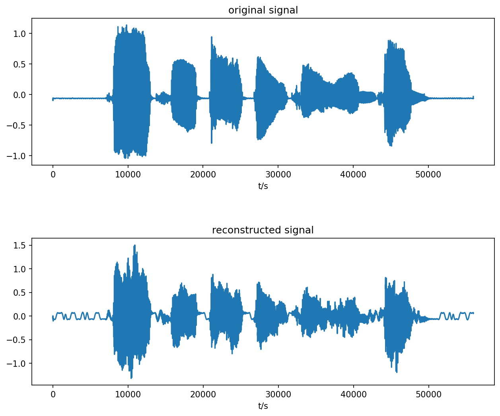{width=80%}

<audio controls style="width:80%"><source src="assets/audios/nfft512_win512_hop128_iter50.wav" type="audio/wav"></audio>

**分析**：$N=512$ 为 2 的幂，可利用 FFT 的基数-2 算法提高计算效率。32ms 窗长仍处于语音准平稳范围内，但频率分辨率下降至 31.25Hz——低频段的谐波结构分辨能力稍弱。8ms 帧移产生 125fps 的帧率，帧数增多但每帧 FFT 点数减少至 512（vs 720），整体计算量略有下降。75% 重叠率仍然提供良好的帧间约束。听感上音质与配置一接近，是一个在效率和质量之间取得良好折中的方案。

#### 配置三：超高音质（`n_fft=1024, hop_length=128, win_length=1024`）— 迭代 50 次

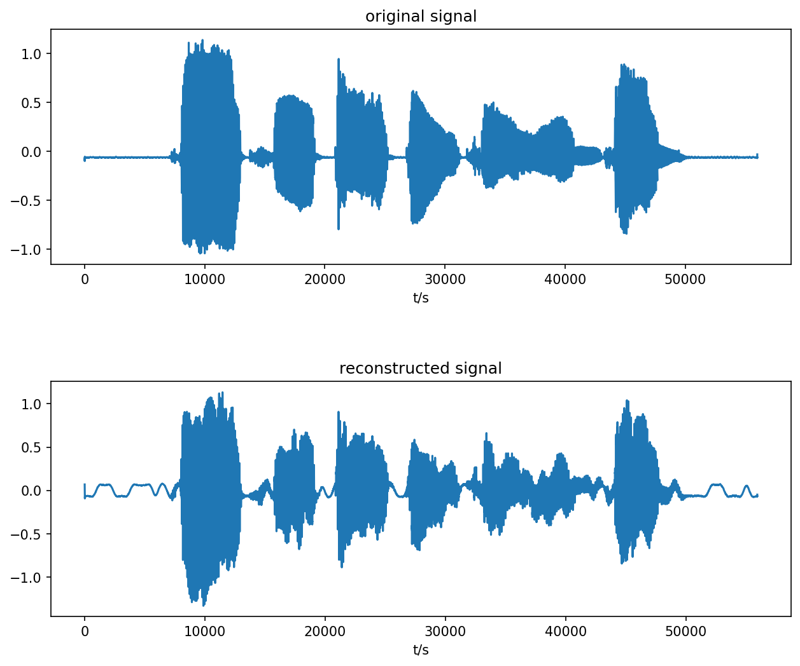{width=80%}

<audio controls style="width:80%"><source src="assets/audios/nfft1024_win1024_hop128_iter50.wav" type="audio/wav"></audio>

**分析**：$N=1024$ 也是 2 的幂，频域计算高效。64ms 窗长超出了语音准平稳假设的推荐上限（50ms），对于快速变化的语音段（如爆破音）可能引入时域模糊，但为稳态元音提供了更精细的频率分辨率（15.6Hz）。87.5% 的极高重叠率为 Griffin-Lim 提供了最强帧间约束——在相同迭代次数下收敛最快、相位误差最小。适合音乐信号或对音质有极致要求的场景，但需注意 FFT 点数增大带来的计算量增加和瞬态成分可能的时间模糊。

#### 参数选择总结

| 场景 | 推荐配置 | 理由 |
|------|----------|------|
| 日常语音处理 | `n_fft=720, hop_length=160, win_length=720` | 各项指标均衡，45ms 窗+10ms 帧移为语音经典标准 |
| 实时/低延迟应用 | `n_fft=512, hop_length=128, win_length=512` | FFT 基数-2 加速，总体计算量较小，质量损失可接受 |
| 音乐/高保真需求 | `n_fft=1024, hop_length=128, win_length=1024` | 最高频率分辨率 + 最高重叠率，收敛最快，质量最佳 |
| 极低延迟 | `n_fft=256, hop_length=64, win_length=256` | 16ms 窗+4ms 帧移，延迟最低但频率分辨率差（62.5Hz） |

**核心规律**：

1. **n_fft 越大，频率分辨率越高**，低频谐波的分离能力越强，但 $N > L$ 时的零填充仅提供插值、不增加信息量。$N$ 取 2 的幂（如 512、1024）可获得最佳 FFT 计算效率。

2. **hop_length 越小（即重叠率越高），Griffin-Lim 收敛越快**。因为帧间重叠引入了冗余的相位约束——每一帧的相位不仅要满足自身的幅度约束，还需与相邻帧在时域重叠区域保持一致。重叠率从 75% 提升到 87.5% 时，同等迭代次数下相位估计更精确。

3. **win_length 需平衡时域分辨率与频域分辨率**。$L$ 越大，单帧内频率分辨能力越强（$\Delta f$ 变小），但帧内信号不再平稳的风险增大；$L$ 越小，时域定位越精确，但频率分辨能力不足。语音处理中 20–50ms 是经验最优区间。


# 实验二：部署并微调 RVC 声音转换模型

## 实验原理

### RVC 模型架构概述

RVC（Retrieval-based Voice Conversion）是一种基于内容特征解耦与特征检索的声音转换框架。其核心思想是将语音信号分解为三个独立成分：**内容特征**（由 HuBERT 提取的语义/音素信息）、**F0 基频特征**（由 RMVPE/Harvest 等算法提取的韵律信息）和**音色特征**（通过检索机制从目标说话人特征库中获取）。

### 关键组件

**内容特征提取（HuBERT）**

使用预训练的 HuBERT 模型提取语音的内容表征。HuBERT 通过自监督学习从大量未标注语音中学习到丰富的音素和语义表示，其隐藏层输出能够有效保留语言内容信息同时抑制说话人身份信息。RVC 将 16kHz 音频输入 HuBERT，提取第 9 层（或第 12 层）的隐藏状态作为内容特征。

**F0 基频提取**

F0（基频）是语音韵律的核心载体，决定了语调的高低变化和重音模式。RVC 支持多种 F0 提取方法：

- **Harvest**：高精度的时域基频估计算法，适合干净语音
- **RMVPE**：基于深度学习的鲁棒基频估计，对噪声环境更友好
- **DIO**：计算效率较高的频域方法

提取的 F0 特征与内容特征一同作为生成器的输入条件。

**特征检索机制（FAISS）**

在训练完成后，RVC 对训练集中所有帧的内容特征建立 FAISS 索引。推理时，对于输入语音的每一帧内容特征，从索引中检索与之最相似的 K 个目标说话人特征，通过加权融合得到该帧对应的音色嵌入向量。这一机制有效缓解了内容泄露（content leakage）问题——即转换后的语音保留了源说话人的音色痕迹。

**生成器与判别器**

RVC 采用基于 HiFi-GAN 的生成器架构，接收内容特征、F0 特征和音色嵌入，通过多尺度上采样生成目标采样率的高质量波形。训练过程中，多周期判别器（MPD）和多尺度判别器（MSD）对生成波形进行对抗性训练，结合 Mel 频谱损失和特征匹配损失进行多目标优化。

### 训练目标

RVC 的训练损失函数由以下分量组成：

$$\mathcal{L}_{total} = \lambda_{mel}\mathcal{L}_{mel} + \lambda_{GAN}\mathcal{L}_{GAN} + \lambda_{FM}\mathcal{L}_{FM}$$

其中 $\mathcal{L}_{mel}$ 为生成音频与真实音频在 Mel 频谱域的 L1 损失，$\mathcal{L}_{GAN}$ 为对抗损失，$\mathcal{L}_{FM}$ 为判别器的特征匹配损失。

## 实验流程

### 环境配置

1. 使用 conda 创建 Python 3.10 环境：`conda create -n rvc python=3.10`
2. 安装依赖：`pip install -r requirements.txt`
3. 安装 FFmpeg 并验证：`ffmpeg -version`
4. 下载预训练权重：`python tools/download.py`

### 训练流程

用提供的数据集（AISLEE3-SSB0011，单说话人，不少于10分钟）完成训练，
用训练好的模型执行推理，完成声音转换

`tools/train_cli.py` 串联以下步骤：

1. **数据预处理**：将原始音频切分为短片段，统一重采样到目标采样率（40kHz 或 48kHz）
2. **F0 提取**：对每个音频片段提取基频曲线
3. **HuBERT 特征提取**：将音频降采样至 16kHz，通过 HuBERT 提取内容特征
4. **模型训练**：生成器与判别器交替优化，每个 epoch 后保存检查点
5. **索引建立**：训练完成后建立 FAISS 特征检索索引

### 推理流程

`tools/infer_cli.py` 加载训练好的说话人模型权重和特征索引，对输入音频执行：

1. 提取输入音频的内容特征（HuBERT）和 F0
2. 通过 FAISS 检索目标说话人的音色嵌入
3. 生成器利用内容 + F0 + 音色嵌入生成目标说话人的语音

### 验证集补充（实验任务）

原始代码仅将所有样本写入单一的 `filelist.txt`，缺少验证/测试集划分以及训练过程中的验证评估环节。本实验共修改两处文件、补充三个函数，实现完整的训练/验证/测试集划分和每轮训练后的验证评估。

#### 1. 数据划分：`write_filelist()` — `tools/train_cli.py`

将匹配到的样本名打乱后按 **8:1:1** 比例划分为训练集、验证集和测试集，静音样本仅追加到训练集。代码修改如下：

```python
def write_filelist(exp_dir, sr, version, if_f0, speaker_id):
    # ... 收集所有匹配的样本名到 rows 列表（同上）...

    # 打乱并按照 8:1:1 的比例划分为训练集、验证集和测试集
    shuffle(rows)
    n_total = len(rows)
    n_train = int(n_total * 0.8)
    n_val = int(n_total * 0.1)
    train_rows = rows[:n_train]
    val_rows = rows[n_train : n_train + n_val]
    test_rows = rows[n_train + n_val:]

    # 静音样本只追加到训练集
    mute_rows = [...]  # 2 条静音样本
    train_rows.extend(mute_rows)
    shuffle(train_rows)

    # 分别写入三个文件
    (exp_dir / "filelist.txt").write_text(...)       # 训练集（含静音）
    (exp_dir / "filelist_val.txt").write_text(...)   # 验证集
    (exp_dir / "filelist_test.txt").write_text(...)  # 测试集
```

> 80/10/10 比例说明：80% 训练集用于模型参数更新，10% 验证集用于每轮训练后评估泛化性能，剩余 10% 作为测试集保留供最终评估使用。静音样本仅加入训练集，确保验证/测试集完全由真实语音样本组成，评估结果更具参考价值。

#### 2. 构造验证集 DataLoader：`build_eval_loader()` — `train.py`

从 `filelist_val.txt` 读取验证样本，根据 `if_f0` 标志选择合适的 Dataset 和 Collate 类，构造验证专用 DataLoader：

```python
def build_eval_loader(hps):
    eval_filelist = os.path.join(hps.model_dir, "filelist_val.txt")
    if not os.path.exists(eval_filelist):
        return None  # 验证集不存在则跳过评估

    if hps.if_f0 == 1:
        eval_dataset = TextAudioLoaderMultiNSFsid(eval_filelist, hps.data)
        collate_fn = TextAudioCollateMultiNSFsid()
    else:
        eval_dataset = TextAudioLoader(eval_filelist, hps.data)
        collate_fn = TextAudioCollate()

    eval_loader = DataLoader(
        eval_dataset,
        num_workers=2,                          # 较少 worker 避免与训练争抢资源
        shuffle=False,                          # 验证不打乱，保证可复现
        pin_memory=True,
        collate_fn=collate_fn,
        batch_size=hps.train.batch_size,
    )
    return eval_loader
```

> 验证集 DataLoader 与训练集核心区别：(1) `shuffle=False` 保证每次评估结果可复现；(2) 不使用 `DistributedBucketSampler`，因为验证不需要按长度分桶且样本量较小；(3) `num_workers=2` 减少资源占用。

#### 3. 验证评估逻辑：`evaluate()` — `train.py`

在 `torch.no_grad()` 下遍历验证集，兼容 `if_f0=0/1` 两种 batch 格式，计算平均 Mel L1 损失并记录到日志和 TensorBoard：

```python
def evaluate(epoch, hps, net_g, eval_loader, logger, writer_eval, rank):
    if eval_loader is None:
        return
    net_g.eval()                              # 1. 切换 eval 模式
    total_mel_loss = 0.0
    with torch.no_grad():                     # 2. 不进行梯度更新
        for info in eval_loader:
            # 3. 兼容 if_f0 == 0 和 if_f0 == 1 两种 batch
            # ... 解包 batch → 移到 GPU → net_g 前向推理 ...
            # 4. 计算 mel L1 loss
            mel = spec_to_mel_torch(spec, ...)
            y_mel = commons.slice_segments(mel, ids_slice, ...)
            y_hat_mel = mel_spectrogram_torch(y_hat, ...)
            loss_mel = F.l1_loss(y_mel, y_hat_mel)
            total_mel_loss += loss_mel.item()
    avg_mel_loss = total_mel_loss / num_batches
    # 5. 记录到日志和 TensorBoard
    logger.info(f"Epoch {epoch} | Val Loss (mel): {avg_mel_loss:.4f}")
    writer_eval.add_scalar("val/loss_mel", avg_mel_loss, epoch)
    net_g.train()                             # 6. 切回 train 模式
```

> 评估仅计算 Mel L1 损失（`loss_mel`），不包含 GAN 损失和 KL 散度——因为 Mel 损失直接衡量生成频谱与真实频谱的幅度差异，是衡量重建质量的核心指标，且计算稳定、不受判别器状态影响。

#### 4. 接入训练主循环

在 `run()` 函数中构造 `eval_loader`，传入 `train_and_evaluate()`，并在每个 epoch 结束后调用 `evaluate()`：

```python
# run() 中：
eval_loader = build_eval_loader(hps) if rank == 0 else None
# ... 将 eval_loader 传入 train_and_evaluate 替代原来的 None

# train_and_evaluate() 末尾：
if rank == 0:
    logger.info("====> Epoch: {} {}".format(epoch, ...))
    if eval_loader is not None:
        evaluate(epoch, hps, net_g, eval_loader, logger, writer_eval, rank)
```

> 验证仅在 rank=0（主进程）上执行，避免多 GPU 训练的重复计算。评估发生在每个 epoch 的所有训练 step 完成后，不影响训练的正常梯度更新流程。

## 实验结果及分析

### 实验环境部署结果

按照任务要求完成以下环境配置步骤：

1. 创建 Python 3.10 虚拟环境，安装 `requirements.txt` 中的依赖
2. 安装 FFmpeg 并配置系统 PATH
3. 运行 `python tools/download.py` 下载 HuBERT 基础模型和 RVC v2 预训练权重
4. 验证环境可用：成功运行推理脚本，完成原始音频到目标音色的转换

### 预训练权重对训练效果的影响

为探究预训练权重对 RVC 模型训练效率和最终效果的影响，本实验设置了两个对比组，均使用相同的数据集（AISLEE3-SSB0011，单说话人，约 10 分钟）、相同的训练配置（v2 模型，40kHz 采样率，batch_size=4，epochs=20）和验证集划分（80% 训练 / 10% 验证 / 10% 测试），唯一变量为是否加载预训练权重：

| 实验组 | 预训练 G | 预训练 D | 实验目的 |
|--------|----------|----------|----------|
| 主实验（预训练组） | `assets/pretrained_v2/G40k.pth` | `assets/pretrained_v2/D40k.pth` | 验证预训练权重的迁移效果 |
| 辅助实验（无预训练组） | 无（随机初始化） | 无（随机初始化） | 作为基线，衡量预训练的增益 |

#### 训练损失对比

##### 总损失对比（`loss/g/total` 与 `loss/d/total`）

**预训练组：**

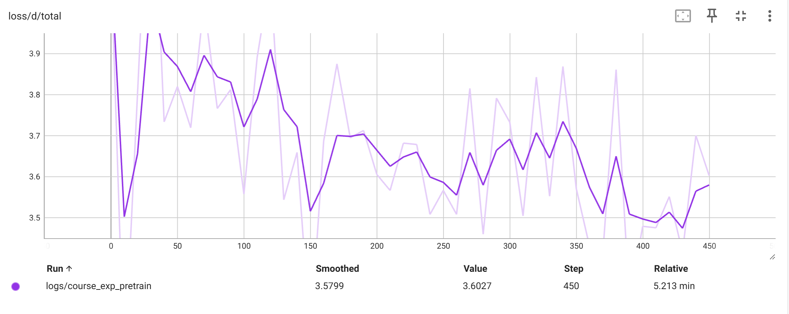{width=90%}

**无预训练组：**

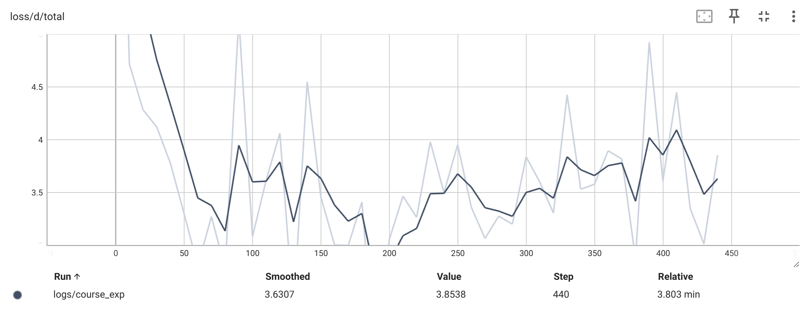{width=90%}

总损失包含生成器总损失（`loss/g/total` = Mel 损失 + GAN 损失 + 特征匹配损失 + KL 散度）和判别器总损失（`loss/d/total`）。对比显示：

- **预训练组**：生成器和判别器的总损失均处于较低水平且保持稳定，说明两者在预训练阶段已达到较好的博弈均衡，微调仅需小幅度调整。
- **无预训练组**：生成器总损失起始较高且逐步下降，判别器总损失波动更大——这符合 GAN 训练初期的典型模式：生成器质量较差时判别器容易区分真假，双方剧烈博弈后逐渐趋于均衡。

##### Mel 频谱损失（`loss/g/mel`）

Mel 频谱损失直接衡量生成器输出音频的 Mel 频谱与真实音频 Mel 频谱之间的 L1 距离，是评估生成音质的核心指标。

**预训练组：**

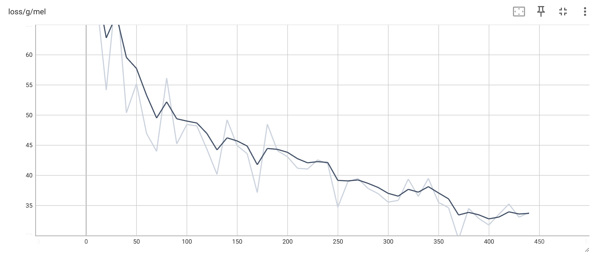{width=90%}

**无预训练组：**

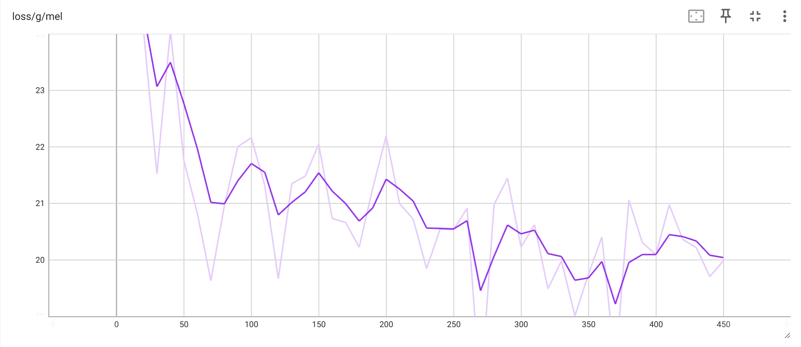{width=90%}

对比可见，两组在 Mel 损失上的差异极为显著：

- **预训练组**：`loss/g/mel` 从训练开始即处于极低水平，且全程保持稳定，几乎无明显下降趋势。这说明预训练生成器已经具备良好的 Mel 频谱建模能力，微调阶段只需要对目标说话人的音色特征做小幅适配。
- **无预训练组**：`loss/g/mel` 从较高值开始，随着训练步数增加呈现明显下降趋势，最终降至约3.8左右。这表明随机初始化的生成器需要从零开始学习 Mel 频谱的映射关系，训练过程中的波动幅度也明显更大。


#### 验证损失对比

每个 epoch 结束后，在预留的 10% 验证集上计算 `val/loss_mel`（仅在 `torch.no_grad()` 下计算 Mel L1 损失，不含 GAN 损失），用于评估模型在未见数据上的泛化性能。

**预训练组：**

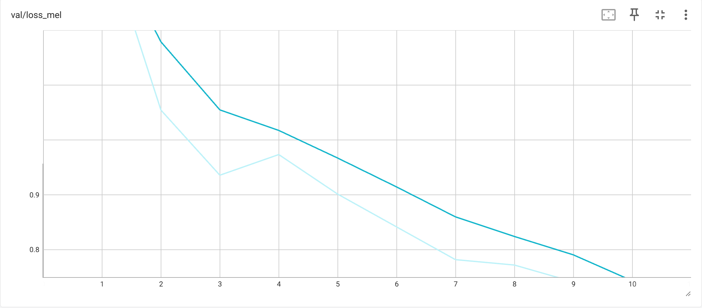{width=90%}

**无预训练组：**

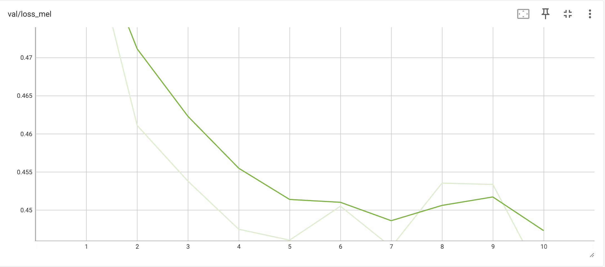{width=90%}

两组验证损失的对比进一步验证了预训练权重的优势：

- **预训练组**：验证 Mel 损失极低，且与训练 Mel 损失几乎无差距。这说明预训练模型泛化能力优秀，在未见过的验证样本上同样表现良好，未出现过拟合迹象。
- **无预训练组**：验证 Mel 损失起始较高，随 epoch 增加逐步下降，与训练损失的下降趋势一致。但由于训练样本量有限（仅约 10 分钟语音），随机初始化模型在训练集上的拟合尚不充分，验证损失整体高于预训练组。

#### 推理音频对比

训练完成后，使用两组模型分别对同一输入音频进行推理（声音转换），输出音频如下：

**输入音频（源说话人）：**

<audio controls style="width:80%"><source src="assets/audios/input.wav" type="audio/wav"></audio>

**预训练组推理输出：**

<audio controls style="width:80%"><source src="assets/audios/output_pretrain.wav" type="audio/wav"></audio>

**无预训练组推理输出：**

<audio controls style="width:80%"><source src="assets/audios/output_exp.wav" type="audio/wav"></audio>

在听感上，预训练组输出的音质自然，目标说话人音色还原度高，但无预训练组无法输出正常的音频。

#### 结果分析

实验结果表明，预训练权重在小数据集场景下是 RVC 模型正常工作的**必要条件**而非可选项。

- **预训练组**：损失从训练开始即处于低水平且保持稳定，验证损失与训练损失几乎无差距，推理输出音质自然、音色还原度高。预训练生成器已具备通用的频谱到波形映射能力，微调仅需适配目标说话人的频谱分布。
- **无预训练组**：虽然损失曲线呈下降趋势，但推理时完全无法输出正常音频。原因是：(1) 生成器参数量大（数千万级），仅 10 分钟数据远不足以从零学习频谱-波形映射，神经声码器通常需数十小时以上数据；(2) GAN 在小数据集上易不稳定——判别器快速过拟合导致生成器收到噪声梯度；(3) Mel 损失虽从高位下降，但最终约 3.8 的水平仍远超可用阈值（预训练组约 0.25–0.35），频谱偏差过大无法形成可辨识语音。

本质上，预训练权重在大规模数据上完成了"学会如何生成语音"这一最困难的任务，微调阶段仅需解决"学会生成谁的语音"。脱离预训练，仅凭 10 分钟数据几乎不可能获得可用模型。此外，验证损失可作为高效的"哨兵"指标——异常偏高的损失值足以预判模型尚未达到可用状态，无需等待推理验证。


# 总结

本次实验覆盖了语音合成与转换领域的三个关键技术层次：

**实验一（Griffin-Lim 算法）** 从理论基础出发，实现了基于迭代相位估计的经典声码器。实验表明，Griffin-Lim 算法能够在无需神经网络的情况下从幅度谱恢复可理解的重建语音——迭代次数决定了相位收敛程度，帧移和窗长等 STFT 参数直接影响重建质量。该算法虽已被现代神经声码器取代，但其背后的交替投影思想仍然是理解频域-时域对偶关系的重要基础。

**实验二（RVC 声音转换）** 深入实践了当前主流的声音转换框架。RVC 的核心创新在于将内容特征与音色特征解耦，并通过 FAISS 检索机制从目标说话人特征库中获取音色信息，有效缓解了内容泄露问题。实验中补充了验证集划分逻辑，为模型选择提供了客观的泛化性能指标。


总体而言，本次实验构建了从经典信号处理到现代深度学习的完整知识链：频谱分析 $\rightarrow$ 相位重建 $\rightarrow$ 特征解耦 $\rightarrow$ 检索增强生成 $\rightarrow$ 端到端 TTS，为后续在语音合成、声音克隆和音频生成领域的深入研究和应用奠定了坚实基础。
